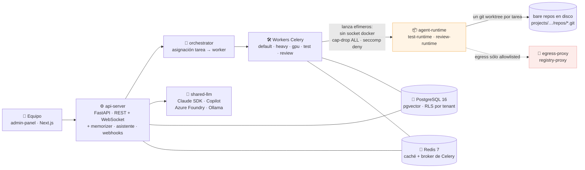

[English](README.md) · **Español**

# agent-ai-multitenant

**Una plataforma agéntica multi-tenant donde equipos de agentes IA especialistas planifican, escriben, prueban y revisan software — sobre un único host Docker Compose, no Kubernetes.**

[](https://github.com/daycry/agent-ai-multitenant/actions/workflows/ci.yml)
[](https://github.com/daycry/agent-ai-multitenant/actions/workflows/build-runtime-templates.yml)
[](https://github.com/daycry/agent-ai-multitenant/actions/workflows/eval-on-prompt-change.yml)
[](LICENSE)
[](https://daycry.github.io/agent-ai-multitenant/)

[](https://github.com/daycry/agent-ai-multitenant)
[](https://github.com/daycry/agent-ai-multitenant/forks)
[](https://github.com/daycry/agent-ai-multitenant/issues)
[](https://github.com/daycry/agent-ai-multitenant/commits/master)
[](https://github.com/daycry/agent-ai-multitenant/pulse)
[](https://github.com/daycry/agent-ai-multitenant/graphs/contributors)

[](pyproject.toml)
[](apps/api-server)
[](docker/docker-compose.yml)
[](docker/docker-compose.yml)
[](apps/admin-panel)
[](docker/docker-compose.yml)

[](docs/05-architecture-decisions/README.md)
[](apps/api-server/migrations/versions)
[](docker/agent-runtimes)
[](docs/04-reference/README.md)

> Los cuatro contadores de arriba no son decorativos:
> [`tests/unit/test_readme_badges_do_not_lie.py`](tests/unit/test_readme_badges_do_not_lie.py)
> cuenta los ficheros de verdad y rompe la build cuando un número de este README
> deja de coincidir con el repositorio. Y el mismo test comprueba que todos los
> enlaces relativos de esta página resuelven.

## Qué es esto

Describes lo que quieres construir. De ahí sale un **Plan** —un conjunto ordenado
de tareas con dependencias DAG— y un equipo de agentes especialistas (Project
Manager, Arquitecto, Backend, Frontend, QA, Reviewer, Technical Writer…) lo
ejecuta en paralelo contra un repositorio git real, corriendo la suite de tests
del propio proyecto en su propio toolchain, y abriendo una pull request al cerrar
el plan.

Se opera como un **stack Docker Compose en una sola máquina**. El multi-tenancy
llega a departamentos y equipos dentro de una organización, no a SaaS comercial
masivo. Kubernetes y multi-máquina están explícitamente fuera de alcance.



## Qué hace distinto

| Decisión de diseño                              | Qué te da                                                                                                                                                                                                     |
| ----------------------------------------------- | ------------------------------------------------------------------------------------------------------------------------------------------------------------------------------------------------------------- |
| **El Plan es la unidad de cambio**              | Un plan se materializa como rama `plan/{id}-{slug}`; cada commit de tarea lleva trailers `Plan-Id` / `Task-Id` / `Execution-Id`; al cerrarlo se abre UNA PR. Revisas un cambio coherente, no cuarenta commits |
| **Doble Kanban**                                | Arriba un tablero gerencial de Planes; dentro de cada plan, el tablero operativo de Tareas. Nunca un tablero plano que mezcla tareas de varios planes                                                         |
| **Multi-tenancy desde el día uno**              | `tenant_id` en cada tabla, RLS de PostgreSQL activado, middleware que inyecta el tenant en cada request y tests de fuga cross-tenant en CI                                                                    |
| **Los agentes no ejecutan código en el worker** | Los workers sólo orquestan. El código no confiable corre en contenedores efímeros con red restringida, sin socket Docker, `cap-drop ALL` y perfil seccomp default-deny                                        |
| **Tu stack, no el nuestro**                     | 14 imágenes de test-runtime mantenidas (pytest, jest, vitest, playwright, phpunit, pest, go, maven, gradle, rspec, cargo, dotnet, shell, http) para que el agente corra _tu_ suite                            |
| **Guardrails declarativos por capas**           | Plataforma → tenant → proyecto, aplicados en cuatro puntos del ciclo: `pre_llm`, `post_llm`, `pre_tool`, `post_tool`                                                                                          |
| **Validación humana donde importa**             | 13 categorías de acción sensible × 4 plantillas (Sandbox, Desarrollo, Producción, Cliente Externo), más la tool `ask_human` que el propio agente puede llamar. Por plan, nunca un checkbox por tarea          |
| **Los proveedores LLM son catálogo cerrado**    | Claude Agent SDK, GitHub Copilot, Azure AI Foundry vía APIM y Ollama — detrás de un único `Protocol` async `LLMProvider`. Un quinto proveedor exige un ADR escrito                                            |
| **Las decisiones están escritas**               | 165 ADR, una cadena de precedencia para cuando dos documentos se contradicen, y tests que fallan cuando la documentación deja de describir el repositorio                                                     |

## Cómo se arranca

Prerequisitos: Docker Engine 24+, Docker Compose v2+, Python 3.12+, Node.js 20+,
Git 2.40+. En Windows funciona con Docker Desktop.

```bash
git clone https://github.com/daycry/agent-ai-multitenant.git
cd agent-ai-multitenant
```

**1. Bootstrap del entorno Python** — crea `.venv/`, instala los paquetes
locales en editable y registra el hook de pre-commit. Idempotente.

```bash
./scripts/dev/bootstrap.sh        # Linux / macOS
.\scripts\dev\bootstrap.ps1       # Windows
```

**2. Levantar el stack.** La infraestructura (PostgreSQL + pgvector, Redis,
MinIO, Vault, ClamAV, docling-serve, egress-proxy, Ollama) vive en Compose; el
`api-server` y el `admin-panel` corren desde fuente en modo desarrollo:

```bash
./scripts/dev/up.sh               # Linux / macOS  (añade --monitoring para Grafana)
.\scripts\dev\up.ps1              # Windows
```

El Postgres de desarrollo publica el puerto **15432** del host, no el 5432, para
no chocar con un Postgres local. Dale 30–60 s a los contenedores hasta que
reporten healthy (`docker compose ps`) y sigue con
[primeros pasos](docs/02-getting-started/README.md) para sembrar un tenant y
lanzar tu primer plan.

### Instalarla, en vez de desarrollar sobre ella

Tres caminos, decididos en el
[ADR 0161](docs/05-architecture-decisions/0161-distribucion-e-instalacion-de-la-plataforma.md).
Se diferencian en qué necesitas tener antes de empezar:

**(1) Sin clonar.** Descargas el compose de arranque, **lo lees**, y lo
ejecutas. Son dos comandos y no una línea mágica a propósito: el artefacto está
pensado para auditarse antes de ejecutarse.

```bash
curl -fsSLO https://raw.githubusercontent.com/daycry/agent-ai-multitenant/master/docker/bootstrap/docker-compose.generate.yml
# léelo, y entonces:
docker compose -f docker-compose.generate.yml run --rm generate
cd /data/agent-platform && docker compose up -d --wait
```

El instalador **genera y no aprovisiona**: escribe el árbol de arranque y sale,
sin hablar nunca con el daemon de Docker. Por eso no monta
`/var/run/docker.sock` — montarlo es acceso root efectivo al host, que el
[ADR 0060](docs/05-architecture-decisions/0060-acceso-daemon-docker-y-ruta-api-interna-sandbox.md)
rechazó. **Este camino todavía no existe para un usuario real**: necesita las
imágenes publicadas —la del propio instalador incluida— y hoy no hay ninguna en
`ghcr.io/daycry`.

**(2) Clonando, con Compose.** Lo que describen los pasos de arriba. Sirve para
desarrollar y para leerse el stack, pero te da infraestructura y no el producto:
el compose canónico levanta PostgreSQL, Redis, MinIO, Vault y compañía, y los
servicios de aplicación salen del compose generado.

**(3) Desatendido, con los scripts** — el camino soportado, y el único medido de
punta a punta:

```bash
./scripts/install.sh --config install.yaml   # perfiles: scripts/install-profiles/
```

Este CLI es el camino de instalación **real**. El wizard HTTP de
`apps/installer` es una simulación: no aprovisiona nada y las credenciales que
revela no son reales.

**Qué ha quedado probado.** En una máquina Linux limpia este camino llega ahora
al final: 18 pasos en verde, 22 servicios healthy, migraciones de Alembic
aplicadas, Vault inicializado, el primer tenant sembrado y sus credenciales
reveladas, el proxy sirviendo HTTPS y el login funcionando con la credencial
revelada. Es el job [Install E2E](.github/workflows/install-e2e.yml), ejecución
`33197920542`, cuatro tests pasados.

**Qué NO ha quedado probado, y es la mitad del mensaje.** Esa ejecución
**construye las seis imágenes en el propio job y las sirve desde un registro
local**. Ejercita el instalador, el compose generado y la secuencia de arranque;
**no** demuestra que la instalación con las imágenes **publicadas** funcione,
porque no hay ninguna publicada. Ese único hueco es toda la distancia entre el
camino (3), que hoy funciona con imágenes construidas en local, y el camino (1),
que quien no ha clonado sigue sin poder usar. Publicar es acto del operador, y
no se prometen fechas. Estado de cada camino:
[runbook de instalación](docs/06-runbooks/01-installation-from-scratch.md).

**Por qué esto se puede creer.** El test que hay detrás se escribió en junio de
2026 y no se había ejecutado NUNCA: estaba gateado por `E2E_INSTALL=1`,
ningún workflow ponía la variable, y el gate cae en el setup de las fixtures —
así que pytest recolectaba los cuatro casos, los saltaba y salía 0. Un check
verde que no instalaba nada. Ahora corre **cada noche y a petición**, y el job
no se fía de su propio código de salida: una guarda anti-falso-verde
([`scripts/check_e2e_install_report.py`](scripts/check_e2e_install_report.py))
lee el informe JUnit y falla si alguno de los cuatro casos exigidos no se
ejecutó de verdad. Encenderlo costó 24 ejecuciones y sacó defectos reales,
ninguno hipotético: el perfil de AppArmor no se había aplicado jamás y rompía
seis cosas, los workers hacían chown de los datos de todos los demás servicios,
el almacén de artefactos del marketplace no estaba cableado, y el watchdog
heredaba una sonda HTTP sin servir HTTP.

La configuración se lee de `docker/.env`, que está en `.gitignore`. Las
credenciales de plataforma viven en **Vault**; la base de datos guarda sólo el
puntero. La única excepción escrita —secretos de terceros que configura un
tenant, en columnas cifradas con Fernet— está argumentada en el
[ADR 0146](docs/05-architecture-decisions/0146-fernet-en-db-vs-vault.md).

## Dónde leer más

Todo esto se puede leer en
**[daycry.github.io/agent-ai-multitenant](https://daycry.github.io/agent-ai-multitenant/)**
— el mismo corpus, renderizado y con buscador, publicado desde `master` por
[`docs.yml`](.github/workflows/docs.yml). El badge de arriba refleja el estado
real del despliegue `github-pages`, así que dice «inactive» hasta la primera
publicación en vez de presumir de un sitio que no está. La tabla de abajo es el
mismo mapa dentro del repositorio.

| Ruta                                                                          | Qué hay dentro                                                                                                      |
| ----------------------------------------------------------------------------- | ------------------------------------------------------------------------------------------------------------------- |
| [`CLAUDE.md`](CLAUDE.md)                                                      | Los principios rectores, el árbol real del repositorio y la cadena de precedencia entre documentos                  |
| [`docs/01-overview/`](docs/01-overview/README.md)                             | Qué es el producto y cómo está montado                                                                              |
| [`docs/02-getting-started/`](docs/02-getting-started/README.md)               | Instalación y primer arranque                                                                                       |
| [`docs/03-guides/`](docs/03-guides/README.md)                                 | Guías por tarea — más [`gotchas/`](docs/03-guides/gotchas/README.md), las trampas del toolchain que ya hemos pagado |
| [`docs/04-reference/`](docs/04-reference/README.md)                           | Modelo de dominio, guardrails, auth/SSO, backup y restore, API pública                                              |
| [`docs/05-architecture-decisions/`](docs/05-architecture-decisions/README.md) | Cada decisión arquitectónica, con la opción que se descartó y por qué                                               |
| [`docs/06-runbooks/`](docs/06-runbooks/README.md)                             | Procedimientos de operación: upgrades, recuperación ante desastres, rotación de claves, capacidad                   |
| [`docs/07-changelog/`](docs/07-changelog/README.md)                           | Una entrada por plan cerrado                                                                                        |
| [`docs/roadmap/`](docs/roadmap/README.md)                                     | Los planes en sí, con su estado en el frontmatter YAML                                                              |

Antes de implementar nada, dos documentos valen más que su longitud:
[gotchas](docs/03-guides/gotchas/README.md) (trampas del toolchain, con síntoma,
causa raíz y fix) y
[verificar antes de implementar](docs/03-guides/verificar-antes-de-implementar.md)
(los modos de fallo que no producen error alguno — sólo trabajo perdido o
confianza injustificada).

## Estado del proyecto — qué _no_ está publicado

Dicho sin adornos, para que nadie busque algo que no está:

- **No se ha cortado ninguna release.** No hay tags de git ni releases de
  GitHub, así que arriba no hay badge de versión.
- **Los SDK no están publicados.** `packages/sdk-python` y
  `packages/sdk-typescript` se generan del OpenAPI v1 y viven sólo en este
  repositorio. Todavía no hay un `pip install agentic-platform-sdk` ni un
  `npm install @agentic-platform/sdk` que funcione.
- **Aún no hay imágenes en ningún registry.** Las imágenes de aplicación se
  publican en `ghcr.io/daycry/*` cuando se empuja un tag `v*` — el workflow
  [Release images](.github/workflows/release-images.yml) no ha corrido nunca,
  porque ese tag no existe. Hasta entonces las imágenes se construyen en local
  con los scripts de desarrollo. Es ya lo único que separa el camino de
  instalación que sí está medido —el (3), con las imágenes construidas en el
  propio job— del que no exige clonar. (Esta línea decía
  `ghcr.io/agentic-platform/*` hasta el 2026-08-27; el workflow deriva el
  espacio de nombres del dueño del repositorio, así que era falsa — y falsa
  justo en el sitio de donde alguien la copiaría.)
- **El wizard de instalación no instala.** El wizard HTTP de nueve pasos de
  `apps/installer` corre contra un ejecutor falso: no aprovisiona nada y las
  credenciales que revela al final no son reales. El camino soportado es el CLI
  de arriba. De las dos averías medidas en el
  [ADR 0161](docs/05-architecture-decisions/0161-distribucion-e-instalacion-de-la-plataforma.md),
  la segunda —el compose generado pidiendo ficheros que nadie escribía— está
  reparada. La primera, las imágenes sin publicar, no está arreglada, pero sí
  **acotada**: el e2e de instalación lleva la secuencia entera hasta el final en
  un Linux limpio con las imágenes construidas dentro del job, así que lo que
  queda es publicarlas, no averiguar qué más se rompe. O sea: hoy un host Linux
  limpio se puede instalar partiendo de un clon; lo que nadie puede hacer
  todavía es instalar desde imágenes publicadas, que es justo lo que necesita
  quien no clona.
- **No hay número de cobertura publicado**, porque no hay servicio de cobertura
  conectado. Lo que CI aplica es un suelo de ratchet sobre el subconjunto unit
  ([`ci.yml`](.github/workflows/ci.yml), job `test-unit`).
- **El sitio de documentación se construye, pero aún no se publica.** El workflow
  [Docs site](.github/workflows/docs.yml) construye `docs/` con MkDocs en cada
  pull request, y `mkdocs build --strict` es la puerta que rompe con un enlace
  muerto antes de que llegue a `master`. Publicar espera un único interruptor
  manual que sólo puede accionar quien es dueño del repositorio —Settings →
  Pages → Source: GitHub Actions—, así que hoy no hay URL viva a la que enlazar y
  `docs/` se lee directamente en GitHub. Por eso tampoco hay badge de ese
  workflow: no ha corrido nunca en `master`, y renderizaría «no status».

Comprueba cualquiera de esas afirmaciones tú mismo en vez de creerte la lista:

```bash
git tag                                              # sin tags
gh release list --repo daycry/agent-ai-multitenant   # sin releases
ls docs/05-architecture-decisions/[0-9]*.md | wc -l  # el número del badge de ADR
ls apps/api-server/migrations/versions/*.py | wc -l  # el número del badge de migraciones
```

## Idioma de la documentación

El inglés es el canónico y el castellano va en un sidecar `.es.md`: `foo.md` es
el documento inglés, `foo.es.md` su traducción, y los dos se enlazan en la
cabecera. La política y su guarda están escritas en
[documentación bilingüe](docs/03-guides/bilingual-docs.es.md).

El resto del corpus se describe honestamente como **castellano hoy, traducido de
forma incremental**. Es grande —165 ADR, un catálogo entero de gotchas, las siete
carpetas canónicas de documentación, el roadmap— con enlaces internos y guardas
estáticas sobre todo ello, así que una traducción de golpe rompería más de lo que
entregaría. Los documentos llevan un campo `docs_language` en su frontmatter YAML,
y la plantilla de ADR ya renderiza los encabezados en inglés cuando vale `en`. Lo
nuevo de primer nivel nace en los dos idiomas.

## Contribuir

La rama por defecto es `master`, y nada se empuja a ella directamente: una pull
request por plan. Conventional Commits con trailers `Plan-Id` / `Task-Id` /
`Execution-Id`; `black`, `ruff` y `mypy --strict` en Python; `prettier` y
`eslint` sin `any` en TypeScript. El detalle está en
[`docs/context/conventions.md`](docs/context/conventions.md).

```bash
.venv/Scripts/python.exe -m pytest tests/unit -q    # la puerta rápida más útil
pre-commit run --all-files
```

## Licencia

[MIT](LICENSE) © daycry
