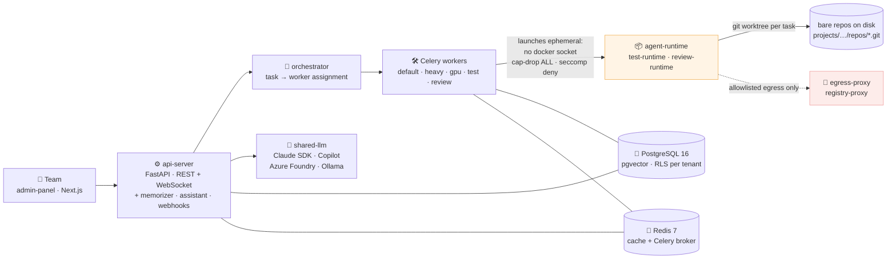

**English** · [Español](README.es.md)

# agent-ai-multitenant

**A multi-tenant agentic platform where teams of specialist AI agents plan, write, test and review software — on one Docker Compose host, not Kubernetes.**

[](https://github.com/daycry/agent-ai-multitenant/actions/workflows/ci.yml)
[](https://github.com/daycry/agent-ai-multitenant/actions/workflows/build-runtime-templates.yml)
[](https://github.com/daycry/agent-ai-multitenant/actions/workflows/eval-on-prompt-change.yml)
[](LICENSE)
[](https://daycry.github.io/agent-ai-multitenant/)

[](https://github.com/daycry/agent-ai-multitenant)
[](https://github.com/daycry/agent-ai-multitenant/forks)
[](https://github.com/daycry/agent-ai-multitenant/issues)
[](https://github.com/daycry/agent-ai-multitenant/commits/master)
[](https://github.com/daycry/agent-ai-multitenant/pulse)
[](https://github.com/daycry/agent-ai-multitenant/graphs/contributors)

[](pyproject.toml)
[](apps/api-server)
[](docker/docker-compose.yml)
[](docker/docker-compose.yml)
[](apps/admin-panel)
[](docker/docker-compose.yml)

[](docs/05-architecture-decisions/README.md)
[](apps/api-server/migrations/versions)
[](docker/agent-runtimes)
[](docs/04-reference/README.md)

> The four counters above are not decorative: [`tests/unit/test_readme_badges_do_not_lie.py`](tests/unit/test_readme_badges_do_not_lie.py)
> counts the real files and breaks the build when a number in this README stops
> matching the repository. Every relative link on this page is checked by the
> same test.

## What this is

You describe what you want built. A **Plan** is produced — an ordered set of tasks
with DAG dependencies — and a team of specialist agents (Project Manager,
Architect, Backend, Frontend, QA, Reviewer, Technical Writer…) executes it in
parallel against a real git repository, running the project's own test suite in
its own toolchain, opening a pull request when the plan closes.

It runs as a **Docker Compose stack on a single machine**. Multi-tenancy is
scoped to departments and teams inside an organisation, not mass-market SaaS.
Kubernetes and multi-host are explicitly out of scope.



## What makes it different

| Design decision                       | What it buys you                                                                                                                                                                                       |
| ------------------------------------- | ------------------------------------------------------------------------------------------------------------------------------------------------------------------------------------------------------ |
| **The Plan is the unit of change**    | A plan becomes a git branch `plan/{id}-{slug}`; every task commit carries `Plan-Id` / `Task-Id` / `Execution-Id` trailers; closing the plan opens one PR. You review a coherent change, not 40 commits |
| **Dual Kanban**                       | A management board of Plans on top, an operational board of Tasks inside each plan. Never one flat board mixing tasks from several plans                                                               |
| **Multi-tenancy from day one**        | `tenant_id` on every table, PostgreSQL RLS enabled, middleware that injects the tenant on every request, and cross-tenant leak tests in CI                                                             |
| **Agents never run code in a worker** | Workers only orchestrate. Untrusted code runs in ephemeral containers with restricted networking, no Docker socket, `cap-drop ALL` and a default-deny seccomp profile                                  |
| **Your stack, not ours**              | 14 maintained test-runtime images (pytest, jest, vitest, playwright, phpunit, pest, go, maven, gradle, rspec, cargo, dotnet, shell, http) so the agent runs _your_ suite                               |
| **Layered declarative guardrails**    | Platform → tenant → project, applied at four points of the cycle: `pre_llm`, `post_llm`, `pre_tool`, `post_tool`                                                                                       |
| **Human approval where it matters**   | 13 categories of sensitive action × 4 policy templates (Sandbox, Development, Production, External Client), plus an `ask_human` tool the agent itself can call. Per plan, never a checkbox per task    |
| **LLM providers are a closed set**    | Claude Agent SDK, GitHub Copilot, Azure AI Foundry via APIM, and Ollama — behind one async `LLMProvider` protocol. A fifth provider requires a written ADR                                             |
| **Decisions are written down**        | 167 ADRs, a precedence chain for when two documents disagree, and tests that fail when the documentation stops describing the repository                                                               |

## Get started

Prerequisites: Docker Engine 24+, Docker Compose v2+, Python 3.12+, Node.js 20+,
Git 2.40+. Windows works with Docker Desktop.

```bash
git clone https://github.com/daycry/agent-ai-multitenant.git
cd agent-ai-multitenant
```

**1. Bootstrap the Python dev environment** — creates `.venv/`, installs the
local packages editable, registers the pre-commit hook. Idempotent.

```bash
./scripts/dev/bootstrap.sh        # Linux / macOS
.\scripts\dev\bootstrap.ps1       # Windows
```

**2. Bring up the stack.** Infrastructure (PostgreSQL + pgvector, Redis, MinIO,
Vault, ClamAV, docling-serve, egress-proxy, Ollama) lives in Compose; the
`api-server` and `admin-panel` run from source in dev mode:

```bash
./scripts/dev/up.sh               # Linux / macOS  (add --monitoring for Grafana)
.\scripts\dev\up.ps1              # Windows
```

The dev Postgres binds host port **15432**, not 5432, so it does not collide
with a local Postgres. Give the containers 30–60 s to report healthy
(`docker compose ps`), then follow
[getting started](docs/02-getting-started/README.md) to seed a tenant and run
your first plan.

### Installing it, rather than developing on it

Three paths, decided in
[ADR 0161](docs/05-architecture-decisions/0161-distribucion-e-instalacion-de-la-plataforma.md).
They differ in what you need to have before you start:

**(1) Without cloning.** Download the bootstrap compose, **read it**, then run
it. It is deliberately two commands and not one magic line: the artifact is
meant to be audited before it executes.

```bash
curl -fsSLO https://raw.githubusercontent.com/daycry/agent-ai-multitenant/master/docker/bootstrap/docker-compose.generate.yml
# read it, then:
docker compose -f docker-compose.generate.yml run --rm generate
cd /data/agent-platform && docker compose up -d --wait
```

The installer **generates and does not provision**: it writes the boot tree and
exits, and never talks to the Docker daemon. That is why it does not mount
`/var/run/docker.sock` — mounting it is effective root on the host, which
[ADR 0060](docs/05-architecture-decisions/0060-acceso-daemon-docker-y-ruta-api-interna-sandbox.md)
rejected. **This path does not exist yet for a real user**: it needs the images
published — the installer's own included — and there is none on
`ghcr.io/daycry` today.

**(2) Cloning, with Compose.** What the `Get started` steps above describe. Good
for development and for reading the stack, but it gives you infrastructure and
not the product: the canonical compose brings up PostgreSQL, Redis, MinIO,
Vault and the rest, and the application services come from the generated
compose.

**(3) Unattended, with the scripts** — the supported path, and the only one
measured end to end:

```bash
./scripts/install.sh --config install.yaml   # profiles: scripts/install-profiles/
```

This CLI is the **real** install path. The HTTP wizard under `apps/installer` is
a simulation: it provisions nothing and the credentials it reveals are not real.

**What is proven.** On a clean Linux machine this path now runs to the end: 18
steps green, 22 services healthy, Alembic migrations applied, Vault initialised,
the first tenant seeded and its credentials revealed, the proxy serving HTTPS
and the login working with the revealed credential. That is the
[Install E2E](.github/workflows/install-e2e.yml) job, run `33197920542`, four
tests passed.

**What is not proven, and it is half the message.** That run **builds the six
images inside the job and serves them from a local registry**. It exercises the
installer, the generated compose and the boot sequence; it does **not** show
that installing from the **published** images works, because none is published.
That single gap is the whole distance between path (3), which works today with
locally built images, and path (1), which a user who has not cloned still cannot
use. Publishing is an operator action and no date is promised. State of each
path: [installation runbook](docs/06-runbooks/01-installation-from-scratch.md).

**Why any of that is believable.** The test behind it was written in June 2026
and had never run once: it was gated on `E2E_INSTALL=1`, no workflow set the
variable, and the gate falls in the fixture setup — so pytest collected the four
cases, skipped them, and exited 0. A green check that installed nothing. It now
runs **nightly and on manual dispatch**, and the job does not trust its own exit
code: an anti-false-green guard
([`scripts/check_e2e_install_report.py`](scripts/check_e2e_install_report.py))
reads the JUnit report and fails when any of the four required cases did not
actually execute. Turning it on took 24 runs and cost real defects, none of them
hypothetical: the AppArmor profile had never been applied and broke six things,
the workers were chowning every other service's data, the marketplace artifact
store was not wired, and the watchdog had inherited an HTTP probe without
serving HTTP.

Configuration is read from `docker/.env`, which is git-ignored. Platform
credentials live in **Vault**; the database stores only the pointer. The single
written exception — tenant-configured third-party secrets in Fernet-encrypted
columns — is argued in
[ADR 0146](docs/05-architecture-decisions/0146-fernet-en-db-vs-vault.md).

## Where to read more

All of this is browsable at
**[daycry.github.io/agent-ai-multitenant](https://daycry.github.io/agent-ai-multitenant/)**
— the same corpus, rendered and searchable, published from `master` by
[`docs.yml`](.github/workflows/docs.yml). The badge above tracks the real state of
the `github-pages` deployment, so it says "inactive" until the first publish
rather than claiming a site that is not there. The table below is the same map
inside the repository.

| Path                                                                          | What is in there                                                                                                |
| ----------------------------------------------------------------------------- | --------------------------------------------------------------------------------------------------------------- |
| [`CLAUDE.md`](CLAUDE.md)                                                      | The guiding principles, the real repository tree, and the document precedence chain                             |
| [`docs/01-overview/`](docs/01-overview/README.md)                             | What the product is and how it is put together                                                                  |
| [`docs/02-getting-started/`](docs/02-getting-started/README.md)               | Install, first run                                                                                              |
| [`docs/03-guides/`](docs/03-guides/README.md)                                 | Task guides — plus [`gotchas/`](docs/03-guides/gotchas/README.md), the toolchain traps we have already paid for |
| [`docs/04-reference/`](docs/04-reference/README.md)                           | Domain model, guardrails, auth/SSO, backup and restore, public API                                              |
| [`docs/05-architecture-decisions/`](docs/05-architecture-decisions/README.md) | Every architectural decision, with the option that was rejected and why                                         |
| [`docs/06-runbooks/`](docs/06-runbooks/README.md)                             | Operating procedures: upgrades, disaster recovery, key rotation, capacity                                       |
| [`docs/07-changelog/`](docs/07-changelog/README.md)                           | One entry per closed plan                                                                                       |
| [`docs/roadmap/`](docs/roadmap/README.md)                                     | The plans themselves, with their status in YAML frontmatter                                                     |

Before implementing anything, two documents are worth more than their length:
[gotchas](docs/03-guides/gotchas/README.md) (toolchain traps, with symptom, root
cause and fix) and
[verify before implementing](docs/03-guides/verificar-antes-de-implementar.md)
(the failure modes that produce no error at all — only lost work or unearned
confidence).

## Project status — what is _not_ published

Stated plainly, so nobody goes looking for something that is not there:

- **No release has been cut.** There are no git tags and no GitHub releases, so
  there is no version badge above.
- **The SDKs are not published.** `packages/sdk-python` and
  `packages/sdk-typescript` are generated from the OpenAPI v1 spec and live in
  this repository only. There is no `pip install agentic-platform-sdk` and no
  `npm install @agentic-platform/sdk` to run yet.
- **No container images are on a registry yet.** The application images publish
  to `ghcr.io/daycry/*` when a `v*` tag is pushed — the
  [Release images](.github/workflows/release-images.yml) workflow has never run,
  because no such tag exists. Until then, images are built locally by the dev
  scripts. This is now the only thing between the install path that has been
  measured — path (3), with images built in the job — and the one that needs no
  clone. (This line said `ghcr.io/agentic-platform/*` until 2026-08-27; the
  workflow derives the namespace from the repository owner, so it was wrong —
  and wrong in the one place a reader would copy it from.)
- **The install wizard does not install.** The nine-step HTTP wizard under
  `apps/installer` runs against a fake executor: it provisions nothing and the
  credentials it reveals at the end are not real. The supported path is the CLI
  above. Of the two breakages measured in
  [ADR 0161](docs/05-architecture-decisions/0161-distribucion-e-instalacion-de-la-plataforma.md),
  the second — the generated compose referring to files nobody wrote — is
  repaired. The first, the missing published images, is not fixed, but it is now
  **bounded**: the install e2e drives the whole sequence to the end on a clean
  Linux host with images built inside the job, so what is left is publishing
  them, not finding out what else breaks. So: a clean Linux host can be
  installed today from a clone; what nobody can do yet is install from published
  images, which is exactly what a user who does not clone needs.
- **There is no published coverage number**, because no coverage service is
  wired up. CI enforces a ratchet floor on the unit subset instead
  ([`ci.yml`](.github/workflows/ci.yml), job `test-unit`).
- **The documentation site is built but not published yet.** The
  [Docs site](.github/workflows/docs.yml) workflow builds `docs/` with MkDocs on
  every pull request, and `mkdocs build --strict` is the gate that fails a dead
  link before it reaches `master`. Publishing waits on one manual switch that
  only the repository owner can throw — Settings → Pages → Source: GitHub
  Actions — so there is no live URL to link to today and `docs/` reads directly
  on GitHub. That is also why there is no badge for that workflow: it has never
  run on `master`, and a badge for it would render "no status".

Verify any of that yourself rather than trusting this list:

```bash
git tag                                              # no tags
gh release list --repo daycry/agent-ai-multitenant   # no releases
ls docs/05-architecture-decisions/[0-9]*.md | wc -l  # the ADR badge number
ls apps/api-server/migrations/versions/*.py | wc -l  # the migrations badge number
```

## Documentation language

English is canonical and Spanish rides alongside it in a `.es.md` sidecar —
`foo.md` is the English document, `foo.es.md` its translation, and both link to
each other in the header. The policy and its guard are written up in
[bilingual documentation](docs/03-guides/bilingual-docs.md).

The rest of the corpus is honestly described as **Spanish today, translated
incrementally**. It is large — 167 ADRs, a full gotchas catalogue, seven
canonical documentation folders, the roadmap — with internal links and static
guards over all of it, so a big-bang translation would break more than it
delivers. Documents carry a `docs_language` field in their YAML frontmatter, and
the ADR template already renders English headings when it is set to `en`. New
top-level documents are written in both languages from the start.

## Contributing

The default branch is `master`, and nothing is pushed to it directly: one pull
request per plan. Conventional Commits with `Plan-Id` / `Task-Id` /
`Execution-Id` trailers; `black`, `ruff` and `mypy --strict` on Python;
`prettier` and `eslint` with no `any` on TypeScript. The details are in
[`docs/context/conventions.md`](docs/context/conventions.md).

```bash
.venv/Scripts/python.exe -m pytest tests/unit -q    # fastest meaningful gate
pre-commit run --all-files
```

## License

[MIT](LICENSE) © daycry
