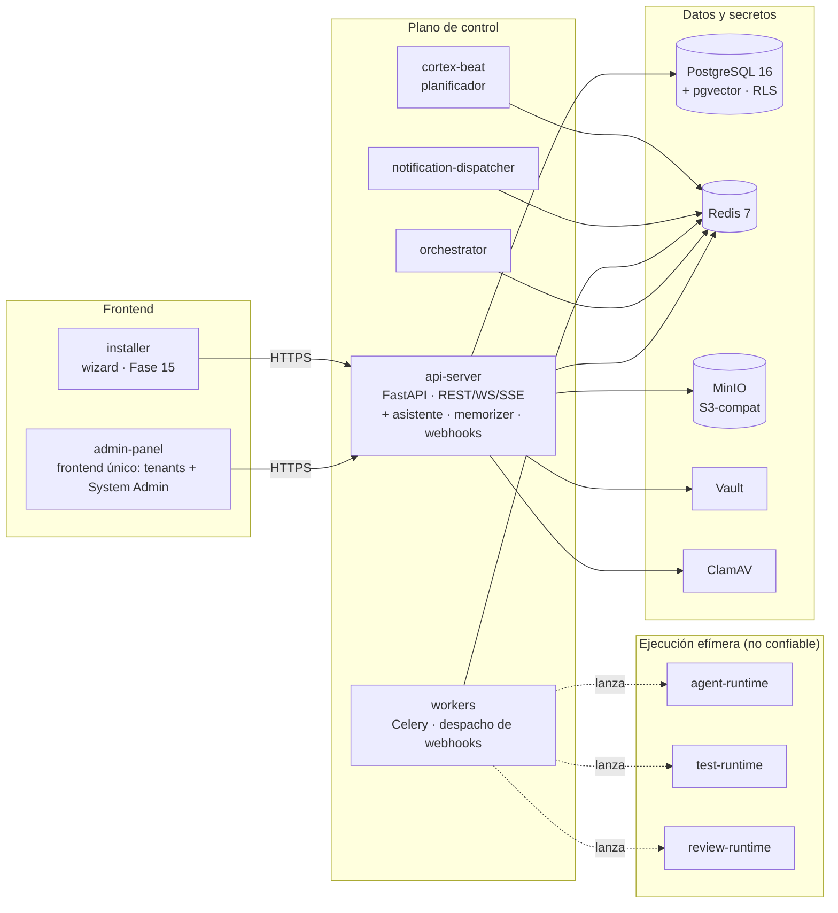

# Arquitectura (resumen)

Esta página resume **cómo encajan las piezas** del sistema final. Para
el detalle end-to-end (diagramas de componentes, flujo de un plan,
topología multi-tenant, planos de control vs ejecución) ve a
[`docs/context/architecture-overview.md`](../context/architecture-overview.md);
la fuente de verdad de producto sigue siendo el `.docx` maestro.

## Componentes en una máquina (Docker Compose)

> **El memorizer, el asistente personal y el despacho de webhooks no son
> contenedores.** Son módulos que viven dentro de `api-server` (los dos
> primeros) y dentro de los workers (el tercero), por el
> [ADR 0033](../05-architecture-decisions/0033-personal-assistant-en-api-server-reutilizando-chat.md).
> Este diagrama los dibujaba como servicios propios, y quien leía eso buscaba
> contenedores que nunca arrancan. Lo vigila
> `tests/docs/test_diagram_guards.py::test_no_mermaid_diagram_draws_a_phantom_service`.

Los diagramas de detalle —máquinas de estados de Plan y Tarea, los dos
significados de «review», el aislamiento multi-tenant y el del sandbox— están
en [03-diagrams.es.md](./03-diagrams.es.md) ([English](./03-diagrams.md)).

## Planos: control vs ejecución

- **Plano de control** (api-server, orchestrator, workers,
  notification-dispatcher, cortex-beat): código de la plataforma,
  confiable. Los **workers nunca ejecutan código del usuario**: orquestan
  contenedores.
- **Plano de ejecución** (agent-runtime, test-runtime, review-runtime):
  contenedores **efímeros y no confiables** con red restringida, sin
  socket Docker, `cap-drop ALL` y perfiles seccomp/AppArmor (confiables
  vs no confiables — ver
  [ADR 0040](../05-architecture-decisions/0040-seccomp-apparmor-default-deny-por-contenedor.md)
  y [ADR 0012](../05-architecture-decisions/0012-aislamiento-contenedores-agent-runtime.md)).
  El catálogo de **runtime templates** políglotas (`python-pytest`,
  `node-jest`, `php-phpunit`, `dotnet-test`, …) define qué stack ejecuta
  los tests.

## Servicios de infraestructura

| Servicio                 | Propósito                                       | Notas                       |
| ------------------------ | ----------------------------------------------- | --------------------------- |
| PostgreSQL 16 + pgvector | datos relacionales + embeddings                 | RLS activado desde día 1    |
| Redis 7                  | sesiones server-side, broker Celery, rate-limit | AOF + RDB                   |
| MinIO                    | object storage S3-compatible                    | consola en puerto 9001      |
| Vault                    | gestión de secretos (incl. credenciales LLM)    | KV v2; unseal Shamir 3-of-5 |
| ClamAV                   | antivirus de uploads                            | freshclam mantiene firmas   |

## Apps del producto

| App                            | Rol                                                                                                                |
| ------------------------------ | ------------------------------------------------------------------------------------------------------------------ |
| `apps/api-server`              | FastAPI: REST/WebSocket/SSE, RBAC, middleware multi-tenant (RLS).                                                  |
| `apps/orchestrator`            | Asigna tareas listas del DAG a los workers.                                                                        |
| `apps/workers`                 | Celery (default/heavy/gpu/ingestion/test/review): orquestan runtimes.                                              |
| `apps/memorizer`               | RESERVADA (vacía): indexa memoria (4 scopes) y destila ejecuciones **dentro de `api-server`** (ADR 0033).          |
| `apps/personal-assistant`      | RESERVADA (vacía): el asistente por usuario vive **dentro de `api-server`** (ADR 0033).                            |
| `apps/notification-dispatcher` | Entrega notificaciones multicanal.                                                                                 |
| `apps/webhook-dispatcher`      | RESERVADA (vacía): el despacho de webhooks vive **en los workers**.                                                |
| `apps/admin-panel`             | Next.js 14 — frontend ÚNICO: tenants + System Admin, separados por RBAC y rutas (ADR 0117 c). Incl. `/admin/docs`. |
| `apps/installer`               | Bootstrap (Fase 15). El CLI aprovisiona; el wizard HTTP simula (prod-09).                                          |

## Modelo multi-tenant

- `organizations` (= tenants) — una fila por organización cliente.
- `users` — globales; un user puede pertenecer a varias orgs vía
  `user_org_memberships` (tenant-scoped, M:N + rol).
- RLS sobre cada tabla tenant-scoped:
  `tenant_id = NULLIF(current_setting('app.tenant_id', true), '')::uuid`.
- `app_user` (runtime) es **NOBYPASSRLS** — toda query respeta la
  policy; las migraciones y los endpoints `system_admin` platform-global
  usan un rol **BYPASSRLS** (`get_admin_session`). Tablas platform-global
  (`llm_providers`, `model_prices`, `exchange_rates`, fuentes del
  marketplace) viven sin `tenant_id` — ver
  [referencia de RBAC](../04-reference/rbac.md) y
  [ADR 0028](../05-architecture-decisions/0028-platform-global-providers.md).

## Auth

- Passwords con **Argon2id**; **SSO** (OIDC/SAML) + **MFA** (TOTP +
  WebAuthn) + **SCIM** junto al login con contraseña — ver
  [referencia auth/SSO](../04-reference/auth-sso.md).
- JWT HS256 con `sub`, `sid`, `iat`, `exp`, `tid?`, `sys?`; `sid` apunta
  a una sesión Redis revocable.
- **API pública v1** con tokens por scope (read/write) — ver
  [referencia de API pública](../04-reference/public-api.md).

## Observabilidad

- `structlog` con renderer JSON y máscara de PII.
- OpenTelemetry: auto-instrumentación de FastAPI, SQLAlchemy, asyncpg,
  Redis, httpx; propagación W3C TraceContext entre servicios. Exporta a
  Tempo + Loki + Grafana.

## Próximos pasos

- [Arquitectura end-to-end](../context/architecture-overview.md).
- [Modelo de dominio](../04-reference/domain-model.md).
- [Instalación](../02-getting-started/01-installation.md).
