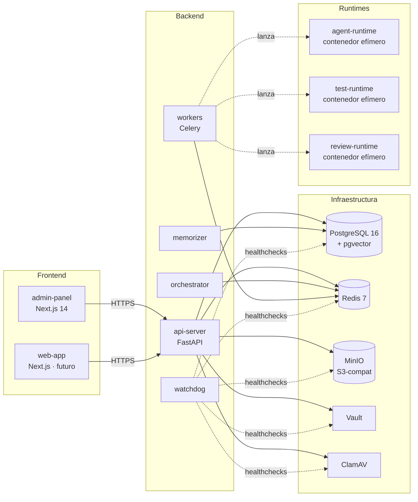

# Arquitectura

Esta página resume **cómo encajan las piezas**. Para profundidad,
ver `docs/context/architecture-overview.md` y la sección 5 del
documento maestro (`especificaciones-completas.docx`).

## Componentes en una máquina

## Servicios de infraestructura (Fase 00)

| Servicio                 | Propósito                                       | Notas                       |
| ------------------------ | ----------------------------------------------- | --------------------------- |
| PostgreSQL 16 + pgvector | datos relacionales + embeddings                 | RLS activado desde día 1    |
| Redis 7                  | sesiones server-side, broker Celery, rate-limit | AOF + RDB                   |
| MinIO                    | object storage S3-compatible                    | consola en puerto 9001      |
| Vault                    | gestión de secretos                             | KV v2; unseal Shamir 3-of-5 |
| ClamAV                   | antivirus de uploads                            | freshclam mantiene firmas   |

## Apps del producto (Fase 00)

| App                | Rol                                                                                                                                                                      |
| ------------------ | ------------------------------------------------------------------------------------------------------------------------------------------------------------------------ |
| `apps/api-server`  | FastAPI con `/auth/*` (register/login/logout/me) y `/admin/*` (tenants/users/system-health). Middleware multi-tenant que setea `app.user_id` y `app.tenant_id` para RLS. |
| `apps/admin-panel` | Next.js 14 — login + dashboard de salud del sistema.                                                                                                                     |
| `apps/watchdog`    | servicio Python que vigila contenedores y reinicia los que se caen con backoff exponencial.                                                                              |

Los demás (`apps/orchestrator`, `apps/workers`, `apps/memorizer`,
`apps/personal-assistant`, `apps/notification-dispatcher`,
`apps/webhook-dispatcher`, `apps/installer`, `apps/web-app`)
llegan en fases posteriores.

## Modelo multi-tenant

- `organizations` (= tenants) — una fila por organización cliente.
- `users` — globales; un user puede pertenecer a varias orgs vía
  `user_org_memberships` (tenant-scoped, M:N + rol).
- RLS sobre cada tabla tenant-scoped:
  `tenant_id = current_setting('app.tenant_id')::uuid`.
- `migrations_user` (Alembic) tiene `BYPASSRLS`. `app_user` (runtime)
  **no** lo tiene — toda query respeta la policy.

## Auth

- Passwords con **Argon2id** (time_cost=3, mem=64MiB, parallelism=4).
- JWT HS256 con `sub`, `sid`, `iat`, `exp`, `tid?`, `sys?`.
- `sid` apunta a una sesión Redis revocable; logout invalida al
  instante.
- Rate-limit en login: 5 intentos / 15 min por IP **y** por email.

## Observabilidad (Fase 00)

- `structlog` con renderer JSON, máscara de PII (email, IBAN,
  DNI/NIE, JWT, Bearer).
- OpenTelemetry: auto-instrumentación de FastAPI, SQLAlchemy,
  asyncpg, Redis, httpx. Propagación W3C TraceContext entre
  servicios. `trace_id` / `span_id` añadidos a los logs.
- Phase 12 conectará el exportador OTLP a Tempo + Loki + Grafana.

## Próximos pasos

- [Instalación](../02-getting-started/01-installation.md).
- [Primer arranque](../02-getting-started/03-first-run.md).
