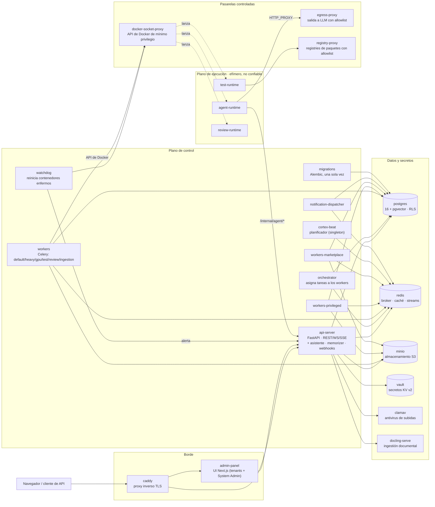
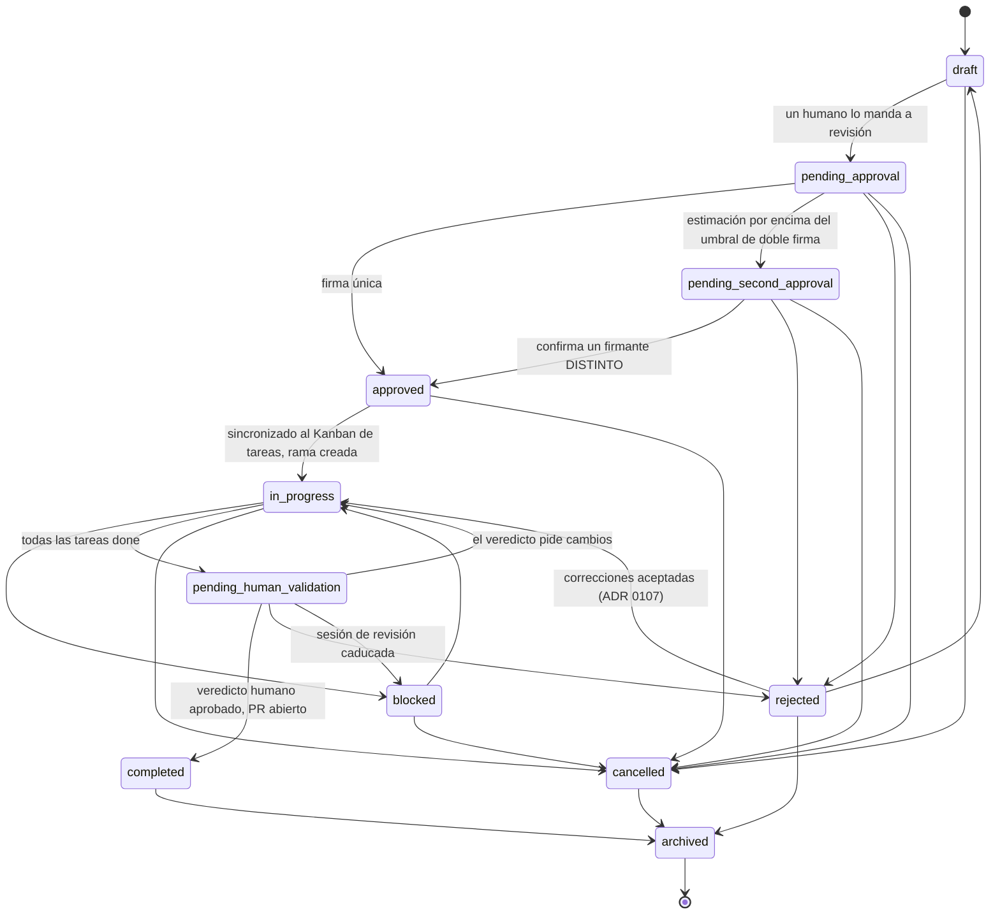
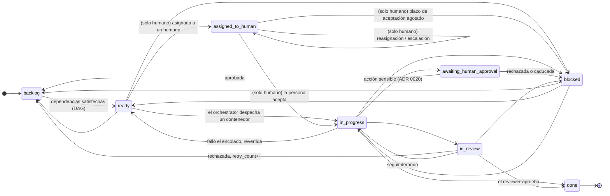
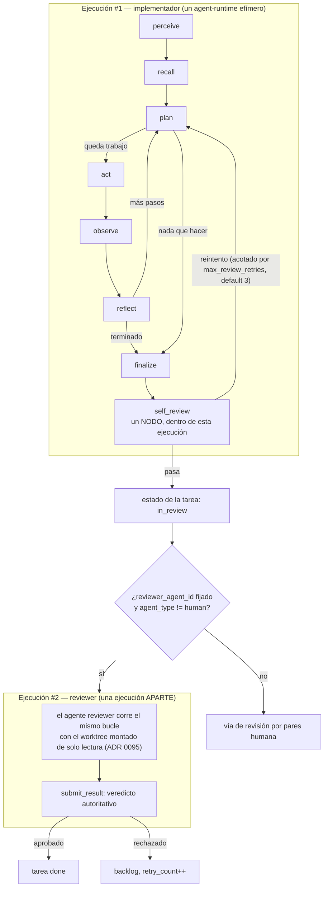
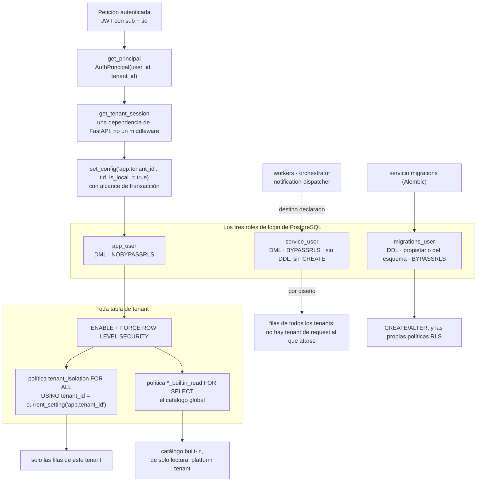
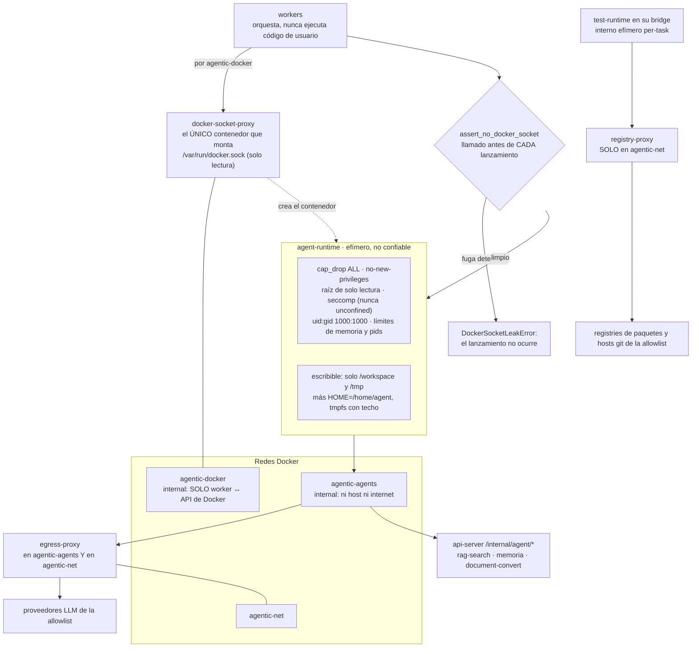

# Diagramas de arquitectura

> **Idioma:** [English](./03-diagrams.md) (canónico) · **castellano**

Seis diagramas, cada uno para una pregunta que la prosa contesta mal, dibujados desde el
código que decide la respuesta. Cada diagrama nombra su **fuente de verdad** y dice **qué
omite**: un dibujo que se calla lo que deja fuera es como empieza a mentir.

Los vigila [`tests/docs/test_diagram_guards.py`](../../tests/docs/test_diagram_guards.py),
que los compara contra el código: las dos máquinas de estados arista por arista, los
nombres de servicio contra la lista del instalador, los roles de base de datos contra el
SQL que los crea y las banderas del sandbox contra el módulo que las fija. También
comprueba que este fichero y su gemelo inglés dibujen los **mismos identificadores de
nodo**, para que una traducción a medias falle en vez de irse separando.

| #                                          | Qué pregunta contesta                                                       |
| ------------------------------------------ | --------------------------------------------------------------------------- |
| [1](#1-topología-del-stack)                | Qué contenedores existen y quién habla con quién                            |
| [2](#2-ciclo-de-vida-de-un-plan)           | Todos los movimientos legales de un Plan, y quién los hace                  |
| [3](#3-ciclo-de-vida-de-una-tarea)         | Todos los movimientos legales de una Tarea, de IA y humanos                 |
| [4](#4-las-dos-cosas-que-se-llaman-review) | Por qué `self_review` y «el reviewer» no son lo mismo                       |
| [5](#5-aislamiento-multi-tenant)           | Cómo llega `tenant_id` a PostgreSQL, y qué rol se lo puede saltar           |
| [6](#6-aislamiento-por-contenedor)         | Por qué un worker no ejecuta código de usuario, y qué no alcanza el runtime |

---

## 1. Topología del stack

**Fuente de verdad:** `CORE_SERVICES` en
`apps/installer/backend/src/installer_backend/compose_generator.py` — la lista de
servicios que el instalador genera de verdad. Si una caja de abajo no está en esa lista,
la guarda falla.

**Qué omite, a propósito.** Los overlays opcionales — `ollama` + `ollama-bootstrap`
(modelos locales), `stt` + `tts` (voz, ADR 0073) y los seis servicios de observabilidad
(`prometheus`, `textfile-init`, `node-exporter`, `alertmanager`, `cadvisor`, `grafana`) —
porque son opt-in y dibujarlos convierte un diagrama legible en un inventario. También
omite la mayoría de aristas: solo se dibujan las verificadas en el generador y en el
compose. Un stack con los overlays encendidos pasa holgadamente de veinte contenedores, y
por eso este diagrama elige.

Los tres runtimes efímeros **no** son servicios: ningún compose los declara, el worker
los lanza por tarea y mueren con ella. De eso va el
[diagrama 6](#6-aislamiento-por-contenedor).

---

## 2. Ciclo de vida de un Plan

El Plan es la unidad de cambio (principio rector 5): un plan, una rama git, un PR.

**Fuente de verdad:** la tabla de adyacencia `_TRANSITIONS` de
`apps/api-server/src/api_server/chat/plan_state_machine.py`. La guarda compara este
diagrama contra ella en **las dos direcciones**, así que falla tanto una arista dibujada
que no es legal como una arista legal que no está dibujada.

Tres cosas que el dibujo hace visibles y la prosa no:

- **A `approved` y `completed` no se llega por el `PUT` genérico.** Son de endpoints con
  puerta (`POST /plans/{id}/approve` y el veredicto humano), y eso es lo que impone
  `PRIVILEGED_PUT_TARGETS`. La flecha existe; la puerta está en otro sitio.
- **`pending_human_validation` tiene cuatro salidas, no dos.** Además de aprobar y
  rechazar, un veredicto que pide cambios devuelve el plan a `in_progress`, y una sesión
  de revisión caducada lo escala a `blocked`.
- **`archived` es el único estado terminal.** `completed` no es el final del grafo.

---

## 3. Ciclo de vida de una Tarea

**Fuente de verdad:** `_AI_TRANSITIONS` y `_HUMAN_OVERLAY` en
`apps/api-server/src/api_server/task_state_machine.py`.

Las aristas etiquetadas **`(solo humano)`** son el **overlay humano**: legales solo cuando
el agente asignado tiene `agent_type='human'`. El mismo movimiento en una tarea asignada a
IA levanta `TaskTransitionError`. La marca va en la etiqueta y no en el estilo de la flecha
porque la gramática de `stateDiagram-v2` de Mermaid solo acepta `-->`: una discontinua
`-.->` es sintaxis de flowchart y hace que el bloque entero no renderice. La guarda
comprueba la marca contra `_HUMAN_OVERLAY` en las dos direcciones.

**Qué omite, y la regla que hace segura la omisión:** todo estado no terminal puede pasar
además a `cancelled`. Esas siete aristas se dejan fuera — una por estado triplicaría las
flechas para decir una frase. La guarda comprueba la frase: si algún estado no terminal
pierde su arista a `cancelled`, o aparece un estado terminal nuevo, el test falla y este
párrafo tiene que cambiar con él.

`done` y `cancelled` son los estados terminales.

---

## 4. Las dos cosas que se llaman «review»

Este es el diagrama que se paga solo. El ADR
[0159](../05-architecture-decisions/0159-rigor-de-review-por-nivel-del-cambio.md) abre
avisando de que **hay dos mecanismos distintos llamados «review»**, de que el nombre
invita al error y de que el coste de confundirlos es una regresión de seguridad, no un bug
visible:

1. **`self_review`** — un nodo **dentro** del grafo LangGraph de una ejecución, acotado por
   `max_review_retries`, un límite duro de plataforma (default `3`) que vive en
   `platform_settings` sin `tenant_id` y que un tenant no puede aflojar (ADR 0013).
2. **El reviewer** — una **ejecución aparte**, despachada al entrar la tarea en
   `in_review`, cuyo veredicto es autoritativo (ADR 0087, ADR 0096).

**Fuentes de verdad:** el cableado de nodos y aristas en
`docker/agent-runtimes/agent-runtime/agent_runtime/graph.py` (`_AgentLoop.build`), la
constante `DEFAULT_MAX_REVIEW_RETRIES` de
`apps/api-server/src/api_server/db/platform_settings.py` y
`Orchestrator._on_task_in_review` en `apps/orchestrator/src/orchestrator/dispatch.py`.

Dos consecuencias que conviene decir a bocajarro, porque las dos han mordido a este
repositorio:

- **`max_review_retries` no es el número de pasadas del reviewer.** Acota el bucle de la
  caja #1. Cablear un «nivel de rigor» por tarea a esa constante sería apretar o aflojar
  una salvaguarda global, no añadir una pasada de review: exactamente el error del que
  avisa el ADR 0159.
- **Hoy hay exactamente una ejecución de reviewer por cada entrada en `in_review`**, y la
  guarda de idempotencia que protege de un evento re-entregado («¿hay alguna ejecución de
  esta tarea ya `running`?») es la misma que impediría una segunda pasada legítima.

---

## 5. Aislamiento multi-tenant

El principio rector 1, dibujado como está implementado — que no es exactamente como se
suele describir.

**Fuentes de verdad:** `open_tenant_session` en
`apps/api-server/src/api_server/auth/deps.py`, las definiciones de rol de
`docker/postgres/init/02-roles.sh` y `docker/postgres/init/04-service-role.sql`, y las
sentencias `FORCE ROW LEVEL SECURITY` de las migraciones Alembic.

- **`FORCE`, no solo `ENABLE`.** `ENABLE ROW LEVEL SECURITY` exime al propietario de la
  tabla; `FORCE` le quita la exención, así que la propiedad deja de ser un bypass
  accidental.
- **El punto de inyección es una dependencia, no un middleware.** `CLAUDE.md` habla de «un
  middleware que inyecta tenant_id»; el código lo ata en `open_tenant_session`, que es
  donde vive la garantía de verdad. `SET LOCAL` no acepta parámetros ligados a través de
  asyncpg, de ahí `set_config(..., is_local := true)`.
- **`service_user` es BYPASSRLS a propósito, y eso no es lo mismo que `migrations_user`.**
  Un worker procesa la ejecución del tenant que le toque sin un `app.tenant_id` de request
  al que atarse, así que tiene que ver cross-tenant. Lo que la separación le quita es el
  `GRANT ALL` sobre el esquema: un worker comprometido conectado como propietario podría
  ejecutar `ALTER TABLE agents DISABLE ROW LEVEL SECURITY` y desmontar el aislamiento de
  todos los demás.
- **La arista discontinua está discontinua porque no está cableada.** `service_user` se
  crea y se le pasa la contraseña (`docker/postgres/init/04-service-role.sql`,
  `05-service-role-password.sh`), pero ningún compose del repositorio ni ninguna vía del
  generador de compose del instalador conecta ningún servicio con él —
  `docker/docker-compose.manuals.yml` sigue conectando `orchestrator` y las colas de
  workers como `migrations_user`. Dibujar esa arista continua sería el dibujo afirmando
  una postura que el despliegue no tiene.

---

## 6. Aislamiento por contenedor

Principio rector 2: **los workers no ejecutan código de usuario.** Lanzan contenedores
efímeros y los orquestan.

**Fuentes de verdad:** `build_hardened_run_kwargs` y `assert_no_docker_socket` en
`apps/workers/src/workers/isolation.py`, `agent_network` en
`apps/workers/src/workers/config.py`, y las declaraciones de red de
`docker/docker-compose.yml` y del `_networks_block` del instalador.

- **El socket no se monta nunca en un worker, y menos en un runtime.** El worker alcanza
  la API de Docker por la red interna `agentic-docker` a través de `docker-socket-proxy`,
  que es el único contenedor con el socket montado, de solo lectura, y que vive solo en esa
  red — nunca en `agentic-net`, nunca en `agentic-agents`.
- **`assert_no_docker_socket` es un cable trampa, no una casilla.** Recorre los volúmenes y
  los mounts de la configuración de run antes de cada lanzamiento y levanta
  `DockerSocketLeakError`, para que una edición descuidada futura no pueda reintroducir el
  socket en silencio.
- **`agent-runtime` y los runtime templates no comparten salida.** El agente alcanza los
  proveedores LLM solo por `egress-proxy`; `registry-proxy` vive a propósito solo en
  `agentic-net`, así que un agente no puede llegar a GitHub ni a PyPI, mientras que un
  runtime template en su bridge per-task sí.
- **El runtime sí alcanza al `api-server`.** También está en `agentic-agents`, así que la
  API interna del agente (búsqueda RAG, memoria, conversión de documentos) funciona sin
  abrir la red (ADR 0060).

---

## Lo que NO se dibuja aquí, y por qué

La lista de diagramas que **no** se han hecho es parte del diseño. Cada uno de estos se
consideró y se descartó, o porque ya existe un diagrama o porque la forma de la
información no es un grafo.

| No dibujado                                   | Por qué                                                                                                                  |
| --------------------------------------------- | ------------------------------------------------------------------------------------------------------------------------ |
| Flujo end-to-end del chat de planning al PR   | Ya está en [architecture-overview](../context/architecture-overview.md). Redibujarlo crea una segunda fuente.            |
| Visibilidad del platform tenant y el catálogo | En el mismo documento, ya dibujado allí.                                                                                 |
| Bandeja y escalación de agentes humanos       | Ya está en [human-agents](../03-guides/human-agents.md).                                                                 |
| Selección de proveedor LLM (los cuatro)       | Una lista de cuatro sin ramificación. Una tabla se lee mejor que unas cajas (ADR 0021).                                  |
| Puntos de enganche de los guardrails          | Una cadena lineal de cuatro: `pre_llm → post_llm → pre_tool → post_tool`. Una frase gana a cuatro cajas.                 |
| Diagrama ER del dominio                       | Más de cien tablas; cualquier subconjunto es una elección arbitraria que envejece. Ver [04-reference](../04-reference/). |
| Scopes de memoria                             | Cuatro valores disjuntos (`private`, `team_shared`, `project_shared`, `global`). Una tabla, no un grafo.                 |

## Relacionado

- [02-architecture.md](./02-architecture.md) — el mismo stack en prosa, en una sola máquina.
- [architecture-overview](../context/architecture-overview.md) — la vista end-to-end de
  desarrollo, con los diagramas del flujo de un plan y del catálogo built-in.
- [Índice de ADR](../05-architecture-decisions/README.md) — las decisiones detrás de cada caja.
