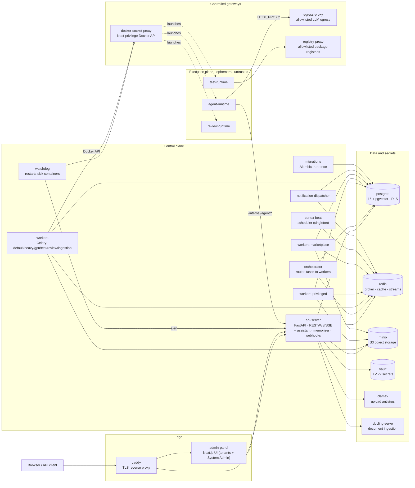
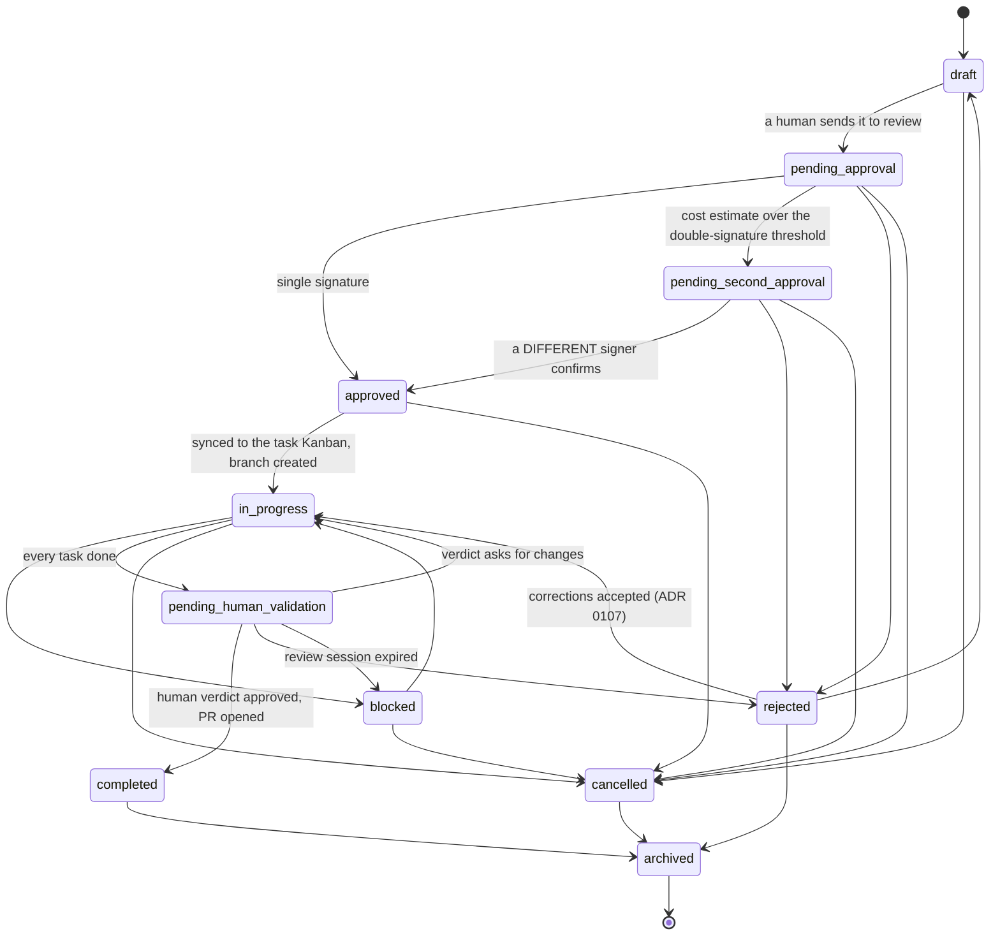
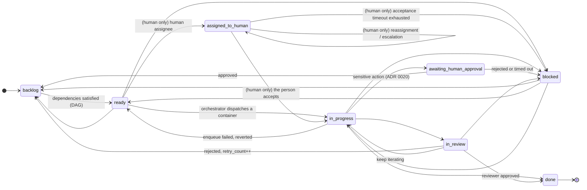
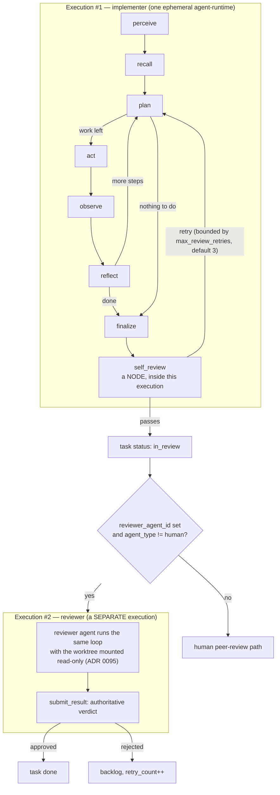
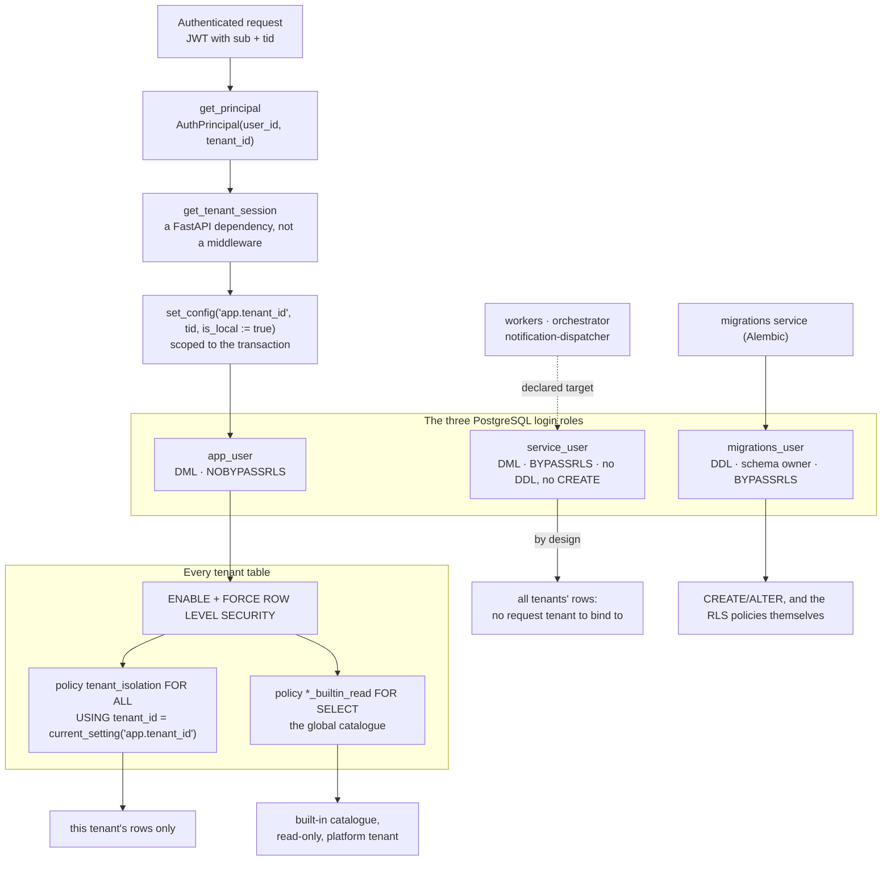
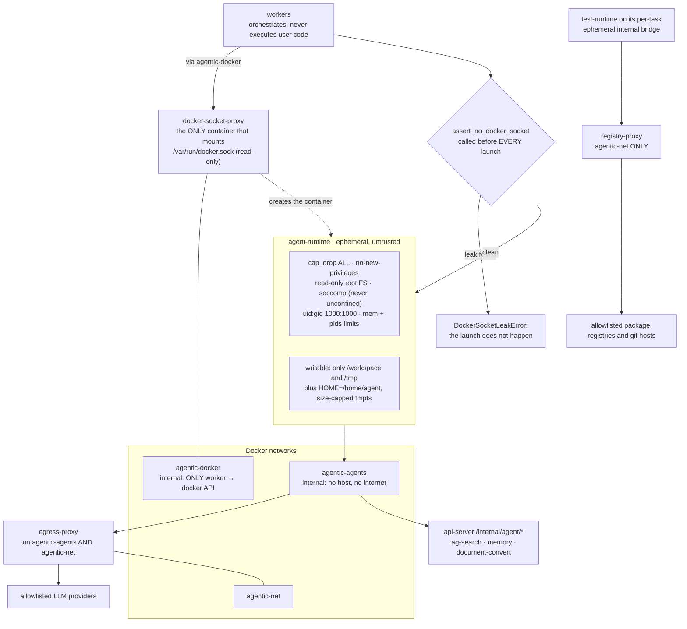

# Architecture diagrams

> **Language:** **English** (canonical) · [Español](./03-diagrams.es.md)

Six diagrams that each answer a question the prose answers badly, drawn from the code
that decides the answer. Every diagram names its **source of truth** and says **what it
omits** — a diagram that quietly leaves something out is how a drawing starts lying.

They are guarded by [`tests/docs/test_diagram_guards.py`](../../tests/docs/test_diagram_guards.py),
which compares them against the code: the two state machines edge by edge, the service
names against the installer's service list, the database roles against the SQL that
creates them, and the sandbox flags against the module that sets them. It also checks
that this file and its Spanish twin draw the **same node identifiers**, so a half-finished
translation fails instead of drifting.

| #                                    | Question it answers                                                  |
| ------------------------------------ | -------------------------------------------------------------------- |
| [1](#1-stack-topology)               | Which containers exist and who talks to whom                         |
| [2](#2-plan-lifecycle)               | Every legal move of a Plan, and who makes it                         |
| [3](#3-task-lifecycle)               | Every legal move of a Task, AI and human                             |
| [4](#4-the-two-things-called-review) | Why `self_review` and "the reviewer" are not the same thing          |
| [5](#5-multi-tenant-isolation)       | How `tenant_id` reaches PostgreSQL, and which role can skip it       |
| [6](#6-container-isolation)          | Why a worker never runs user code, and what the runtime cannot reach |

---

## 1. Stack topology

**Source of truth:** `CORE_SERVICES` in
`apps/installer/backend/src/installer_backend/compose_generator.py` — the list of
services the installer actually generates. If a box below is not in that list, the guard
fails.

**What it omits, on purpose.** The optional overlays — `ollama` + `ollama-bootstrap`
(local models), `stt` + `tts` (voice, ADR 0073) and the six monitoring services
(`prometheus`, `textfile-init`, `node-exporter`, `alertmanager`, `cadvisor`, `grafana`) —
because they are opt-in and drawing them turns a readable diagram into an inventory. It
also omits most edges: only the ones verified in the generator and the compose file are
drawn. A stack with the overlays on runs well over twenty containers, which is exactly
why this diagram chooses.

The three ephemeral runtimes are **not** services: no compose file declares them, the
worker launches them per task and they die with it. That is the subject of
[diagram 6](#6-container-isolation).

---

## 2. Plan lifecycle

The Plan is the unit of change (guiding principle 5): one plan, one git branch, one PR.

**Source of truth:** the `_TRANSITIONS` adjacency table in
`apps/api-server/src/api_server/chat/plan_state_machine.py`. The guard compares this
diagram against it in **both** directions, so a drawn edge that is not legal and a legal
edge that is not drawn both fail.

Three things the drawing makes visible that the prose does not:

- **`approved` and `completed` are not reachable through the generic `PUT`.** They belong
  to gated endpoints (`POST /plans/{id}/approve`, and the human verdict), which is what
  `PRIVILEGED_PUT_TARGETS` enforces. The arrow exists; the door is elsewhere.
- **`pending_human_validation` has four exits, not two.** Besides approve and reject, a
  verdict asking for changes returns the plan to `in_progress`, and an expired review
  session escalates it to `blocked`.
- **`archived` is the only terminal state.** `completed` is not the end of the graph.

---

## 3. Task lifecycle

**Source of truth:** `_AI_TRANSITIONS` and `_HUMAN_OVERLAY` in
`apps/api-server/src/api_server/task_state_machine.py`.

Edges labelled **`(human only)`** are the **human overlay**: legal only when the assigned
agent has `agent_type='human'`. The same move on an AI-assigned task raises
`TaskTransitionError`. The marker is in the label and not in the arrow style because
Mermaid's `stateDiagram-v2` grammar accepts only `-->`; a dotted `-.->` is flowchart
syntax and makes the whole block fail to render. The guard checks the marker against
`_HUMAN_OVERLAY` in both directions.

**What it omits, and the rule that makes the omission safe:** every non-terminal state
can also move to `cancelled`. All seven of those edges are left out — one per state
would triple the arrows to say one sentence. The guard checks the sentence: if any
non-terminal state ever loses its `cancelled` edge, or a new terminal state appears, the
test fails and this paragraph has to change with it.

`done` and `cancelled` are the terminal states.

---

## 4. The two things called "review"

This is the diagram that pays for itself. ADR
[0159](../05-architecture-decisions/0159-rigor-de-review-por-nivel-del-cambio.md) opens
with the warning that **two different mechanisms are called "review"**, that the name
invites the confusion, and that the cost of mixing them up is a security regression
rather than a visible bug:

1. **`self_review`** — a node **inside** one execution's LangGraph loop, bounded by
   `max_review_retries`, a hard platform limit (default `3`) that lives in
   `platform_settings` with no `tenant_id` and that a tenant cannot loosen (ADR 0013).
2. **the reviewer** — a **separate execution**, dispatched when the task enters
   `in_review`, whose verdict is authoritative (ADR 0087, ADR 0096).

**Sources of truth:** the node and edge wiring in
`docker/agent-runtimes/agent-runtime/agent_runtime/graph.py` (`_AgentLoop.build`), the
`DEFAULT_MAX_REVIEW_RETRIES` constant in
`apps/api-server/src/api_server/db/platform_settings.py`, and
`Orchestrator._on_task_in_review` in `apps/orchestrator/src/orchestrator/dispatch.py`.

Two consequences worth stating flat, because both have bitten this repository:

- **`max_review_retries` is not the number of reviewer passes.** It bounds the loop in
  box #1. Wiring a per-task "rigour level" to it would be tightening or loosening a
  global safeguard, not adding a review pass — exactly the mistake ADR 0159 warns about.
- **There is exactly one reviewer execution per entry into `in_review` today**, and the
  idempotency guard that protects against a re-delivered event ("is any execution of
  this task already `running`?") is the same guard that would block a legitimate second
  pass.

---

## 5. Multi-tenant isolation

Guiding principle 1, drawn as it is implemented — which is not quite how it is usually
described.

**Sources of truth:** `open_tenant_session` in
`apps/api-server/src/api_server/auth/deps.py`, the role definitions in
`docker/postgres/init/02-roles.sh` and `docker/postgres/init/04-service-role.sql`, and
the `FORCE ROW LEVEL SECURITY` statements in the Alembic migrations.

- **`FORCE`, not just `ENABLE`.** `ENABLE ROW LEVEL SECURITY` exempts the table owner;
  `FORCE` removes that exemption, so ownership stops being an accidental bypass.
- **The injection point is a dependency, not a middleware.** `CLAUDE.md` describes "a
  middleware that injects tenant_id"; the code binds it in `open_tenant_session`, which
  is where the guarantee actually lives. `SET LOCAL` cannot take bound parameters through
  asyncpg, hence `set_config(..., is_local := true)`.
- **`service_user` is BYPASSRLS on purpose, and that is not the same as `migrations_user`.**
  A worker processes whichever tenant's execution it is handed, with no request
  `app.tenant_id` to bind to, so it has to see across tenants. What the split takes away
  is `GRANT ALL` on the schema: a compromised worker connected as the owner could run
  `ALTER TABLE agents DISABLE ROW LEVEL SECURITY` and dismantle isolation for everyone.
- **The dashed edge is dashed because it is not wired yet.** `service_user` is created and
  its password is passed in (`docker/postgres/init/04-service-role.sql`,
  `05-service-role-password.sh`), but no checked-in compose and no path in the installer's
  compose generator connects any service as it — `docker/docker-compose.manuals.yml`
  still connects `orchestrator` and the worker lanes as `migrations_user`. Drawing that
  edge solid would be the drawing claiming a posture the deployment does not have.

---

## 6. Container isolation

Guiding principle 2: **workers never execute user code.** They launch ephemeral
containers and orchestrate them.

**Sources of truth:** `build_hardened_run_kwargs` and `assert_no_docker_socket` in
`apps/workers/src/workers/isolation.py`, `agent_network` in
`apps/workers/src/workers/config.py`, and the network declarations in
`docker/docker-compose.yml` and the installer's `_networks_block`.

- **The socket is never mounted into a worker, let alone a runtime.** The worker reaches
  the Docker API over the internal `agentic-docker` network through
  `docker-socket-proxy`, which is the only container with the socket bound, read-only,
  and which sits on that network alone — never on `agentic-net`, never on
  `agentic-agents`.
- **`assert_no_docker_socket` is a tripwire, not a check-box.** It scans the volumes and
  mounts of the run configuration before every launch and raises
  `DockerSocketLeakError`, so a careless future edit cannot silently reintroduce the
  socket.
- **`agent-runtime` and the runtime templates do not share an exit.** The agent reaches
  LLM providers through `egress-proxy` only; `registry-proxy` deliberately lives on
  `agentic-net` alone, so an agent cannot reach GitHub or PyPI, while a runtime template
  on its per-task bridge can.
- **The runtime can still reach `api-server`.** It is on `agentic-agents` too, so the
  agent's internal API (RAG search, memory, document conversion) works without opening
  the network (ADR 0060).

---

## What is not drawn here, and why

The list of diagrams **not** made is part of the design. Each of these was considered and
dropped, either because a diagram already exists or because the shape of the information
is not a graph.

| Not drawn                                       | Why                                                                                                                            |
| ----------------------------------------------- | ------------------------------------------------------------------------------------------------------------------------------ |
| Planning-chat-to-PR end-to-end flow             | Already drawn in [architecture-overview](../context/architecture-overview.md) (Spanish). Redrawing it creates a second source. |
| Platform tenant / built-in catalogue visibility | Same document, already drawn there.                                                                                            |
| Human-agent inbox and escalation                | Already drawn in [human-agents](../03-guides/human-agents.md).                                                                 |
| LLM provider selection (four providers)         | A four-item list with no branching. A table reads better than boxes (ADR 0021).                                                |
| Guardrail hook points                           | A linear chain of four: `pre_llm → post_llm → pre_tool → post_tool`. One sentence beats four boxes.                            |
| Domain ER diagram                               | Over a hundred tables; any subset is an arbitrary choice that rots. See [04-reference](../04-reference/).                      |
| Memory scopes                                   | Four disjoint values (`private`, `team_shared`, `project_shared`, `global`). A table, not a graph.                             |

## Related

- [02-architecture.md](./02-architecture.md) — the same stack in prose, one machine.
- [architecture-overview](../context/architecture-overview.md) — the end-to-end
  development view, with the plan flow and the built-in catalogue diagrams (Spanish).
- [ADR index](../05-architecture-decisions/README.md) — the decisions behind every box.
