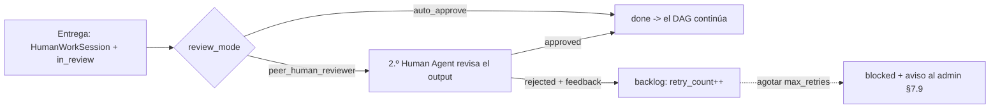

# Human Agents — crear, configurar, asignar y operar tareas humanas

Esta guía te lleva por todo el ciclo de un **Human Agent**: qué es, cómo
crearlo y configurarlo en tu tenant, cómo el PM lo asigna a tareas durante el
chat de planning, cómo el usuario asignado opera la tarea desde su **bandeja
personal**, los **modos de revisión** y cómo se imputa el **coste humano** al
plan y al budget.

> **Concepto clave (ADR 0046).** Un Human Agent es un **Agent** normal con
> `agent_type=human`: el sistema lo planifica, lo asigna a tareas del DAG, le
> imputa coste y lo audita **exactamente igual que a un agente IA**. La única
> diferencia es que lo "ejecuta" una persona, no un contenedor. Por eso un
> plan puede mezclar tareas IA y tareas humanas en el mismo Kanban.

## 1. Crear y configurar un Human Agent

Ve a la **galería de Human Agents** del panel del tenant. Tienes dos caminos:

### A. Desde una plantilla global (recomendado)

El sistema trae plantillas globales clonables: **Security Reviewer Senior**,
**Brand Lead**, **DBA Senior**, **Legal Reviewer**, **UX Lead**. Pulsa
**"Clonar y forkar al tenant"**: se crea una copia editable **dentro de tu
tenant**.

> **Las plantillas SIEMPRE se forkan, nunca se enlazan.** El campo
> `assigned_user_id` (la persona concreta) es intrínsecamente del tenant y no
> puede compartirse cross-tenant. Por eso no existe el modo "linked" para
> Human Agents (contraste con ADR 0006).

### B. Crear uno desde cero

Pulsa **"Nuevo Human Agent"** y rellena el formulario. Campos
(`human_agent_config`):

| Campo                            | Qué es                                                     |
| -------------------------------- | ---------------------------------------------------------- |
| **Usuario asignado**             | La persona concreta del tenant que ejecutará las tareas.   |
| **Tarifa / moneda**              | Coste por hora (ej. `50 EUR/h`) para imputar coste humano. |
| **Canales de notificación**      | email / in-app / asistente personal (si el user es admin). |
| **Timeout de aceptación (h)**    | Horas para aceptar antes de escalar (default **24**).      |
| **Escalation target**            | A quién se reasigna la tarea si no se acepta a tiempo.     |
| **Tiempo de respuesta esperado** | Estimación (h) para que el PM planifique.                  |
| **Tiempo de ejecución esperado** | Estimación (h) de duración del trabajo.                    |

> **MVP — modo de asignación `specific_user`.** En esta versión un Human Agent
> apunta a **una persona concreta**. Los modos `role_queue` (cola por rol) y
> `team_pool` (pool de equipo) llegan en iteración futura.

## 2. Asignar tareas humanas en el chat de planning

Durante el **chat de planning**, el **PM agente** ve los Human Agents de tu
tenant en la galería igual que los agentes IA, con su **tarifa**, sus
**tiempos esperados** y su **carga actual**. Puede asignarles tareas del DAG
sin distinción.

La **estimación del plan** integra cada tarea humana así:

```
duración estimada = expected_response_time_hours + expected_execution_time_hours
coste estimado     = hourly_rate * expected_execution_time_hours
```

> **Alerta de ruta crítica.** Si un Human Agent crítico (en la ruta crítica
> del DAG) está **sobrecargado** (flag `overloaded`), el chat de planning lo
> avisa durante el diseño del plan. En MVP esto **no bloquea**: es una alerta
> informativa (el calendario/disponibilidad llega en iteración futura).

## 3. La bandeja personal — "Tareas asignadas a mí"

Cualquier usuario con tareas humanas asignadas tiene en su panel la bandeja
**"Tareas asignadas a mí"**, con dos pestañas:

### Activas

Lista de tareas con su **estado** (`assigned` / `accepted` / `in_progress` /
`in_review`), proyecto, plan y deadline. Acciones contextuales:

- **Aceptar** → la tarea pasa a `in_progress`.
- **Rechazar** (con justificación) → vuelve a la cola / escala.
- **Escalar al admin**.
- **Marcar como completada** → abre el **formulario de entrega**.

El formulario de entrega pide: **textarea de output**, **attachments**
(archivos / URLs / screenshots) y un campo **opcional de horas trabajadas**.
Al enviarlo el sistema crea una **`HumanWorkSession`** (la trazabilidad
auditable, equivalente a una `Execution` de tarea IA) y transiciona la tarea a
`in_review`.

> **Las horas son la base del coste.** Si logueas horas, se imputan a la
> tarifa configurada. Si no logueas ninguna, el coste humano de esa sesión es
> **0** (el sistema nunca fabrica horas).

### Histórico

Tareas pasadas con tus **métricas personales**: tiempo medio de aceptación,
tiempo medio de ejecución y **% de tareas aprobadas a la primera**. Estas
métricas alimentan las **estimaciones futuras** del PM agente.

## 4. Modos de revisión (por proyecto)

El proyecto fija `human_task_review_mode`:



- **`auto_approve`** (default): entregar **es** finalizar. La tarea pasa a
  `done` sin paso de revisión extra. Ideal para tareas tipo "firma" o
  "decisión de marca".
- **`peer_human_reviewer`**: la tarea queda `in_review` y se asigna a **otro**
  Human Agent (el reviewer, resuelto desde `task.reviewer_agent_id`). El
  reviewer ve el output completo y **aprueba** (`→ done`) o **rechaza** con
  comentarios (`→ backlog`, `retry_count += 1`). Al agotar `max_retries`, la
  misma infra de §7.9 que usa el acceptance-timeout aparca la tarea en
  `blocked` y avisa al Tenant Admin.

> El modo `ai_reviewer` (un agente IA revisa output humano) **no está** en esta
> versión; se difiere a iteración futura.

## 5. Coste humano y budget

El coste humano se calcula `horas_trabajadas * tarifa` y se convierte a **USD
canónico** con el mismo catálogo FX que el coste IA (ADR 0043), de modo que es
comparable con el coste de los agentes IA en el dashboard.

- El **dashboard 13.7** segmenta **siempre** "AI cost" vs "Human cost".
- El campo **`Project.budget_includes_human_cost`** (default **false**)
  decide si el coste humano cuenta para el **budget**:
  - **false**: sólo el coste IA dispara alertas / auto-pausa; el coste humano
    se ve segmentado pero no afecta al presupuesto.
  - **true**: el coste humano **suma** al gasto que los umbrales y la
    auto-pausa (28.7.4) comparan contra el cap.

## 6. Acceptance timeout y escalación

Si el usuario asignado **no acepta** una tarea dentro de su
`acceptance_timeout_hours` (default 24), un sweep periódico la **reasigna
automáticamente** al `escalation_target_user_id`. Si el escalation target
**tampoco** acepta dentro del mismo timeout, la tarea pasa a **`blocked`** y se
notifica al **Tenant Admin**. El detalle operativo está en el runbook
[Operar tareas humanas](../06-runbooks/human-tasks-operations.md).

## 7. Asistente personal — preguntar por carga humana

Si tienes el [asistente personal](./roles-y-permisos.md) habilitado, dispones
de dos tools que respetan tu RBAC:

- **`tenant_human_workload`** — _"¿Cuántas tareas tiene Fulano esta semana?"_
  Cuenta asignaciones abiertas (`pending` + `accepted`) más las sesiones de la
  semana ISO. Sólo resuelve usuarios **de tu propio tenant**.
- **`tenant_human_assignments_pending`** — _"¿Qué tareas humanas llevan sin
  aceptar más de 24h?"_ Lista las asignaciones en `pending_acceptance` por
  encima del umbral de horas.

## Referencias

- [ADR 0046 — Human Agents: agent_type y workflows mixtos](../05-architecture-decisions/0046-human-agents-agent-type-y-workflows-mixtos.md)
- [Runbook — Operar tareas humanas](../06-runbooks/human-tasks-operations.md)
- [ADR 0043 — Coste USD canónico + budgets con auto-pausa](../05-architecture-decisions/0043-coste-usd-canonico-fx-de-visualizacion-budgets-con-auto-pausa.md)
- [ADR 0008 — Doble Kanban planes/tareas](../05-architecture-decisions/0008-dual-kanban-planes-tareas.md)
- [Roles y permisos](./roles-y-permisos.md)
- [Changelog Plan 16](../07-changelog/16-human-agents.md)
