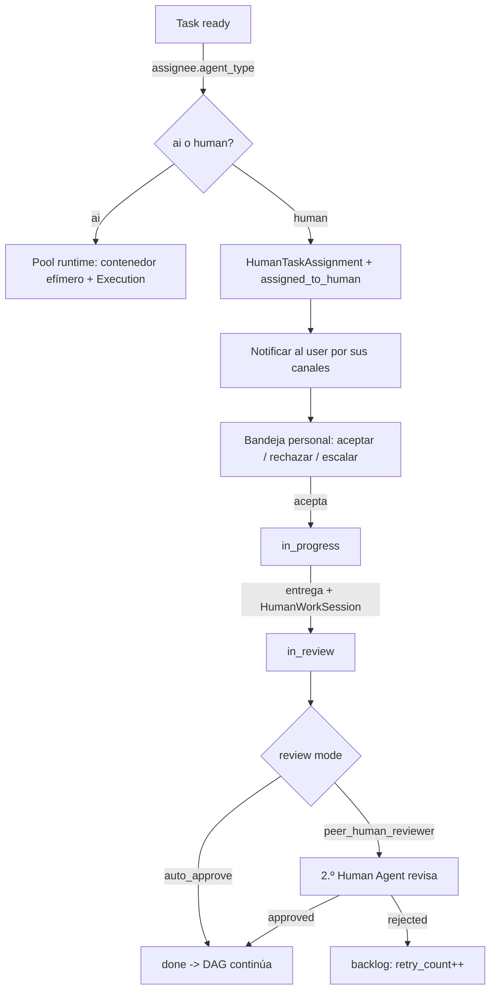

# ADR 0046 — Human Agents: `agent_type` en la entidad Agent + workflows mixtos

## Contexto

Hasta el Plan 16 **todas** las tareas de un plan las ejecuta un agente IA en
un contenedor `agent-runtime` efímero. Muchos flujos reales necesitan, sin
embargo, un **paso humano dentro del propio DAG**: revisión legal, decisión
de marca, firma del cliente, audit de seguridad, intervención DBA en
producción. Modelarlos como **interrupciones externas** (un `awaiting_human`
genérico fuera del plan, ADR 0020) los deja invisibles para el PM agente, no
imputa coste ni duración, y rompe la trazabilidad auditable.

El requisito es que el sistema **planifique, orqueste, mida coste/duración y
audite** esos pasos humanos exactamente igual que un paso IA, en el mismo
plan, en el mismo doble Kanban (ADR 0008), bajo la misma máquina de estados
(§7.2) y el mismo motor de revisión/retry (§7.9). La pregunta de diseño es
**cómo representar a un humano** dentro de un sistema cuya unidad de trabajo
es "un Agent asignado a una Task".

## Decisión

### 1. Un humano es un **Agent** con `agent_type='human'`, no una entidad nueva

Se añade un enum **`agent_type` ∈ {`ai`, `human`}** (default `ai`) a la
entidad `Agent` existente, en vez de crear una tabla/jerarquía separada de
"humanos". Migración **0066** (`agent_type_check`): columna `TEXT NOT NULL
DEFAULT 'ai'` + CHECK `ck_agents_agent_type`, de modo que **todos los agentes
existentes quedan `ai`** sin tocar dato alguno.

La config específica del humano vive en una tabla 1:1 satélite
**`human_agent_config`** (migración **0067**), no en columnas dispersas de
`agents`:

| Campo                           | Tipo / nota                                        |
| ------------------------------- | -------------------------------------------------- |
| `agent_id`                      | FK → `agents.id` (1:1, el Agent humano)            |
| `assignment_mode`               | MVP: sólo `specific_user` (CHECK)                  |
| `assigned_user_id`              | FK → `users.id` — la persona concreta              |
| `hourly_rate` / `..._currency`  | tarifa para imputar coste (ej. 50 EUR/h)           |
| `notification_channels`         | JSONB (email / in-app / asistente personal)        |
| `acceptance_timeout_hours`      | default 24 — ventana para aceptar antes de escalar |
| `escalation_target_user_id`     | FK → `users.id` — a quién se reasigna al expirar   |
| `expected_response_time_hours`  | estimación para el PM agente                       |
| `expected_execution_time_hours` | estimación para el PM agente                       |

**Por qué reutilizar `Agent`** (y no una entidad `HumanWorker` paralela):

- **Simetría con todo el sistema**: el DAG, el chat de planning, el doble
  Kanban, el registro auditable, la galería del tenant y el forking
  linked-vs-forked (ADR 0006) ya operan sobre `Agent`. Un humano "es asignable
  a una Task" igual que un IA → es un `Agent`. Cero duplicación de la lógica
  de asignación/orquestación.
- **Plantillas clonables coherentes**: las plantillas globales de Human Agent
  (`Security Reviewer Senior`, `Brand Lead`, `DBA Senior`, `Legal Reviewer`,
  `UX Lead` — seed `human_agent_templates.py`) son `Agent` globales que se
  **forkan obligatoriamente al tenant** (no linked) porque el
  `assigned_user_id` es intrínsecamente del tenant y no puede compartirse
  cross-tenant.
- **Un solo punto de divergencia**: lo único que cambia entre IA y humano es
  **quién/qué ejecuta** la tarea. Eso se resuelve con un `if agent_type` en el
  orquestador y en la máquina de estados, no con dos pipelines.

### 2. El **orquestador NO pide contenedor** para una tarea humana

Cuando `assignee.agent_type='human'`, el orquestador (`orchestrator/dispatch`)
**no solicita contenedor del pool** (no hay `agent-runtime`, no hay
`Execution`). En su lugar crea un **`HumanTaskAssignment`** (migración
**0069**: `task_id`, `human_agent_id`, `assigned_to_user_id` resuelto desde
`human_agent_config.assigned_user_id`, `assigned_at`, estado) y transiciona la
Task a `assigned_to_human`. El trabajo del humano se registra en
**`HumanWorkSession`** (migración **0068**: `start_at`, `end_at`,
`hours_logged`, `comments`, `output_files_attached` JSONB, `user_id`,
`task_id`, `tenant_id`) — el **reemplazo de `Execution`** como trazabilidad
auditable de una tarea humana.

### 3. Máquina de estados: transiciones humanas **gated por `agent_type`**

`task_state_machine.transition_task_status` (migración/lógica de §7.2,
task_16_04) añade las transiciones humanas y **las valida sólo si el
assignee es humano**:

- `ready → assigned_to_human`
- `assigned_to_human → in_progress` (el user acepta)
- `assigned_to_human → assigned_to_human` (reasignación / escalación)
- `assigned_to_human → blocked` (rechazo / timeout agotado)
- `in_progress → in_review` (entrega que crea la `HumanWorkSession`)

Una tarea con `agent_type='ai'` **no puede** transicionar a
`assigned_to_human`: la guarda lo rechaza. Esto mantiene un único state
machine para IA y humano sin caminos cruzados.

### 4. Modos de revisión a nivel de proyecto: `auto_approve` + `peer_human_reviewer`

`project.human_task_review_mode` (migración **0073**, default `auto_approve`):

- **`auto_approve`** (default): el acto de entregar **es** la finalización —
  la Task pasa directamente a `done`, sin paso de revisión extra. Para tareas
  tipo "firma" / "decisión".
- **`peer_human_reviewer`**: la Task queda `in_review` y se crea un **segundo
  `HumanTaskAssignment`** para **otro** Human Agent (el reviewer, resuelto
  desde `task.reviewer_agent_id → human_agent_config.assigned_user_id`). El
  reviewer aprueba (`→ done`) o rechaza con `feedback_text` (`→ backlog`,
  `retry_count += 1`). Al agotar `max_retries`, la infra de §7.9 aparca la
  Task en `blocked` + `task_blocked` a los tenant admins — **la misma**
  escalación que usa el sweep de acceptance-timeout.

El modo **`ai_reviewer` queda fuera** de este plan (requiere diseño cuidadoso
del prompt y de los `acceptance_criteria` para que el reviewer IA evalúe
output humano). Se difiere a iteración futura con su propio ADR.

> **Reutilización, no reinvención**: el camino de rechazo del peer-review
> espeja el mecanismo de review/retry de tareas IA (`reviewer_bridge` /
> `task_lifecycle`): Task a `backlog`, `retry_count += 1`, comentario de
> review auditado. La escalación-por-agotamiento espeja la infra humana de
> §7.9 (`human_agents.escalation`). Todo pasa por
> `transition_task_status` y queda como fila auditable en `task_audit_events`.

### 5. Coste humano en **USD canónico**, opt-in al budget por proyecto

`human_cost(session) = hours_logged * hourly_rate` convertido a **USD
canónico** a la fecha de la sesión (`start_at`) con el mismo catálogo
`exchange_rates` que el coste IA (ADR 0043) — así el coste humano es
**apples-to-apples** con `executions.total_cost_usd`. Sin tarifa configurada,
fallback a `DEFAULT_HOURLY_RATE_EUR` (50 EUR/h, placeholder de CLAUDE.md §6);
sin horas logueadas, contribuye 0 (nunca se fabrican horas).

`Project.budget_includes_human_cost` (migración **0074**, default **false**):

- **false** (default): sólo el coste IA cuenta para el budget / auto-pausa
  (28.7.4). El coste humano se imputa y **se ve segmentado** en el dashboard
  13.7, pero no dispara alertas de presupuesto.
- **true**: el coste humano **suma** al gasto que los umbrales y la auto-pausa
  comparan contra el cap.

El dashboard 13.7 (`routers/tenant_stats` + admin-panel) **segmenta AI cost vs
Human cost** siempre, independientemente del flag.

### 6. El Memorizer destila también `HumanWorkSession`

El Memorizer IA destila las `HumanWorkSession` igual que las `Execution`
(migración **0075**: `memory_entries.source_human_work_session_id` + CHECK
`ck_memory_entries_single_source` — Execution **XOR** HumanWorkSession). El
**scope `private`** del agente humano **se atribuye al user trabajador** (a
diferencia del agente IA, cuyo private es del propio agente), porque el
conocimiento "X decisión la tomó Fulano en este contexto" pertenece a la
persona. Gate de destilación: `task=done`. Disparado desde el submit del
inbox (auto_approve) y desde el approve del peer-review.

## Consecuencias

### Lo que mejora

- **Un solo modelo mental**: humano = Agent. El PM agente planifica, el DAG
  orquesta, el dashboard mide, el auditor revisa — todo sin un subsistema
  paralelo.
- **Coste y duración reales** de los pasos humanos integrados en plan,
  proyecto y dashboard, comparables con el coste IA en USD canónico.
- **Trazabilidad auditable**: `HumanWorkSession` + `task_audit_events` +
  reviews dan un bundle exportable (13.6.3) equivalente al de tareas IA.
- **Seguro y backward-compatible**: los agentes existentes quedan `ai`; el
  budget no incluye coste humano salvo opt-in explícito.

### Lo que añade de complejidad

- Una bifurcación `agent_type` en el orquestador y en la máquina de estados
  (acotada y documentada en la ruta de arriba).
- Tabla satélite `human_agent_config` + `human_work_sessions` +
  `human_task_assignments` (3 tablas nuevas con RLS por tenant).
- El acceptance-timeout exige un sweep periódico (Celery Beat, 10 min) que
  escala al `escalation_target_user_id` y, si tampoco acepta, aparca en
  `blocked`.

### Trade-offs explícitos

- **MVP `assignment_mode=specific_user`**: se asigna a una **persona
  concreta**. `role_queue` y `team_pool` (queueing / asignación por equipo)
  quedan fuera; entran cuando haya demanda real (cada uno con su ADR).
- **Sin calendario/disponibilidad** en MVP: la asignación no respeta
  vacaciones ni horario laboral. El chat de planning **alerta** si un Human
  Agent crítico (ruta crítica del DAG) está sobrecargado, pero no bloquea.
- **`ai_reviewer` diferido**: sólo `auto_approve` + `peer_human_reviewer`.

## Alternativas consideradas

### Alt-1: Entidad `HumanWorker` separada de `Agent`

Modelar humanos en su propia tabla/jerarquía, fuera de `Agent`.

- ❌ Duplica TODA la lógica de asignación, planning, Kanban, forking y
  auditoría. El DAG tendría que saber asignar dos cosas distintas.
- ❌ El PM agente tendría dos catálogos que conciliar al planificar.

Rechazada. La simetría "humano = Agent" es el punto entero del diseño.

### Alt-2: Paso humano como `awaiting_human` genérico (ADR 0020)

Reutilizar la pausa de validación humana existente en vez de un Agent humano.

- ❌ `awaiting_human` es una **interrupción de aprobación** sobre una tarea
  IA, no una tarea ejecutada por un humano. No tiene assignee humano, ni
  coste, ni HumanWorkSession, ni bandeja personal, ni métricas de performance.
- ❌ Invisible para el PM agente al estimar el plan.

Rechazada. Son features complementarias (la validación humana sigue siendo
ADR 0020); el Human Agent es un **ejecutor**, no un aprobador.

### Alt-3: `ai_reviewer` en el MVP

Permitir que un agente IA revise el output de una tarea humana ya en este plan.

- ❌ Requiere diseñar el prompt y los `acceptance_criteria` para evaluación
  cruzada IA→humano de forma fiable. No trivial; riesgo de falsos
  rechazos/aprobaciones.

Diferida a iteración futura. MVP = `auto_approve` + `peer_human_reviewer`.

### Alt-4: Coste humano siempre dentro del budget

Que el coste humano cuente siempre para alertas/auto-pausa.

- ❌ Muchos operadores presupuestan IA y humano por separado (el humano ya
  está en nómina). Forzar la inclusión sorprendería con pausas inesperadas.

Rechazada a favor de **opt-in por proyecto**
(`budget_includes_human_cost`, default false); el dashboard segmenta siempre.

## Migraciones (reversibles, single head)

| Revisión | Contenido                                                                               |
| -------- | --------------------------------------------------------------------------------------- |
| **0066** | `agents.agent_type` (`TEXT NOT NULL DEFAULT 'ai'` + CHECK `ck_agents_agent_type`)       |
| **0067** | `human_agent_config` (1:1 → agents; rate, canales, timeout, escalation, tiempos)        |
| **0068** | `human_work_sessions` (trazabilidad humana; RLS por tenant — reemplaza Execution)       |
| **0069** | `human_task_assignments` (estado de asignación humana; RLS por tenant)                  |
| **0073** | `projects.human_task_review_mode` (`auto_approve` / `peer_human_reviewer`)              |
| **0074** | `projects.budget_includes_human_cost` (default false)                                   |
| **0075** | `memory_entries.source_human_work_session_id` + CHECK `ck_memory_entries_single_source` |

> Las revisiones 0070-0072 NO pertenecen a este plan (Plan 11.2 y 06.16): la
> cadena de Plan 16 intercala 0066-0069 (fases A/B) y 0073-0075 (fases D/E),
> todas reversibles (up/down/up) sobre la single head.

## Trazabilidad

- Roadmap: `docs/roadmap/16-human-agents.md` (16 tareas, 6 fases A-F).
- ORM + dominio: `apps/api-server/src/api_server/db/domain.py`
  (`Agent.agent_type`, `HumanAgentConfig`, `HumanWorkSession`,
  `HumanTaskAssignment` + `HumanTaskAssignmentStatus`),
  `db/human_metrics.py` (métricas por user).
- Máquina de estados: `apps/api-server/src/api_server/task_state_machine.py`.
- Orquestación humana: `apps/orchestrator/src/orchestrator/dispatch.py`;
  sweep de escalación: `apps/workers/src/workers/human_escalation.py`.
- Revisión + escalación: `apps/api-server/src/api_server/human_agents/review.py`
  - `human_agents/escalation.py`; puente de review IA reutilizado:
    `reviewer_bridge.py`.
- Routers: `routers/human_agents.py` (galería), `routers/human_inbox.py`
  (bandeja personal + aceptar/rechazar/completar/escalar/entrega).
- Coste: `apps/api-server/src/api_server/budgets/human_cost.py`,
  `budgets/consumption.py`, `chat/cost.py`
  (`compute_human_cost` / `compute_human_agent_plan_estimate`,
  `DEFAULT_HOURLY_RATE_EUR`); dashboard `routers/tenant_stats.py` +
  `apps/admin-panel/app/admin/dashboard/page.tsx`.
- Planning: `chat/planning_context.py` (galería del tenant + carga + flag
  overloaded), `chat/planning_graph.py`.
- Asistente personal: `assistant/tools.py`
  (`tenant_human_workload`, `tenant_human_assignments_pending`) +
  `assistant/config.py` (`DEFAULT_ENABLED_TOOLS`).
- Memorizer: `apps/api-server/src/api_server/memorizer/distillation.py`
  (`distil_human_work_session`), `memorizer/policy.py`,
  `apps/workers/src/workers/memorizer.py`.
- Seed de plantillas: `apps/api-server/src/api_server/seeds/human_agent_templates.py`.
- Guía: `docs/03-guides/human-agents.md`.
- Runbook: `docs/06-runbooks/human-tasks-operations.md`.
- Changelog: `docs/07-changelog/16-human-agents.md`.
- ADRs relacionados: 0006 (linked vs forked), 0008 (doble Kanban),
  0020 (validación humana `awaiting_human`), 0043 (coste USD canónico + FX +
  budgets/auto-pausa), 0009/0013 (LangGraph + agent loop).
