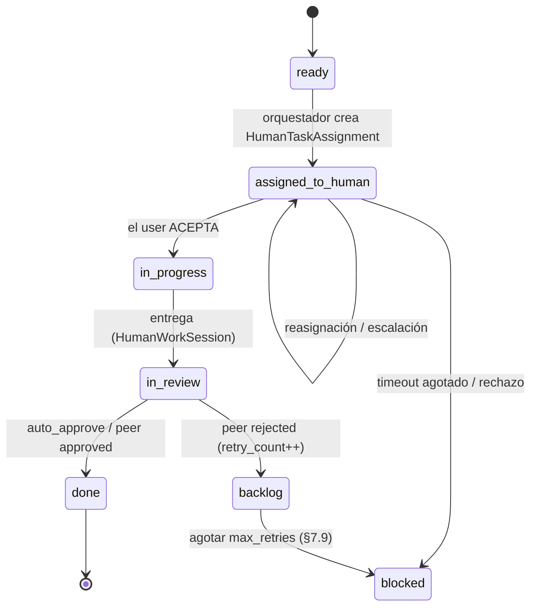

# Runbook — Operar tareas humanas (aceptación, escalación, peer review)

Procedimientos operativos para las **tareas humanas** dentro de un plan mixto
humano-IA (Plan 16, [ADR 0046](../05-architecture-decisions/0046-human-agents-agent-type-y-workflows-mixtos.md)).
Cubre el ciclo normal, el sweep de **acceptance-timeout + escalación**, el
**peer review**, y cómo diagnosticar las situaciones de bloqueo. Para la parte
de producto (crear/configurar/asignar), ver la guía
[Human Agents](../03-guides/human-agents.md).

> **Multi-tenancy.** Todas las consultas de este runbook van bajo RLS por
> `tenant_id`. Un operador actúa **sólo dentro de su tenant**; el `system_admin`
> cross-tenant (ADR 0010) usa el engine BYPASSRLS y debe filtrar explícitamente
> por el tenant que inspecciona.

## 1. Ciclo de vida normal de una tarea humana

Puntos clave:

- El orquestador **no pide contenedor** para una tarea humana: crea un
  `HumanTaskAssignment` y notifica al user por sus canales.
- La entrega crea una `HumanWorkSession` (no una `Execution`).
- En `auto_approve` la entrega lleva la tarea directa a `done`.

## 2. Acceptance timeout y escalación automática

### Qué hace el sweep

Un job periódico (**Celery Beat, cada 10 min**,
`apps/workers/src/workers/human_escalation.py`) busca `HumanTaskAssignment`
en estado **pendiente de aceptación** cuya antigüedad supera el
`acceptance_timeout_hours` del Human Agent (default 24):

1. **Primer timeout** → reasigna al `escalation_target_user_id` (nueva
   asignación, `assigned_to_human → assigned_to_human`) y notifica al target.
2. **Segundo timeout** (el target tampoco acepta) → la tarea pasa a
   **`blocked`** y se notifica al **Tenant Admin** (`task_blocked`).

### Diagnóstico — "una tarea humana no avanza"

1. Mira el **estado de la Task** y de su `HumanTaskAssignment` más reciente.
2. Si está `pending_acceptance`:
   - ¿El user recibió la notificación? Revisa `notification_channels` del
     Human Agent y el log del notification-dispatcher.
   - ¿Cuánto lleva pendiente vs `acceptance_timeout_hours`? Si supera el
     timeout y **no** se escaló, comprueba que el **Celery Beat** está vivo
     (`docker compose ps`, schedule del sweep) — un beat caído es la causa
     #1 de timeouts que no escalan.
3. Si está `blocked` por doble timeout: reasigna manualmente (galería →
   cambia el `assigned_user_id` o el `escalation_target_user_id`) y vuelve a
   poner la tarea en `ready`, o ajusta el plan.

### Acción correctiva — forzar reasignación

- Edita el Human Agent (galería) y corrige `assigned_user_id` /
  `escalation_target_user_id`.
- Si el beat estuvo caído: levántalo; el siguiente sweep recoge las
  asignaciones vencidas. No hace falta re-disparar nada a mano.

## 3. Peer review (`peer_human_reviewer`)

Cuando el proyecto está en `human_task_review_mode=peer_human_reviewer`:

1. Tras la entrega del primer humano, la tarea queda `in_review` y se crea un
   **segundo** `HumanTaskAssignment` para el reviewer (resuelto desde
   `task.reviewer_agent_id → human_agent_config.assigned_user_id`).
2. El reviewer ve el output completo + attachments y **aprueba** (`→ done`) o
   **rechaza** con `feedback_text` (`→ backlog`, `retry_count += 1`).
3. Al agotar `max_retries`, la **misma** infra de §7.9 que usa el
   acceptance-timeout aparca la tarea en `blocked` + `task_blocked` a los
   tenant admins.

### Diagnóstico — "la tarea no se asigna al reviewer"

- Si la tarea se queda `in_review` **sin** segunda asignación: el
  `reviewer_agent_id` no resuelve a un Human Agent del **mismo tenant** (un
  `reviewer_agent_id` cross-tenant resuelve a `None` por diseño — la tarea
  queda `in_review` sin reviewer). Configura un `reviewer_agent_id` válido del
  tenant en la tarea.
- Si el reviewer no recibe aviso: mismo diagnóstico de notificaciones que en §2.

## 4. Trazabilidad auditable

Para auditar una tarea humana cerrada:

- Las **`HumanWorkSession`** (no `Execution`) con `hours_logged`, `comments`,
  `output_files_attached`.
- Las **reviews** con `verdict`, `reviewer_user_id`, `feedback_text` en
  `task_audit_events`.
- El bundle exportable JSON (13.6.3) incluye sesiones humanas + reviews.
- El **Memorizer** destila las `HumanWorkSession` a `MemoryEntry` (con
  `source_human_work_session_id`); el scope `private` se atribuye al **user
  trabajador**.

## 5. Coste humano y budget

- El coste humano se imputa `horas * tarifa` → USD canónico (FX como el coste
  IA). El dashboard 13.7 lo segmenta siempre.
- Si `Project.budget_includes_human_cost=true`, el coste humano **suma** al
  budget: al cruzar el 100% con coste humano incluido, los nuevos arranques se
  **pausan** (28.7.4). Si las alertas de budget no reflejan el coste humano,
  verifica que el flag está en `true` en ese proyecto.

## Checklist rápido de incidencias

| Síntoma                                       | Causa probable                              | Acción                                                           |
| --------------------------------------------- | ------------------------------------------- | ---------------------------------------------------------------- |
| Tarea humana atascada en `pending_acceptance` | User no aceptó / notificación no llegó      | Revisar canales + dispatcher; comprobar Celery Beat vivo         |
| Timeout vencido pero **no** escaló            | Celery Beat caído                           | Levantar beat; el siguiente sweep recoge las vencidas            |
| `in_review` sin reviewer asignado             | `reviewer_agent_id` inválido o cross-tenant | Asignar un Human Agent reviewer válido **del tenant** a la tarea |
| Tarea en `blocked` tras doble timeout         | Ni assignee ni escalation target aceptaron  | Reasignar en galería + volver a `ready` (o replanificar)         |
| Budget no incluye coste humano                | `budget_includes_human_cost=false`          | Activar el flag en el proyecto si se desea incluirlo             |

## Referencias

- [Guía — Human Agents](../03-guides/human-agents.md)
- [ADR 0046 — Human Agents: agent_type y workflows mixtos](../05-architecture-decisions/0046-human-agents-agent-type-y-workflows-mixtos.md)
- [Runbook — Reinicio de servicios](./restart-services.md) (para revivir Celery Beat)
- [Changelog Plan 16](../07-changelog/16-human-agents.md)
