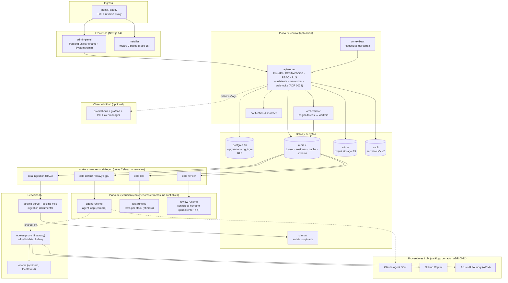
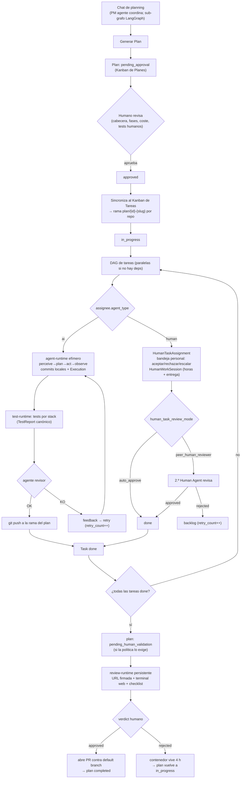
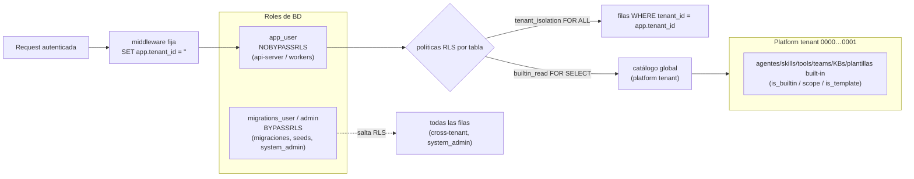
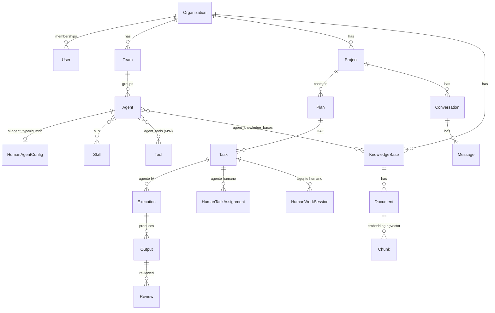

# Arquitectura del Sistema (visión end-to-end)

Documento transversal de un vistazo del **sistema final**: la plataforma de IA
agéntica multi-tenant que construye, configura y orquesta equipos de agentes
(IA **y humanos**) sobre proyectos software, operada como un stack **Docker
Compose en una sola máquina**. Para el detalle de cada decisión, los enlaces
apuntan a su ADR en [`../05-architecture-decisions/`](../05-architecture-decisions/);
para los modelos y endpoints, a [`../04-reference/`](../04-reference/). El `.docx`
maestro sigue siendo la fuente de verdad de producto.

La unidad operativa es el **Plan**: un DAG de tareas con dependencias que los
agentes ejecutan en paralelo, materializado como una rama git `plan/{id}-{slug}`
y cerrado con un PR. El doble Kanban (Planes / Tareas) y los tests humanos a
nivel de plan son no negociables.

## 1. Topología de contenedores (Docker Compose, single-host)



**Plano de control** (servicios de larga vida, imágenes de primera parte
confiables): `api-server`, `orchestrator`, `workers`, `workers-privileged`,
`cortex-beat`, `notification-dispatcher`, `admin-panel`, `caddy`, más el
one-shot `migrations`. Es **exactamente** la lista de aplicación de
`CORE_SERVICES` en
[`compose_generator.py`](../../apps/installer/backend/src/installer_backend/compose_generator.py)
— lo que el installer genera de verdad; el test
`tests/unit/test_docs_governance.py::test_arch_overview_control_plane_matches_compose_generator`
falla si este párrafo se separa de esa constante.

> **No son servicios**: el **asistente personal**, el **memorizer** y el
> **despacho de webhooks** se diseñaron como contenedores propios y hoy son
> **módulos internos** — `api_server/assistant/`, `api_server/memorizer/`,
> `api_server/webhooks/` (asistente y memorizer por el ADR
> [0033](../05-architecture-decisions/0033-personal-assistant-en-api-server-reutilizando-chat.md);
> el despacho de webhooks corre además en los workers). `apps/memorizer/`,
> `apps/personal-assistant/` y `apps/webhook-dispatcher/` existen en el árbol
> pero solo contienen `.gitkeep`. Buscar sus contenedores en el compose es
> perder el tiempo.

**Colas Celery** (escalables a mano, dentro de los servicios `workers` y
`workers-privileged`, no un contenedor por cola): `default`, `heavy`, `gpu` (si
GPU), `ingestion` (pipeline RAG con Docling), `test` (orquesta `test-runtime`),
`review` (gestiona `review-runtime`); `workers-privileged` está off por
defecto. Los workers **no ejecutan código del usuario**: lanzan contenedores
efímeros.

**Plano de ejecución** (no confiable): `agent-runtime` (agent loop),
`test-runtime` (tests por stack), `review-runtime` (sirve el código al humano).
Endurecidos con `cap-drop ALL`, `no-new-privileges`, seccomp allowlist estricta,
AppArmor y red interna (ver [§9](#9-seguridad-por-capas)).

**Datos**: `postgres` (pgvector + pg_trgm), `redis`, `minio`, `vault`, `clamav`.
**IA**: `docling-serve` + `docling-mcp`, `ollama` (opcional), `egress-proxy`.
**Observabilidad** (opcional): `prometheus`, `grafana`, `loki`, `alertmanager`.

> El seccomp es **diferenciado**: los servicios confiables usan el perfil por
> defecto de Docker; solo los runtimes no confiables llevan la allowlist
> estricta `agent-runtime.json` (ADR
> [0040](../05-architecture-decisions/0040-seccomp-apparmor-default-deny-por-contenedor.md)).

## 2. Ciclo de vida de un Plan (chat → DAG → ejecución → review → PR)



Los commits de cada tarea llevan trailers `Plan-Id`, `Task-Id`, `Execution-Id`.
La sincronización plan→Kanban está descrita en ADR
[0022](../05-architecture-decisions/0022-plan-to-kanban-sync.md) y la guía
[plan-to-kanban-sync](../03-guides/plan-to-kanban-sync.md). Las máquinas de
estado de Plan y Task, el doble Kanban (ADR
[0008](../05-architecture-decisions/0008-dual-kanban-planes-tareas.md)) y el
agent loop LangGraph (ADR
[0013](../05-architecture-decisions/0013-agent-loop-langgraph.md)) son la
columna vertebral. La bifurcación IA/humano vive en ADR
[0046](../05-architecture-decisions/0046-human-agents-agent-type-y-workflows-mixtos.md).

## 3. Multi-tenancy y RLS

Cada tabla con datos de tenant lleva `tenant_id UUID NOT NULL` y PostgreSQL
**Row-Level Security** activado (ADR
[0001](../05-architecture-decisions/0001-postgres-rls-from-day-one.md)). El
middleware del api-server fija `app.tenant_id` por request con `set_config`, y
RLS — **no el código del endpoint** — garantiza el aislamiento.



- **Dos roles de BD**: `app_user` (NOBYPASSRLS) para api-server y workers;
  `migrations_user`/admin (BYPASSRLS) para migraciones, seeds y endpoints
  `system_admin` cross-tenant. Ver el gotcha
  [postgres-roles-bypassrls](../03-guides/gotchas/postgres-roles-bypassrls.md)
  y el de
  [set_local sin bind params](../03-guides/gotchas/asyncpg-set-local-no-bind-params.md).
- **Platform tenant** `00000000-0000-0000-0000-000000000001`: fila real en
  `organizations` que aloja el **catálogo global** (agentes/skills/tools/teams/
  KBs/plantillas built-in). Visible a todo tenant **por la bandera de catálogo**
  (`is_builtin` / `scope='global_builtin'` / `is_template`), inmutable para los
  tenants (políticas `_builtin_read FOR SELECT` + aislamiento `FOR ALL`). Es el
  mecanismo canónico (ADR
  [0029](../05-architecture-decisions/0029-platform-tenant-y-catalogo-global.md));
  ADR [0010](../05-architecture-decisions/0010-superadmin-cross-tenant.md) cubre
  el cross-tenant del System Admin.
- **Catálogos globales sin tenant** (`model_prices`, `exchange_rates`,
  `llm_providers`, listings globales del marketplace): lectura global vía RLS
  `FOR SELECT USING (true)` (o sin RLS y solo accesibles vía BYPASSRLS, caso
  `llm_providers`), escritura solo System Admin.

## 4. Modelo de entidades (resumen)



Detalle completo (columnas, RLS, migraciones) en
[`../04-reference/domain-model.md`](../04-reference/domain-model.md). Los roles
y endpoints en [`../04-reference/rbac.md`](../04-reference/rbac.md).

- **Agentes IA vs humanos** (ADR
  [0046](../05-architecture-decisions/0046-human-agents-agent-type-y-workflows-mixtos.md)):
  un humano es un `Agent` con `agent_type='human'` + tabla satélite
  `human_agent_config`. No pide contenedor: el orquestador crea un
  `HumanTaskAssignment`, el trabajo se registra en `HumanWorkSession`
  (reemplaza `Execution`), y el coste humano se imputa en USD canónico (opt-in
  al budget por `budget_includes_human_cost`). Guía
  [human-agents](../03-guides/human-agents.md), runbook
  [human-tasks-operations](../06-runbooks/human-tasks-operations.md).
- **Linked vs forked** (ADR
  [0006](../05-architecture-decisions/0006-linked-vs-forked-agents.md)): los
  globales son read-only; al añadirlos a un proyecto se referencian (linked) o
  se clonan editables (forked). Las plantillas de Human Agent se **forkan
  obligatoriamente** (el `assigned_user_id` es del tenant).

## 5. Agentes, tools y MCP

- **Skills** declarativas (qué sabe hacer un agente; inyectan prompt, sugieren
  tools) vs **Tools** ejecutables (5 tipos: `builtin`, `python_function`,
  `http_endpoint`, `mcp_tool`, `docker_command`).
- **Taxonomía básica/avanzada derivada** de `is_builtin` (ADR
  [0044](../05-architecture-decisions/0044-per-agent-tool-assignment-y-taxonomia-derivada.md)):
  básica = `is_builtin` (18 builtin de plataforma); avanzada = custom del tenant
  - tools MCP. `security_level` (`safe`/`sandboxed`/`privileged`) es un eje
    **ortogonal**. La asignación por agente vive en la junction `agent_tools`,
    configurable desde la UI; el enforcement real es en el runtime (intersección
    con el allowlist del chat-mode). Guía
    [asignar-tools-a-agentes](../03-guides/asignar-tools-a-agentes.md).
- **`shell_exec` / `run_command`** (ADR
  [0045](../05-architecture-decisions/0045-comandos-shell-por-proyecto-y-runtime-por-stack.md)):
  tool **básica + privilegiada** que ejecuta binarios del stack vía argv (sin
  shell, con timeout), con un **allowlist por proyecto deny-by-default**
  (`projects.allowed_commands`). Los `run_*` (pytest/lint/typecheck/build)
  resuelven su runtime por `projects.default_runtime_template` (no por tool).
  Guía
  [comandos-y-runtime-por-proyecto](../03-guides/comandos-y-runtime-por-proyecto.md).
- **MCP como vía principal** (ADR
  [0025](../05-architecture-decisions/0025-mcp-tools-y-ejecutores.md)): cliente
  genérico (`stdio`/`sse`/`streamable_http`), catálogo de servidores verificados
  ([`../04-reference/mcp-servers.md`](../04-reference/mcp-servers.md)), secretos
  siempre por Vault (`auth_ref: vault:...`). Las tools MCP se descubren y se
  exponen al agente como nativas. Guía
  [configurar-mcp-server](../03-guides/configurar-mcp-server.md).

## 6. Runtime templates políglotas

Catálogo de imágenes de test por stack (`python-pytest`, `node-jest`,
`node-vitest`, `node-playwright`, `php-phpunit`, `php-pest`, `dotnet-test`,
`go-test`, `java-maven/gradle`, `ruby-rspec`, `rust-cargo`, `generic-shell`,
`generic-http`). Los workers solo orquestan; el `test-runtime` ejecuta y
normaliza la salida a un **TestReport canónico**. Detalle en
[`tech-stack.md`](tech-stack.md) y ADR
[0012](../05-architecture-decisions/0012-aislamiento-contenedores-agent-runtime.md).

## 7. Memoria, RAG y chat de planning

- **Memoria** (lo aprendido haciendo): scopes `private` / `team_shared` /
  `project_shared` / `global`, destilada por el **memorizer** al cerrar tareas
  (incluye `HumanWorkSession`, ADR 0046). Episódica vs semántica.
- **RAG** (lo que la organización ya sabe): KBs por proyecto, ingestión con
  **Docling**, búsqueda híbrida BM25 + vector (pgvector HNSW) + RRF + reranking.
  KBs por **rol** vs por **stack** y grants a agentes (ADR
  [0026](../05-architecture-decisions/0026-agent-scoped-kbs.md)). Guías
  [kb-ingestion](../03-guides/kb-ingestion.md) y
  [knowledge-bases-rol-vs-stack](../03-guides/knowledge-bases-rol-vs-stack.md).
- **Chat / planning sub-graph**: conversación natural (modos planning /
  discussion / execution / custom) sobre LangGraph (ADR
  [0009](../05-architecture-decisions/0009-langgraph-motor-agentes-y-chat-planning.md)),
  con compresión jerárquica del historial. El UI en tiempo real usa WebSocket
  (ADR
  [0015](../05-architecture-decisions/0015-ui-tiempo-real-websocket.md)).

## 8. Proveedores LLM, precios, coste y budgets

- **Catálogo cerrado de 4 proveedores** (ADR
  [0021](../05-architecture-decisions/0021-shared-llm-layer-catalogo-cerrado.md)):
  Claude Agent SDK, GitHub Copilot (OAuth Device Flow), Azure AI Foundry (APIM)
  y Ollama (local/cloud), unificados en `packages/shared-llm` (Protocol async
  `LLMProvider`). **LiteLLM retirado**; un quinto proveedor exige ADR.
- **Platform-global** (ADR
  [0028](../05-architecture-decisions/0028-platform-global-providers.md)):
  `llm_providers` + el catálogo de precios `model_prices` viven a nivel
  plataforma, gestionados solo por System Admin en `/admin/llm-providers`. Las
  credenciales van a Vault (`platform/llm/<provider_id>`); la BD guarda solo el
  puntero. El tenant elige qué modelo asigna a cada agente. Guía
  [configurar-proveedores-llm](../03-guides/configurar-proveedores-llm.md).
- **Precios y coste** (ADR
  [0035](../05-architecture-decisions/0035-guardrails-declarativos-en-capas-catalogo-precios-usd-snapshot.md)):
  `model_prices` es USD-canónico con vigencia (`effective_from/to`); el feed
  comunitario de LiteLLM se usa **solo como datos** y acotado a las familias de
  los proveedores activos. Cada llamada congela un **snapshot** de coste; un
  cambio de precio no recalcula el histórico. Referencia
  [pricing](../04-reference/pricing.md).
- **FX y budgets** (ADR
  [0043](../05-architecture-decisions/0043-coste-usd-canonico-fx-de-visualizacion-budgets-con-auto-pausa.md)):
  el coste se almacena en USD; la moneda del tenant (`display_currency`) es solo
  de visualización con el rate del día del run (`exchange_rates`, ECB diario).
  Budgets por tenant/proyecto con umbrales platform-global y **auto-pausa** del
  arranque de nuevas ejecuciones al 100% (las activas nunca se matan); override
  auditado.

## 9. Seguridad por capas

1. **Auth multi-tenant** (ADR
   [0031](../05-architecture-decisions/0031-sso-sesion-saml-xmlsec-reto-mfa.md)):
   password (argon2id, ADR
   [0005](../05-architecture-decisions/0005-argon2id-for-passwords.md)) **junto
   a** OIDC / SAML 2.0 + **MFA** (TOTP + WebAuthn). Sesiones server-side en
   Redis (ADR
   [0002](../05-architecture-decisions/0002-redis-server-side-sessions.md)),
   JIT provisioning, SCIM, mapeo de grupos. Auth y SSO son **platform-global**
   (ADR 0028). Referencia [auth-sso](../04-reference/auth-sso.md).
2. **RBAC** (Casbin): 4 roles globales (System Admin/Operator, Tenant
   Admin/User) + 4 por proyecto. Guía
   [roles-y-permisos](../03-guides/roles-y-permisos.md), matriz
   [rbac](../04-reference/rbac.md).
3. **RLS** por `tenant_id` (ADR 0001, ver [§3](#3-multi-tenancy-y-rls)).
4. **Aislamiento de contenedores** (ADRs
   [0012](../05-architecture-decisions/0012-aislamiento-contenedores-agent-runtime.md),
   [0019](../05-architecture-decisions/0019-egress-red-sandbox-agent-runtime.md),
   [0040](../05-architecture-decisions/0040-seccomp-apparmor-default-deny-por-contenedor.md)):
   `cap-drop ALL`, `no-new-privileges`, seccomp diferenciado (allowlist estricta
   solo para runtimes no confiables), AppArmor MAC, FS read-only salvo
   `/workspace`, egress por proxy con allowlist default-deny.
5. **Vault** (ADRs
   [0003](../05-architecture-decisions/0003-vault-from-day-one.md),
   [0041](../05-architecture-decisions/0041-rotacion-credenciales-vault-dynamic-secrets.md)):
   único almacén de credenciales, inyección just-in-time, rotación de dynamic
   secrets.
6. **Guardrails declarativos en capas** (ADR
   [0035](../05-architecture-decisions/0035-guardrails-declarativos-en-capas-catalogo-precios-usd-snapshot.md)):
   motor puro `packages/shared-guardrails` en 4 hook points (`pre_llm`,
   `post_llm`, `pre_tool`, `post_tool`), composición plataforma → tenant →
   proyecto con baselines **bloqueables** (PII, secret_leakage,
   prompt_injection). 6 acciones (`block`/`redact`/`warn`/`retry_with_feedback`/
   `escalate_to_human`/`transform`). Eventos tenant-scoped con detalle
   enmascarado. Referencia [guardrails](../04-reference/guardrails.md).
7. **Validación humana por proyecto** (ADRs
   [0016](../05-architecture-decisions/0016-motor-validacion-humana.md),
   [0020](../05-architecture-decisions/0020-task-awaiting-human-approval.md)):
   13 categorías de acciones sensibles, plantillas Sandbox/Desarrollo/
   Producción/Cliente Externo. Es **aprobación** (distinta del Human Agent
   ejecutor de ADR 0046).
8. **Hardening del panel admin** (ADR
   [0042](../05-architecture-decisions/0042-hardening-panel-admin-mfa-ip-allowlist-sesiones-cortas.md)):
   MFA, IP allowlist, sesiones cortas.
9. **Auditoría**: `audit_log` inmutable; bundles exportables por tarea (IA y
   humana).

## 10. Marketplace, API pública, webhooks, evals y backup

- **Marketplace** (ADR
  [0032](../05-architecture-decisions/0032-marketplace-confianza-catalogo-hibrido-instalacion-gated.md)):
  listings de `skill` / `tool` / `mcp_server` con **trust tiers**
  (`verified`/`community`/`experimental`) que gobiernan los **guardrails de
  instalación** (firma Ed25519, análisis estático, sandbox, consentimiento por
  permiso), no la disponibilidad. Catálogo híbrido global/privado; compartir
  cross-tenant = grant explícito y auditado. Referencia
  [marketplace](../04-reference/marketplace.md), guía
  [publicar-en-marketplace](../03-guides/publicar-en-marketplace.md).
- **API pública + webhooks** (ADR
  [0037](../05-architecture-decisions/0037-api-publica-x-api-token-versionado-path-webhooks-hmac-config-id-sdks-openapi.md)):
  `/api/v1` autenticada con `X-API-Token` por tenant (scope, rate limit, IP
  allowlist; aislamiento por RLS), versionada en el path, OpenAPI 3.1 + SDKs
  generados. Webhooks **entrantes** verificados por HMAC con `config_id` (no el
  secreto) en la URL; **salientes** firmados (ADR
  [0034](../05-architecture-decisions/0034-notificaciones-dispatcher-channeladapter-tres-capas-webhooks-firmados.md)).
  Referencias [public-api](../04-reference/public-api.md) y
  [dev-portal](../04-reference/dev-portal.md), guía
  [api-publica-y-webhooks](../03-guides/api-publica-y-webhooks.md).
- **Evals + estadísticas** (ADR
  [0038](../05-architecture-decisions/0038-evals-continuos-llm-as-judge-golden-promote-merge-gate-shadow-cross-tenant.md)):
  LLM-as-judge con modelo de juez **distinto** al evaluado, golden dataset por
  tenant promocionado desde tareas reales aprobadas, merge-gate en CI y shadow
  evals no bloqueantes; dashboard de stats por tenant + cross-tenant
  System-Admin-only. Referencia [evals-stats](../04-reference/evals-stats.md).
- **Notificaciones + asistente personal** (ADRs
  [0033](../05-architecture-decisions/0033-personal-assistant-en-api-server-reutilizando-chat.md),
  [0034](../05-architecture-decisions/0034-notificaciones-dispatcher-channeladapter-tres-capas-webhooks-firmados.md)):
  dispatcher con ChannelAdapter (Telegram, WhatsApp, Email, Slack, Teams,
  Discord, SMS, webhooks firmados) en tres capas; asistente cross-proyecto.
  Referencia [notifications](../04-reference/notifications.md).
- **Backup / restore** (ADR
  [0036](../05-architecture-decisions/0036-backup-pgdump-logico-cifrado-aesgcm-destinos-enchufables-restore-por-tenant.md)):
  `pg_dump` lógico cifrado AES-256-GCM (clave de Vault), destinos enchufables y
  restore **selectivo por tenant** vía BD staging. Referencia
  [backup-restore](../04-reference/backup-restore.md).

## 11. Persistencia del código

```text
/data/agent-platform/
├── postgres/  redis/  minio/  vault/  backups/
└── projects/{tenant_slug}/{project_slug}/
    ├── repos/{repo}.git/            (bare repo)
    │   └── worktrees/
    │       ├── {plan_id}-{task_id}/ (worktree por tarea)
    │       └── {plan_id}-review/    (worktree del review-runtime)
    └── dep-cache/                   (npm/pip/composer cacheado por lock file)
```

Cada proyecto tiene su bare repo; los worktrees por tarea dan paralelismo sin
clones repetidos. La `push_policy` por repo (`forbidden` /
`branch_only_pr_required` (default) / `direct_to_default_allowed`) decide el
merge (ver [`conventions.md`](conventions.md)).

## 12. Panel del System Admin, visor de docs e instalador

- **Panel del System Admin**: Dashboard, Tenants, Monitorización (Grafana
  embebido), Backups, Healthchecks, Workers, **LLM Providers** (ADR 0028) +
  Precios, Marketplace, Catálogo de Plantillas, Configuración Global, Auditoría.
  El menú agrupa por ámbito (platform vs tenant).
- **Visor de docs** `/admin/docs`: renderiza Markdown de `docs/` directamente
  (lee la carpeta; las categorías = las 7 carpetas canónicas). Cualquier doc
  nuevo aparece sin tocar código.
- **Instalador** (Fase 15, ADR
  [0039](../05-architecture-decisions/0039-installer-autodestructivo-secretos-csprng-prod-guard.md)):
  wizard de 9 pasos (Bienvenida → Config → Recursos/Workers/GPU → Almacenamiento
  → Providers LLM → Tenant inicial → Resumen → Instalación → Listo) + modo CLI
  desatendido; autodestructivo, secretos CSPRNG, guard de producción. **De los
  dos frontales sólo el CLI aprovisiona**: el wizard HTTP corre contra
  `FakeStepExecutor` y las credenciales que revela no son reales (prod-09).
  Referencia [installation](../04-reference/installation.md).
