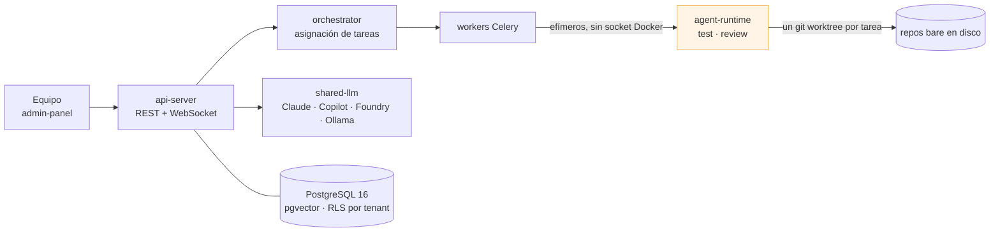

[English](./index.md) · **Español**

# Plataforma Agéntica

**Una plataforma agéntica multi-tenant donde equipos de agentes de IA especialistas planifican, escriben, prueban y revisan software — sobre un único host Docker Compose, no Kubernetes.**

Describes qué quieres construir. De ahí sale un **Plan**: un conjunto ordenado de tareas con dependencias DAG. Un equipo de agentes especialistas — Project Manager, Arquitecto, Backend, Frontend, QA, Reviewer, Technical Writer — lo ejecuta en paralelo contra un repositorio git real, corre la suite de tests del propio proyecto en su propio toolchain, y abre un pull request al cerrar el plan.

## Por dónde entrar

| Si quieres…                                             | Empieza en                                                                                                         |
| ------------------------------------------------------- | ------------------------------------------------------------------------------------------------------------------ |
| entender qué es esto antes de instalar nada             | [Qué es](01-overview/01-introduction.md)                                                                           |
| levantar el stack en una máquina                        | [Instalación](02-getting-started/01-installation.md)                                                               |
| ver un primer plan de punta a punta                     | [Primer arranque](02-getting-started/03-first-run.md) → [Tu primer proyecto](03-guides/01-create-first-project.md) |
| saber cómo se aíslan los tenants de verdad              | [Multi-tenancy](04-reference/multi-tenancy.md)                                                                     |
| decidir dónde tiene que aprobar un humano               | [Validación humana de planes](04-reference/validacion-humana.md)                                                   |
| conectar un proveedor de modelos                        | [Proveedores LLM](04-reference/llm-providers.md)                                                                   |
| saber por qué algo está construido así                  | la pestaña **Decisiones** — un documento por decisión de arquitectura                                              |
| operar, respaldar o recuperar el stack                  | la pestaña **Operación** — un runbook por procedimiento                                                            |
| dejar de pelearte con un error que ya le pasó a alguien | la pestaña **Trampas** — síntoma, causa raíz y fix, una página cada una                                            |

## Las cuatro ideas que condicionan todo lo demás

**El Plan es la unidad de cambio.** Un plan se materializa como rama git `plan/{id}-{slug}`; cada commit de tarea lleva los trailers `Plan-Id`, `Task-Id` y `Execution-Id`; al cerrar el plan se abre un único pull request. Revisas un cambio coherente, no cuarenta commits.

**El multi-tenancy no es una capa añadida después.** Cada tabla lleva `tenant_id`, el row-level security de PostgreSQL está activado, un middleware inyecta el tenant en cada request, y el aislamiento cross-tenant lo afirman tests en CI.

**Los agentes nunca ejecutan código en el worker.** Los workers orquestan; contenedores efímeros ejecutan — red restringida, sin socket Docker, todas las capabilities retiradas, seccomp default-deny. Cada stack de lenguaje tiene su propia imagen de runtime.

**Un humano aprueba donde debe aprobar un humano.** Las políticas de aprobación cubren trece categorías de acción sensible en cuatro plantillas, de Sandbox a Cliente Externo, y un agente puede pararse y preguntar por su cuenta.

## Cómo leer esta documentación

El sitio es **bilingüe, con el inglés como idioma canónico** — usa el selector de idioma de la cabecera. La convención y su guarda están escritas en la [política de documentación bilingüe](03-guides/bilingual-docs.es.md).

Y algo que conviene decir sin adornos: la mayor parte de este corpus — las decisiones de arquitectura, las trampas, el roadmap — sigue **escrita en castellano**, y aparece igual en los dos idiomas del sitio hasta que se traduzca. Eso es un backlog con forma definida, no un hueco: cada documento se vuelve bilingüe por su cuenta, sin coordinarse con ningún otro, mediante el movimiento en dos pasos que describe la política.

## Estado del proyecto

Esto es un sistema que funciona, no un producto publicado, y la diferencia importa para quien llega:

- el stack corre como Docker Compose en una sola máquina — Kubernetes y multi-máquina están explícitamente fuera de alcance;
- los SDK de Python y TypeScript se generan del OpenAPI v1 y viven en `packages/`, pero **ninguno está publicado** en PyPI ni en npm — el paquete npm está marcado como `private`, y no hay todavía imágenes de contenedor publicadas ni releases de GitHub;
- el multi-tenancy alcanza a departamentos y equipos dentro de una organización, no a un SaaS de mercado masivo.

Donde la documentación afirma algo sobre el sistema, la intención es que se pueda comprobar contra el repositorio. Si encuentras una afirmación que no, eso es un defecto que merece un aviso.
