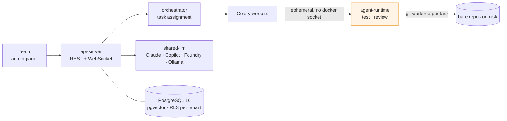

---
# Sin `title:` A PROPOSITO. Material usa `page.meta.title` con prioridad y SIN
# comprobar si la pagina es la portada, asi que un `title: Agentic Platform`
# aqui renderiza `<title>Agentic Platform - Agentic Platform</title>`. Al no
# ponerlo, cae en la rama de portada y sale el nombre del sitio una sola vez.
# La mitad castellana SI lo lleva (`Plataforma Agentica`), y hace bien: alli no
# coincide con el nombre del sitio, asi que distingue la variante de idioma.
last_updated: 2026-08-21
status: published
docs_language: en
audience: everyone
---

**English** · [Español](./index.es.md)

# Agentic Platform

**A multi-tenant agentic platform where teams of specialist AI agents plan, write, test and review software — on one Docker Compose host, not Kubernetes.**

You describe what you want built. A **Plan** is produced: an ordered set of tasks with DAG dependencies. A team of specialist agents — Project Manager, Architect, Backend, Frontend, QA, Reviewer, Technical Writer — executes it in parallel against a real git repository, runs the project's own test suite in the project's own toolchain, and opens a pull request when the plan closes.

## Where to go

| If you want to…                                      | Start at                                                                                                     |
| ---------------------------------------------------- | ------------------------------------------------------------------------------------------------------------ |
| understand what this is before installing anything   | [What this is](01-overview/01-introduction.md)                                                               |
| stand the stack up on a machine                      | [Install](02-getting-started/01-installation.md)                                                             |
| get a first plan running end to end                  | [First run](02-getting-started/03-first-run.md) → [Your first project](03-guides/01-create-first-project.md) |
| know how tenants are actually isolated               | [Multi-tenancy](04-reference/multi-tenancy.md)                                                               |
| decide where a human must approve an agent's action  | [Human validation of plans](04-reference/validacion-humana.md)                                               |
| wire a model provider                                | [LLM providers](04-reference/llm-providers.md)                                                               |
| know why something is built the way it is            | the **Decisions** tab — one document per architecture decision                                               |
| operate, back up or recover the stack                | the **Operations** tab — runbooks per procedure                                                              |
| stop fighting a toolchain error somebody already hit | the **Pitfalls** tab — symptom, root cause and fix, one page each                                            |

## The four ideas that shape everything else

**The Plan is the unit of change.** A plan becomes a git branch `plan/{id}-{slug}`; every task commit carries `Plan-Id`, `Task-Id` and `Execution-Id` trailers; closing the plan opens one pull request. You review a coherent change, not forty commits.

**Multi-tenancy is not a layer added later.** Every table carries `tenant_id`, PostgreSQL row-level security is on, middleware injects the tenant on every request, and cross-tenant isolation is asserted by tests in CI.

**Agents never run code in the worker.** Workers orchestrate; ephemeral containers execute — restricted network, no Docker socket, all capabilities dropped, seccomp default-deny. Each language stack has its own runtime image.

**A human approves where a human should.** Approval policies cover thirteen categories of sensitive action across four templates, from Sandbox to External Client, and an agent can stop and ask on its own.

## Reading this documentation

The site is **bilingual, with English as the canonical language** — use the language selector in the header. The convention and its guard are written up in the [bilingual documentation policy](03-guides/bilingual-docs.md).

One thing to be honest about: most of this corpus — the architecture decisions, the pitfalls, the roadmap — is still **written in Spanish**, and shows in both language builds until it is translated. That is a known backlog with a defined shape, not a gap: each document becomes bilingual on its own, without coordinating with any other, by the two-step move the policy describes.

## Project status

This is a working system, not a released product, and the difference matters for anyone arriving:

- the stack runs as Docker Compose on a single machine — Kubernetes and multi-host are explicitly out of scope;
- the Python and TypeScript SDKs are generated from the OpenAPI v1 specification and live in `packages/`, but **neither is published** to PyPI or npm — the npm package is marked `private`, and there are no published container images or GitHub releases yet;
- multi-tenancy is scoped to departments and teams inside one organisation, not mass-market SaaS.

Where the documentation makes a claim about the system, it is meant to be checkable against the repository. If you find one that is not, that is a defect worth reporting.
