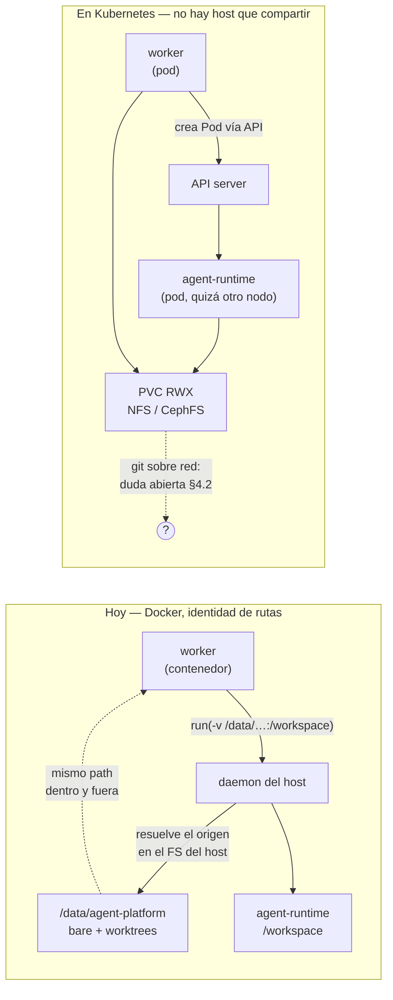

# Coste de llevar la plataforma a Kubernetes. Informe para el operador

Fecha: 2026-08-27. Rama: `chore/infra-images-un-nombre-y-trivy`. Medición en solo lectura sobre el árbol de trabajo. Todas las cifras de abajo salen de un inventario contado; donde no hay inventario, lo digo y va como duda abierta.

---

## 1. La respuesta en tres líneas

**Entre 175 y 275 días-persona: nueve a catorce meses de una persona a jornada completa.** No es una tarde y no es un trimestre.

La frase que explica el número: **sólo una cuarta parte es traducción** (el chart de Helm, los manifiestos, la observabilidad, los runbooks: 39-62 d); **el resto es rediseño** de las tres cosas que hacen que esta plataforma sea esta plataforma —cómo un worker lanza código de usuario, dónde vive el código de los proyectos y dónde está la frontera de confianza— más la gobernanza que nadie presupuesta.

Y el dato que más pesa para decidir: **nadie lo ha pedido**. Las siete veces que "Kubernetes" aparece en `docs/roadmap/` es para excluirlo.

---

## 2. Lo que se traduce y lo que se rediseña

La distinción que decide todo el presupuesto:

> **Traducción** = el mismo mecanismo, expresado en otra sintaxis. Un `Deployment` en vez de un `service:`, un `PersistentVolumeClaim` en vez de un `volumes:`. El resultado se puede revisar leyendo el original al lado.
>
> **Rediseño** = el mecanismo no existe al otro lado y hay que inventar el sustituto. No hay original que leer al lado; hay que volver a decidir, escribir el ADR y tirar los tests que fijaban el mecanismo viejo.

| Lado           | Qué entra                                                                                                                                                                  | Coste         |
| -------------- | -------------------------------------------------------------------------------------------------------------------------------------------------------------------------- | ------------- |
| **Traducción** | Chart de 26 servicios · reescritura del generador de compose del instalador · observabilidad (20 alertas, 98 paneles, promtail, service discovery) · 29 runbooks           | **39-62 d**   |
| **Rediseño**   | Ejecución de código de usuario · estado en disco (bare repos + worktrees) · backup/DR · secretos, red y frontera de confianza · métricas de aplicación                     | **103-156 d** |
| **Gobernanza** | 14 ADR que argumentan desde "una sola máquina" · dos principios de `CLAUDE.md` · el ADR nuevo que los enmienda en el mismo commit                                          | **12-20 d**   |
| **Tests**      | 262 ficheros de test tocan `docker`/`container`; 99 tocan el compose. No todos hay que reescribirlos, pero los que fijan el mecanismo viejo se van con el mecanismo viejo. | **20-35 d**   |
| **Total**      |                                                                                                                                                                            | **175-275 d** |

El error de intuición que este informe existe para corregir: **la traducción es la parte visible, y es la más pequeña**. Quien mira `docker/docker-compose.yml` y piensa "esto es un chart de un par de semanas" tiene razón sobre ese fichero y se está dejando fuera el 75% del trabajo.

---

## 3. Área por área

### 3.1 Plano de despliegue — traducción, 39-62 d

**Inventario contado:**

| Cosa                                                  | Cuántas                                                                 |
| ----------------------------------------------------- | ----------------------------------------------------------------------- |
| Ficheros compose                                      | 9 (`base`, `dev`, `gpu`, `manuals`, `windows`, `ci`, 3 de monitoring)   |
| Servicios en el núcleo (`CORE_SERVICES`)              | 20                                                                      |
| Servicios del overlay de monitorización               | 6                                                                       |
| Servicios opcionales (ollama ×2, stt, tts, whatsapp)  | 5                                                                       |
| Volúmenes nombrados                                   | 8 + 1 externo (`agentic-platform-agent-data`)                           |
| Redes                                                 | 3 (`agentic-net`, `agentic-agents` internal, `agentic-docker` internal) |
| Puertas `depends_on` con condición                    | 25                                                                      |
| Dockerfiles                                           | 28 (14 son plantillas de runtime; **esas no cambian**)                  |
| Campos de configuración (`Field()` en los `Settings`) | 253                                                                     |
| Reglas de alerta Prometheus                           | 20                                                                      |
| Paneles Grafana                                       | 98 en 2 dashboards                                                      |

**Lo que hace que esta parte no sea el chart y ya:** el compose de producción **no es un fichero, es un programa**. `apps/installer/backend/src/installer_backend/compose_generator.py` son **1.923 líneas de Python** con **31 constructores de servicio** que generan el stack a partir de las respuestas del asistente de instalación. Un chart de Helm no sustituye eso: hay que reescribir el generador para que produzca un `values.yaml` (o aplique manifiestos), y el asistente entero cuelga de ahí. Es la mitad del coste de esta área.

Dos piezas de la observabilidad que no son mecánicas:

- `docker/monitoring/promtail/promtail-config.yml:20` lee `/var/lib/docker/containers/*/*-json.log`. Con containerd —el runtime por defecto de un clúster— ni la ruta ni el formato existen.
- Prometheus usa `static_configs` en sus tareas de scrape. Pasa a `kubernetes_sd_configs` o a `ServiceMonitor`s del operador, que es otra dependencia a mantener.

De los 34 runbooks de `docs/06-runbooks/`, **29 dan instrucciones en `docker compose` / `docker exec` / `docker volume`**. Un runbook que dice `docker compose restart api-server` en un clúster no es un runbook desactualizado: es un runbook que no se puede seguir durante un incidente.

### 3.2 Ejecución de código de usuario — rediseño, 40-60 d

**Inventario contado:** 10 módulos, **3.939 líneas**, **47 llamadas** al SDK de Docker repartidas en **17 operaciones distintas**.

| Módulo                                 | Líneas | Qué hace con Docker                                              |
| -------------------------------------- | ------ | ---------------------------------------------------------------- |
| `workers/test_runtime.py`              | 1.081  | Bridge por tarea, sidecars, proxy de egress, exec de los tests   |
| `workers/tasks/review_runtime_task.py` | 629    | Sesión de preview: contenedor principal + servicios del proyecto |
| `api-server/marketplace/sandbox.py`    | 588    | Prueba de humo de una instalación del marketplace                |
| `workers/container.py`                 | 468    | Lanzamiento del `agent-runtime` + streaming de logs              |
| `workers/tasks/stack_exec_task.py`     | 310    | Puente `stack_exec` (ADR 0093)                                   |
| `workers/tasks/test_runtime_task.py`   | 279    | Orquestación de una corrida de tests                             |
| `workers/maintenance/orphan_reaper.py` | 228    | Recolección de contenedores y redes huérfanos                    |
| `workers/isolation.py`                 | 174    | **El perfil de aislamiento entero**                              |
| `watchdog/__main__.py`                 | 152    | Vigilancia y reinicio de los 5 servicios de infraestructura      |
| `workers/docker_client.py`             | 30     | Cliente                                                          |

Operaciones usadas, por frecuencia: `network.remove` (6), `containers.run` (6), `containers.get` (6), `container.remove` (5), `containers.list` (5), `exec_run` (4), `networks.create` (4), `container.reload` (3), `network.connect`/`disconnect` (2+2), `container.logs` (2), `container.kill` (2), `container.attrs` (2), `networks.list`/`get`, `images.pull`/`get`.

Cuatro de esas diecisiete **no tienen equivalente** en Kubernetes, y son las cuatro que sostienen el aislamiento: `networks.create` por tarea, `network.connect`/`disconnect` sobre un contenedor vivo, y el bind del worktree. Están en la §4.

Un apunte a favor: `watchdog` (152 líneas + su paquete) **se borra**. El kubelet reinicia pods; eso es de lo poco que Kubernetes regala.

### 3.3 Estado en disco — rediseño, 30-45 d (+ 12-18 d de backup/DR)

**Inventario contado:** **48 módulos no-test** mencionan `worktree`. `workers/git_repos.py` son 729 líneas dedicadas a bare repos y worktrees. El principio 4 de `CLAUDE.md` **es** este mecanismo.

La disposición actual, del ADR 0085 y de `git_repos.RepoLayout`:

```text
{data_root}/projects/{tenant}/{project}/
├── repos/{repo}.git/          ← bare repo, uno por repositorio
└── worktrees/{task_id}/       ← un worktree por tarea, en paralelo
```

Y `data_root` es `/data/agent-platform`, montado **en la misma ruta absoluta dentro del worker y en el host**. Esa identidad de rutas no es una comodidad: es la condición para que el bind funcione (§4.1).

En Kubernetes el sustituto obligado es un `PersistentVolumeClaim` **RWX** —NFS, CephFS, SMB— compartido por el worker y por cada pod efímero. Eso mueve todo `git` a almacenamiento de red, que es la duda abierta más cara de este informe (§4.2).

Aparte, el backup: `workers/backup.py` produce cinco tipos de artefacto (`pg_dump`, `volume_tar`, `projects_tar`, `bind_tar`, `redis_tar`). El `volume_tar` lo ejecuta la lane `workers-privileged`, que corre **como root** (`WORKERS_RUN_AS_ROOT=1`) con `/var/lib/docker/volumes` bind-montado, porque tiene que leer los `_data` a 0700 de redis (uid 999) y de Vault (uid 100). Ese camino desaparece entero: en Kubernetes son `VolumeSnapshot`s o una herramienta de backup del clúster, y hay que rehacer también la verificación del bundle y los cuatro runbooks de DR.

### 3.4 Secretos, red y frontera de confianza — rediseño, 18-28 d

**Inventario contado:**

- **Vault** con desellado **manual** (ADR 0145, decisión C, firmada el 2026-08-01), y la excepción Fernet del ADR 0146 colgando de esa decisión por escrito.
- **`docker-socket-proxy`** con allowlist explícita de 14 banderas (`CONTAINERS`/`IMAGES`/`NETWORKS`/`POST`/`EXEC` a 1; `VOLUMES`/`SWARM`/`SECRETS`/`CONFIGS`/`NODES`/`SERVICES`/`TASKS`/`SYSTEM`/`INFO` a 0) en una red dedicada donde sólo hablan workers↔proxy.
- **Dos proxies de egress** allowlisted: `egress-proxy` (ADR 0019, para el agente) y `registry-proxy` (ADR 0094, para las descargas de dependencias).
- **Dos redes `internal: true`** más una red efímera por tarea de test y una por sesión de review.
- **Perfiles** seccomp (2) y AppArmor (2) que hoy viajan **dentro** de la aplicación.

Ninguna de esas cinco piezas se traduce. Las cinco se rediseñan, y tres de ellas pierden garantía en el camino (§4.3, §4.4, §4.7).

---

## 4. Lo que se rompe, y no es obvio

Aquí está el valor del informe. Cada uno lleva su **modo de fallo**, porque el nombre de la avería no dice lo caro que es: lo caro es que la mayoría **no dan error**.

### 4.1 El bind del worktree resuelve en el host, y en Kubernetes no hay host

Hoy el worker corre dentro de un contenedor y lanza el `agent-runtime` hablando con el daemon del host (Docker-out-of-Docker). En `docker run -v origen:destino`, **el `origen` lo resuelve el daemon en el sistema de ficheros del host**, no el rootfs del worker. Por eso el stack monta el data-root en la ruta que el daemon resolvería —en dev, el volumen externo montado en su propia ruta daemon-side `/var/lib/docker/volumes/agentic-platform-agent-data/_data`— y por eso ese truco tiene un gotcha de sesenta líneas dedicado.

**Modo de fallo (ya ocurrido):** si la ruta no coincide, **no hay error**. El daemon crea el directorio host inexistente, vacío, y lo monta. El agente arranca, ve `/workspace` vacío, implementa desde cero sobre un árbol que no es el del proyecto, y el run **termina en verde** con un diff que no tiene nada que ver con la tarea. Se perdieron los bare repos una vez por una variante de esto (2026-07-02).

En Kubernetes el mecanismo no se rompe: **desaparece**. Un pod no puede pedirle al kubelet que monte un directorio de otro pod. La única sustitución es el PVC RWX, que lleva directamente al siguiente punto.



### 4.2 Git sobre almacenamiento de red — la duda abierta más cara

Con el PVC RWX, el bare repo y los N worktrees pasan a NFS o CephFS. Git da por sentadas dos cosas que el almacenamiento de red da a medias: **bloqueo POSIX fiable** (`index.lock`, `packed-refs.lock`, `HEAD.lock` se crean con `O_EXCL`) y **`stat` fiable** (la heurística "racy git" compara mtimes para decidir si un fichero cambió).

**Modo de fallo:** con caché de atributos de NFS, `git status` ve mtimes viejos y o bien re-hashea el árbol entero en cada llamada —lento, no incorrecto— o bien, con dos escritores, deja un `.lock` huérfano que bloquea el repositorio hasta que alguien lo borra a mano. No hay un día en que se rompa: hay lentitud creciente y un `fatal: Unable to create '.../index.lock': File exists` a las tres semanas, en mitad de un run.

Encima, el perfil de carga es el peor para NFS: **muchísimos ficheros pequeños**. Y la concurrencia real no es teórica: `workers` y `workers-aux` van a `--concurrency=2`, más las lanes `marketplace` y `backup`, más un `git worktree add` / `reset --hard` / `clean -fdx` por tarea.

> **Duda abierta.** No lo hemos medido. Nadie ha corrido este repositorio sobre un PVC RWX. Antes de presupuestar nada en firme hay que hacer el spike: el repo real, la concurrencia real, el almacenamiento del clúster destino real. Si la respuesta es "git sobre esta RWX no aguanta", **la migración no es cara: es inviable sin rediseñar también el modelo de código persistente**, y el presupuesto de arriba se queda corto.

### 4.3 `pids_limit` no existe por pod

`workers/isolation.py` fija `pids_limit` por contenedor. Es la barrera contra una fork bomb en código que no controlamos. Kubernetes tiene `podPidsLimit`, que es una **bandera del kubelet**: de nodo, no de pod, y no la fija la aplicación.

**Modo de fallo:** silencioso. El pod arranca igual. La fork bomb ya no la para el perfil de la plataforma —que es donde `CLAUDE.md` §2 dice que está— sino una configuración de nodo que el instalador no controla y que en un clúster ajeno puede no estar puesta.

### 4.4 El perfil seccomp deja de viajar con la aplicación

Hoy el SDK de Docker envía el **contenido** del perfil: `build_security_opt` lee `docker/seccomp/agent-runtime.json` y lo pasa como `seccomp=<json>`. Por eso `WORKERS_SECCOMP_PROFILE` es un ajuste de la plataforma y la instalación es autocontenida. Kubernetes sólo admite `localhostProfile`: un fichero que tiene que existir **en cada nodo** bajo el directorio seccomp del kubelet. AppArmor, igual: el perfil tiene que estar **cargado en el nodo**.

**Modo de fallo:** el arranque del pod falla, y eso es lo bueno: es ruidoso. El coste real no es el fallo, es que `docker/seccomp/` y `docker/apparmor/` pasan de ser parte de la aplicación a ser **un paso manual de aprovisionamiento de nodos**, y por tanto algo que se olvida al añadir un nodo. Y hay una segunda mitad silenciosa: `/tmp` y `$HOME` son hoy tmpfs con `noexec,nosuid` explícitos; el `emptyDir: {medium: Memory}` de Kubernetes **no admite opciones de montaje**. Esa capa desaparece sin que nada lo diga.

> **Duda abierta.** El comportamiento exacto de las tres (`podPidsLimit`, seccomp/AppArmor por `localhostProfile`, opciones de montaje de `emptyDir`) debe confirmarse con un spike contra la versión del clúster destino, no desde la documentación.

### 4.5 Las redes efímeras por tarea no tienen equivalente

Cada corrida de tests crea su bridge `internal: true` (`test-runtime-{tpl}-{hex}`) y cada sesión de review el suyo (`review-aux-{session}`). Los sidecars del proyecto viven ahí con alias (`mysql`, `redis`). **El aislamiento entre tenants es la red misma**, y el comentario de `_start_review_aux_services` lo dice con todas las letras: un bridge dedicado mantiene los servicios auxiliares de un tenant inalcanzables desde el contenedor de review de otro, porque alias como `mysql`/`redis` colisionarían en la red compartida.

En Kubernetes todos los pods están en la misma red plana. El aislamiento se **declara** con `NetworkPolicy`, y eso trae tres condiciones nuevas: (a) el CNI del clúster tiene que aplicarlas —no todos lo hacen—, (b) es una allowlist por etiquetas, no una red separada, y (c) hay que crear y borrar una política por sesión.

**Modo de fallo:** si el CNI no aplica NetworkPolicy, **no hay error de ningún tipo**. Los sidecars de un tenant quedan alcanzables desde el runtime de otro, con los alias colisionando — exactamente el escenario que el bridge por sesión existe para impedir. Es un fallo de aislamiento multi-tenant que sólo se descubre buscándolo.

### 4.6 El proxy de egress se enchufa a una red viva, y un pod no admite eso

`_attach_registry_proxy` hace `network.connect(proxy)` sobre un contenedor **compartido y de larga vida**, y `network.disconnect` al terminar. Un único proxy con una única allowlist (ADR 0094) se enchufa temporalmente a la red privada de cada tarea. En Kubernetes **las interfaces de un pod se fijan al crearlo**: no se puede añadir una red a un pod vivo.

Las dos sustituciones y su precio:

- **Sidecar proxy por pod**: la allowlist deja de estar en un sitio y pasa a estar en N. **Modo de fallo:** una tarea con el sidecar mal configurado no falla — **instala**, sólo que a través de una allowlist que nadie ha revisado. Es la peor forma de romper un control de egress: sigue pareciendo que hay control.
- **Gateway de egress central + NetworkPolicy**: correcto, y es un componente nuevo que mantener, con la dependencia del §4.5 encima.

### 4.7 `docker-socket-proxy` no se traduce a "un ServiceAccount"

La frontera de confianza de hoy es un proxy con **14 banderas explícitas** en una red donde sólo hablan workers↔proxy. `VOLUMES: "0"` significa, literalmente, que el worker **no puede crear volúmenes**.

El equivalente en Kubernetes es un RBAC con `create pods`. Y `create pods` **no es mínimo privilegio**: quien puede crear un Pod puede pedir `hostPath`, `hostPID` o `privileged: true` y montar el nodo, salvo que haya admisión (Pod Security Admission `restricted`, o Kyverno/Gatekeeper) que lo prohíba.

**Modo de fallo:** el principio 2 de `CLAUDE.md` se cumple en la letra —el agente sigue sin ver un socket— y se pierde en el espíritu: la garantía se muda de un proxy con 14 banderas que están **en nuestro repositorio** a una política de admisión que **no está en nuestro repositorio** y que un clúster ajeno puede no tener configurada. Nadie se entera hasta que alguien audita el clúster.

### 4.8 Vault con desellado manual contra pods que se reprograman solos

El ADR 0145 decidió **desellado manual** con fragmentos de Shamir. Hoy eso ocurre una vez por reinicio del host: un evento humano, planificado, poco frecuente.

En Kubernetes el pod de Vault se reprograma **por su cuenta**: un `drain` de nodo para actualizar el kubelet, una expulsión por presión de memoria, un reescalado. Cada uno de esos devuelve a Vault **sellado**, sin que nadie haya reiniciado nada.

**Modo de fallo, en cadena:** Vault sellado contesta HTTP 200 al healthcheck que usamos (`sealedcode=200`, y ese mapeo **no es un error** — si `sealed` fuese `unhealthy`, el orquestador reiniciaría Vault en bucle antes de que nadie pudiera desellarlo). Así que los servicios que dependen de él arrancan tan contentos, y la avería aparece en la primera lectura de una credencial de proveedor LLM, sin nada que apunte a la causa. Y hay un segundo orden: el ADR 0146 deja los secretos de SSO en columna Fernet **precisamente porque** el desellado es manual; migrar a Kubernetes agrava el motivo de esa excepción al mismo tiempo que multiplica su frecuencia.

Kubernetes no rompe Vault. Rompe **la suposición de que un reinicio es un evento humano**, que es sobre la que se firmó el ADR 0145.

### 4.9 El orquestador no tolera dos réplicas

`orchestrator/config.py:47` define `consumer_name` con default `"orchestrator-1"`. Dos réplicas del mismo `Deployment` leen el mismo entorno, así que usan **el mismo nombre de consumidor** dentro del grupo de Redis Streams.

**Modo de fallo:** la lista de pendientes (PEL) es compartida y, peor, `consumer.py:187` hace `xautoclaim` con `min_idle_time`: cada réplica **le roba a la otra los mensajes en vuelo** en cuanto pasan el umbral de inactividad. Resultado: **doble despacho de la misma tarea**. Y no falla al arrancar — sólo bajo carga, cuando un despacho tarda más que el umbral.

El arreglo es barato (nombre por pod vía downward API). Lo que importa es que es **el ejemplo del tipo de defecto que sólo aparece cuando alguien pone `replicas: 2`**, que es literalmente lo primero que se hace después de migrar, y que hoy no hay ningún test que lo pueda ver porque el mecanismo no existe.

### 4.10 Las métricas de aplicación viajan por un directorio compartido

El **único** camino por el que las métricas de aplicación llegan a Prometheus en este stack es el textfile collector de node-exporter: `workers` y `workers-privileged` dejan ficheros `.prom` en un volumen nombrado, y **node-exporter los lee**. No hay sidecar de instrumentación.

En Kubernetes node-exporter es un `DaemonSet` (uno por nodo) y los workers son pods que pueden estar en cualquier nodo. El directorio compartido deja de existir.

**Modo de fallo: silencioso, y ya ocurrió.** El escritor trata un sink ausente como "topología sin monitorización" y **calla a propósito** (si no, inundaría el log unas 2.880 veces al día). Así que las cuatro series —`agentic_celery_queue_depth`, `agentic_tasks_by_status`, `agentic_dlq_depth`, `agentic_executions_24h`— sencillamente no existen, y las **cuatro reglas de alerta** montadas sobre ellas (`CeleryQueueGrowing`, `NotificationsDLQNotEmpty`, `ExecutionFailureRateHigh`, `TasksBlockedHigh`) quedan cargadas y armadas **sin poder disparar jamás**. Un dashboard vacío se nota; una alerta que no puede sonar parece que no hay nada que sonar. Esto pasó exactamente así en la instalación generada por el instalador, y hay un comentario de veinte líneas en `compose_generator.py` explicándolo.

### 4.11 El visor de preview alcanza el contenedor por DNS de Docker

`routers/review.py::_proxy_target` alcanza el contenedor de la sesión de review por un **nombre determinista** (`agentic-review-{id}`) en la red compartida `agentic-agents`, y la api-server hace de proxy inverso hacia él (ADR 0062, nunca publicado al host).

En Kubernetes la api-server no tiene esa red ni ese DNS. Haría falta un `Service` por sesión de review, creado y borrado por alguien.

**Modo de fallo al migrar:** ruidoso (fallo de DNS en el visor), y eso está bien. El problema es **lo que cuesta la solución**: si ese alguien es la api-server, entonces el servicio que da la cara a internet necesita credenciales del API de Kubernetes con permiso para crear objetos. Es una superficie de confianza nueva, justo en el sitio donde menos conviene.

---

## 5. El coste de gobernanza (el que nadie presupuesta)

**14 ADR argumentan explícitamente desde "una sola máquina" o "Docker Compose"**, contados sobre `docs/05-architecture-decisions/`:

`0012` (aislamiento de contenedores — la decisión entera), `0023` (docling/embeddings), `0028` (providers platform-global), `0060` (acceso al daemon Docker), `0061` (reverse proxy y TLS), `0067` (web search/fetch con SearXNG), `0073` (voz STT/TTS), `0080` (navegador Playwright), `0083` (colas heavy/gpu — se **recortaron** porque una máquina), `0098` (webhook de push descartado porque en single-machine la plataforma puede no ser alcanzable), `0144` (propagación de secretos rotados), `0145` (Vault: tokens y desellado), `0149` (consistencia del bundle de backup), `0155` (modelo de embeddings de KB).

A esos hay que sumar, **por dependencia escrita y no por la frase**:

- **`0146`** (Fernet en columna vs Vault), cuya justificación entera es el desellado manual del 0145.
- **`0094`** (egress vía proxy allowlisted) y **`0129`** (servicios e imagen de runtime por proyecto), cuyos mecanismos —adjuntar un proxy a una red viva, un bridge por sesión— no sobreviven. _Esto es juicio mío, no `grep`: ninguno de los dos usa la frase._

**Y `CLAUDE.md` en cuatro sitios**, que es lo que hace que esto no sea opcional:

| Dónde                                              | Qué dice hoy                                                    | Qué pasa                                   |
| -------------------------------------------------- | --------------------------------------------------------------- | ------------------------------------------ |
| Línea 14, definición del sistema                   | "stack Docker Compose en una sola máquina (no Kubernetes)"      | Se reescribe                               |
| §«Cosas que NO Hacer»                              | "Asumir Kubernetes / multi-máquina"                             | Se borra la línea                          |
| **Principio 2** — aislamiento por contenedor       | "lanzan contenedores efímeros… sin socket Docker, cap-drop ALL" | Se **reescribe entero** (§4.3, §4.4, §4.7) |
| **Principio 4** — código persistente con worktrees | "su bare repo en disco en `/data/agent-platform/…`"             | Se **reescribe entero** (§4.1, §4.2)       |

Y la regla que lo convierte en trabajo obligatorio y no en buena intención, del propio `CLAUDE.md` §«Qué manda cuando dos documentos se contradicen»:

> Un ADR que contradiga el `CLAUDE.md` está **obligado a actualizarlo en el mismo commit** en el que pasa a `accepted`.

Es decir: el ADR que abra la migración **tiene que traer ya reescritos los dos principios**, no dejarlos para después. No es papeleo: es que dos de los once principios rectores del sistema describen mecanismos que la migración elimina, y hasta que no estén reescritos nadie sabe qué los sustituye.

El resto del corpus: **150 documentos** de `docs/` mencionan `docker compose`, de los cuales **29 de los 34 runbooks** dan instrucciones ejecutables con él (ya contados en §3.1). Y dos guardas de la suite se van con el mecanismo: `test_docs_governance.py::test_claude_md_tree_matches_repo` y `test_diagram_guards.py`, que compara los nombres de servicio de los diagramas contra `compose_generator.CORE_SERVICES`.

**Coste: 12-20 días-persona.** Es el que nadie presupuesta porque no produce nada visible; y es el que, si no se hace, deja el sistema con una constitución que describe una plataforma que ya no existe.

---

## 6. Opciones

| Opción                                                           | Coste         | Qué compra de verdad                                                                | Qué no compra                                                          |
| ---------------------------------------------------------------- | ------------- | ----------------------------------------------------------------------------------- | ---------------------------------------------------------------------- |
| **A. No hacerlo**                                                | **0 d**       | Seguir teniendo un mecanismo de aislamiento que funciona y un solo plano que operar | Nada nuevo. Sigue el techo de una máquina                              |
| **B. Intermedio**: servicios sin estado en K8s                   | **50-80 d**   | Alta disponibilidad del tramo web (api-server, admin-panel, orquestador)            | **Nada de lo que hoy falla.** Los workers siguen siendo el punto único |
| **C. Kubernetes completo**                                       | **175-275 d** | Multi-nodo real, reprogramación automática, escalado del tramo de ejecución         | La durabilidad del data-root (eso sigue siendo backup, no Kubernetes)  |
| **D. Endurecer la máquina única** _(la que sugiere la medición)_ | **5-15 d**    | El 80% del riesgo real que hace que la gente pida Kubernetes                        | Multi-nodo, que nadie ha pedido                                        |

### A. No hacerlo

Coste cero. Lo que se conserva no es "el statu quo": es un perfil de aislamiento con doce controles que hoy están **dentro de la aplicación** (cap-drop ALL, no-new-privileges, rootfs de sólo lectura, seccomp por contenido, AppArmor, red interna, uid no-root, límite de memoria, límite de PIDs, tmpfs con `noexec,nosuid`, bind de sólo lectura para el revisor, y el tripwire `assert_no_docker_socket`). Tres de ellos se degradan al migrar (§4.3, §4.4) y dos cambian de dueño (§4.5, §4.7).

El coste real de no hacerlo es el techo de una máquina. **Nadie lo ha tocado**: `prod-08` ya declara fuera de alcance la alta disponibilidad de Prometheus, `prod-11` dice "no hay Kubernetes", y el plan 15 lo pone en la lista de exclusiones explícitas.

### B. Camino intermedio: servicios sin estado en Kubernetes, workers en una máquina

**50-80 días-persona**, y es la peor de las tres. Paga la mitad del coste y compra un cuarto del beneficio, mientras **duplica lo que hay que operar**: dos planos de control, dos formas de desplegar, dos sitios donde mirar durante un incidente.

Lo que la medición dice que además hay que arreglar sólo para llegar aquí:

- El **proxy de preview** se rompe el primer día (§4.11): la api-server deja de resolver `agentic-review-{id}`. Y ése es justamente uno de los servicios que se mueven.
- El **`consumer_name` del orquestador** (§4.9), porque el orquestador es sin estado y por tanto es de los que se mueven, y poner `replicas: 2` es todo el punto de moverlo.
- El **textfile collector** (§4.10): node-exporter se queda en la máquina y los workers también, pero la observabilidad de aplicación pasa a estar partida entre dos mundos.
- El **instalador** tiene que generar **dos** artefactos coherentes entre sí, no uno.

Y al final de todo eso, el punto único de fallo —los workers, el data-root, PostgreSQL, Vault— sigue exactamente donde estaba.

### C. Kubernetes completo

**175-275 días-persona**, desglosados en §2. Es la única opción que de verdad compra multi-nodo. Su precio no es sólo el número: es que **el sistema pasa a depender de propiedades del clúster destino que no están en nuestro repositorio** — que el CNI aplique NetworkPolicy (§4.5), que la admisión restrinja `create pods` (§4.7), que los nodos lleven los perfiles seccomp y AppArmor (§4.4), que el kubelet fije `podPidsLimit` (§4.3), y que la RWX aguante git (§4.2, sin medir).

Un producto que se instala en casa de un cliente y cuyo aislamiento depende de cómo esté configurado el clúster del cliente es un producto distinto del que hay hoy.

### D. Endurecer la máquina única — la opción que sugiere la medición

Lo que la gente cree que compra con Kubernetes —reinicio automático, límites de recursos, comprobaciones de salud, arranque ordenado— **ya está**:

| Lo que se cree que falta | Dónde está hoy                                                                       |
| ------------------------ | ------------------------------------------------------------------------------------ |
| Reinicio automático      | `restart: unless-stopped` + `watchdog` con backoff exponencial sobre 5 servicios     |
| Comprobaciones de salud  | Healthchecks en los servicios del núcleo, incluido el `-d celery@$HOSTNAME` correcto |
| Límites de recursos      | `deploy.resources.limits` (cpu + memoria) por servicio                               |
| Arranque ordenado        | 25 puertas `depends_on` con `condition: service_healthy`                             |
| Aislamiento de cargas    | 4 lanes de Celery por cola + el perfil endurecido de 12 controles                    |

Lo que **de verdad** falta es lo que Kubernetes tampoco da: **que el data-root sobreviva a la muerte de la máquina**. Eso es un segundo destino de backup y un simulacro de restauración **en una máquina distinta**, y la mitad ya existe (`prod-04`, `docs/06-runbooks/dr-drill.md`, `docs/06-runbooks/dr-full-restore.md`).

**5-15 días-persona** para cerrar esa mitad, y compra la mayor parte del riesgo real por el 5% del precio de la opción C.

---

## 7. Recomendación

**No migrar. Hacer la D, y dejar la C escrita como lo que es: una decisión de producto que hoy no tiene quien la pida.**

Me mojo con las tres razones, en orden de peso:

**1. No hay demanda registrada. De nadie.** Es el dato más importante de este informe y va con todas las letras: he buscado "Kubernetes", "k8s", "Helm", "multi-máquina" y "alta disponibilidad" en `docs/roadmap/`, `docs/context/` y `CONTINUE_HERE.md`. **Las siete apariciones lo mencionan para excluirlo** — el plan 15 lo pone en su lista de exclusiones, `prod-11` dice "no hay Kubernetes", `prod-08` declara fuera de alcance la HA del stack de monitorización, y el análisis del 2026-08-10 rechazó el multi-máquina por SSH con este mismo argumento. Ni un cliente, ni un incidente, ni una nota del operador. **Doscientos días-persona sin un solicitante no son una inversión: son una apuesta.**

**2. El problema que Kubernetes resolvería no es el problema que tenemos.** Kubernetes resuelve "se me cayó un nodo y quiero que la carga se mueva sola". El riesgo real de este sistema, el que se ha materializado, es **la pérdida del data-root** (2026-07-02: bare repos perdidos por un reinicio del engine). Y contra eso Kubernetes no hace nada: si el PVC se pierde, se pierde igual. Lo que protege es el backup con un segundo destino y un simulacro de restauración — la opción D.

**3. Migrar degrada el aislamiento, que es el principio 2.** Es la parte contraintuitiva y por eso la dejo la última: **se paga para empeorar la propiedad de seguridad que más caro ha costado construir**. Tres controles del perfil endurecido pasan de estar en la aplicación a depender de la configuración del clúster (§4.3, §4.4) y dos garantías cambian de naturaleza (§4.5, la red separada se vuelve una allowlist declarativa; §4.7, el proxy de 14 banderas se vuelve un RBAC que sin admisión es casi root de nodo). Un sistema cuyo trabajo es **ejecutar código que no controla** no debería mudar su frontera de confianza a un sitio donde la garantía la pone otro.

**Cuándo cambiaría de opinión** —y conviene dejarlo escrito para no rediscutirlo—: el día que aparezca un cliente cuyo requisito de compra sea desplegar en su clúster, o el día que una sola máquina deje de dar abasto **medido**, no supuesto. Ninguna de las dos ha pasado.

---

## 8. Qué haría falta antes de siquiera empezar

Cinco cosas, y las cinco son previas al primer día de implementación. Si alguna no se puede producir, la respuesta al encargo es "no".

1. **Una demanda escrita.** Quién lo pide, para qué, y qué pasa si no se hace. Hoy no consta ninguna (§7.1). Sin esto, todo lo demás es ocioso.

2. **Un ADR que enmiende `CLAUDE.md` en el mismo commit.** Lo exige la cadena de precedencia del propio `CLAUDE.md`. Y no es una enmienda cosmética: los **principios 2 y 4 hay que reescribirlos enteros** (§5), porque describen mecanismos que la migración elimina. El ADR tiene que decir **qué los sustituye**, no que "se revisará más adelante". Y debe llevar `rejects:` con las casillas del roadmap que quedan sin objeto.

3. **Un spike de 5-8 días que responda las tres dudas abiertas**, antes de presupuestar nada en firme:
   - **git sobre la RWX del clúster destino**, con el repositorio real y la concurrencia real (§4.2). Es la que puede convertir "caro" en "inviable".
   - **Qué queda del perfil de aislamiento**: `podPidsLimit`, seccomp por `localhostProfile`, AppArmor cargado en nodo, opciones de montaje de `emptyDir` (§4.3, §4.4).
   - **Si el CNI del clúster destino aplica NetworkPolicy**, y cómo se verifica que las sigue aplicando (§4.5).

4. **Una decisión sobre Vault, tomada antes y no durante.** Con desellado manual, Kubernetes no es viable (§4.8). Adoptar auto-unseal reabre por escrito el ADR 0146 —la excepción Fernet— en la dirección de migrar esos secretos a Vault. Las dos decisiones se toman juntas o ninguna.

5. **Un destino concreto.** "Kubernetes" no es un destino: EKS, GKE, AKS, k3s y OpenShift dan respuestas distintas a los puntos 3 y 4, y al almacenamiento RWX. Sin destino no hay spike posible, y sin spike no hay presupuesto: sólo este rango de cien días de ancho.
