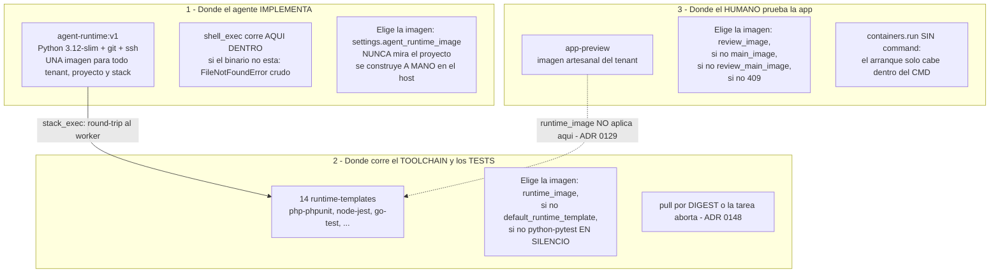

# Imágenes de proyecto y contenedores de pruebas de usuario. Informe para el operador

Fecha: 2026-08-28. Rama: `chore/infra-images-un-nombre-y-trivy`. Medición en solo lectura sobre el árbol de trabajo: **no se ha levantado ningún preview, ni consultado la base de datos viva**. Todo lo que sigue está anclado a fichero:línea; lo que no pude anclar va en §8 como duda abierta, no disfrazado de hallazgo.

La pregunta del operador, literal:

> los contenedores que se levantan para las pruebas de usuario «es algo muy manual, y creo que se podría automatizar según el stack y dockers que se usan para las implementaciones de los agentes»

---

## 1. La respuesta en tres líneas

**Tiene razón en que es manual, y se equivoca en dónde.** El _acto_ de levantar un preview ya está automatizado casi entero —un clic, y la plataforma pone el worktree, la red interna, los sidecars, la URL firmada, la caducidad de 24 h y la limpieza—. Lo manual es el **prerrequisito**: un Dockerfile artesanal que sepa arrancarse solo, escrito, construido y publicado **fuera de la plataforma**, uno por proyecto.

**Su premisa de reaprovechar «los dockers que usan los agentes» es falsa tal cual, y corregirla es la parte útil de este informe.** El bucle del agente **no** corre en la imagen del stack del proyecto: corre siempre en `agent-runtime:v1`, un sandbox fino de Python 3.12-slim + git + ssh, **idéntico para todos los tenants, proyectos y stacks** (`apps/workers/src/workers/execution.py:1488`, `config.py:81-83`). Ahí no hay `php`, ni `composer`, ni `node`. Esa imagen no puede servir la app de nadie, así que no hay nada que reaprovechar de ella.

**Pero la materia prima correcta sí existe, y está a una clave de diccionario de distancia.** Las 14 imágenes de runtime-template (php, node, go, java, ruby, rust, dotnet…) ya están construidas, publicadas en `ghcr.io/daycry` y **fijadas por digest**; lo único que impide usarlas para servir una app es que `build_hardened_run_kwargs` no construye clave `command` (`apps/workers/src/workers/isolation.py:147-174`, verificado en esta sesión), y el preview hace `containers.run(main_image, **kwargs)` sin comando ni entrypoint (`review_runtime_task.py:597`). Recomiendo **la opción B, 14-23 días-persona** — abrir ese gozne — y **no** construir un detector de stack como plato principal.

---

## 2. Cómo funciona hoy: son tres contenedores, no uno

Esta es la confusión que hay que deshacer antes que nada, porque toda la pregunta descansa sobre ella. Hay **tres** contenedores distintos, cada uno con su propia forma de elegir imagen, y ninguno hereda la del anterior.

| Pieza                            | Qué imagen corre                                     | Quién la elige                                                                                | Procedencia verificada                        |
| -------------------------------- | ---------------------------------------------------- | --------------------------------------------------------------------------------------------- | --------------------------------------------- |
| **1. Implementación del agente** | `agent-runtime:v1`, una sola para toda la plataforma | `settings.agent_runtime_image`, default de plataforma. Ni una rama de código mira el proyecto | **No.** Tag local mutable, construido a mano  |
| **2. Toolchain y tests**         | Una de las 14 del catálogo                           | `repository_config.runtime_image` → `default_runtime_template` → `python-pytest`              | **Sí.** Pull por digest o abortar (ADR 0148)  |
| **3. Preview de usuario**        | La imagen artesanal del tenant                       | `review_image` → `main_image` → `worker_config.review_main_image` → 409                       | **No.** Texto libre, sin allowlist ni escaneo |

Tres consecuencias que conviene leer juntas:

- **El agente nunca «implementa dentro de la imagen del stack».** Para tocar `composer` o `npm` hace un round-trip al worker vía `stack_exec`, que lanza un **segundo** contenedor —el runtime-template— sobre el mismo worktree. El binario del stack solo existe ahí.
- **La imagen mejor custodiada del sistema es la de los tests, y la peor es la de la implementación.** El ADR 0148 existe para poder responder «qué imagen exacta ejecutó el código de este tenant», y cubre las 14 plantillas. No cubre `agent-runtime:v1`, que es donde corre el código menos confiable de todos. Ningún workflow la publica y `docs/04-reference/installation.md` la menciona **cero** veces (`grep -c` = 0, comprobado).
- **El preview no reutiliza nada del contenedor principal de los tests.** Comparte la capa de servicios auxiliares (los sidecars mysql/redis/… y la connection-env), y ahí acaba el parecido: el override `runtime_image` no le aplica —dicho con todas las letras en el §Estado de implementación del [ADR 0129](../05-architecture-decisions/0129-servicios-e-imagen-runtime-por-proyecto.md)—, no monta la dep-cache, y corre sobre un worktree propio y limpio (`preview-{slug}`), no sobre el de la tarea donde los agentes instalaron las dependencias.

Ese último punto es el que más caro sale y el menos visible: **la guía oficial recomienda justo lo contrario de lo que el código hace.** [`app-review-images.md:174`](../03-guides/app-review-images.md) aconseja «Deja las deps ya instaladas en el worktree (los agentes lo hacen con `stack_exec`)», pero `stack_exec` instala en `worktree_path(task_id)` y el preview monta otro directorio. Como git no comparte ficheros no trackeados entre worktrees, ahí no hay `vendor/` ni `node_modules`. Y la red del preview es interna (`docker-compose.yml:680`, `internal: true`), así que el `composer install` del CMD tampoco puede descargarlas: cuelga hasta el timeout. Cuatro de los cinco ejemplos de CMD de esa guía dependen de ese consejo. La guía está fechada el 2026-07-09, **quince días antes** de los ADR 0129 y 0130 que la invalidan.

---

## 3. Lo manual, contado

Once datos. **Diez de los once fallan en silencio.** Esa proporción, y no el número, es lo que decide si merece la pena tocar esto.

### 3.1 Lo que pide el preview mínimo

| #     | Dato                                      | Dónde lo aporta el humano                                                   | Si se equivoca                                                                                                                                                                                             | ¿Avisa? |
| ----- | ----------------------------------------- | --------------------------------------------------------------------------- | ---------------------------------------------------------------------------------------------------------------------------------------------------------------------------------------------------------- | ------- |
| **1** | El **Dockerfile de la app**               | Fuera de la plataforma. Contrato de 8 filas en `app-review-images.md:26-37` | `containers.run` lanza excepción, el `except` de `review_runtime_task.py:598-604` la traga y devuelve tupla vacía. La fila ya está creada con `app_configured=true`: la UI ofrece «Abrir app» y da **502** | **No**  |
| **2** | El **comando de arranque**                | No existe campo. Solo cabe dentro del `CMD` de esa imagen                   | Si el CMD no bloquea, el contenedor sale con exit 0 y el síntoma es idéntico al anterior                                                                                                                   | **No**  |
| **3** | Las **dependencias**, dentro de la imagen | Ni worktree compartido, ni dep-cache, ni red (§2)                           | El `install` del arranque cuelga hasta timeout y la app no llega a escuchar                                                                                                                                | **No**  |
| **4** | El **tag** `review_image`                 | `review-preview-section.tsx:90-99`                                          | Sin validación de referencia: un typo da el mismo 502 mudo. Y **no se puede vaciar**: al borrarlo el front quita la clave y el merge server-side la restaura desde la BD                                   | **No**  |
| **5** | El **puerto** `review_port`               | `review-preview-section.tsx:102-116`, default 8080                          | El proxy apunta al puerto equivocado → 502, con la sesión en `running` y la URL firmada válida                                                                                                             | **No**  |

### 3.2 Lo que pide una app con respaldo

| #     | Dato                                    | Dónde                                                         | Si se equivoca                                                                                                                                                                                  | ¿Avisa?                    |
| ----- | --------------------------------------- | ------------------------------------------------------------- | ----------------------------------------------------------------------------------------------------------------------------------------------------------------------------------------------- | -------------------------- |
| **6** | Cada **servicio**: tipo, versión, alias | `runtime-services-section.tsx:162-200`, catálogo de 5, tope 8 | Config inválida cae a main-only. Si el sidecar no llega a healthy, los aux se derriban **pero el principal recibe igual la connection-env** apuntando a un host que ya no existe                | **No**                     |
| **7** | Los **nombres de las variables**        | `runtime-services-section.tsx:203-250`                        | La plataforma inyecta `DATABASE_URL`/`MYSQL_*`/`PG*`; casi ningún framework los lee tal cual. El validador exige `^[A-Z][A-Z0-9_]*$`: las claves punteadas o en minúsculas ni se pueden teclear | Del formato, no del efecto |
| **8** | **Migraciones y seeds**                 | **No existe el paso** en ningún punto del código              | Los sidecars van **sin volumen** y el bridge es nuevo por sesión: **la base de datos nace vacía en cada preview**. Si el CMD no migra, el humano ve la pantalla de error del framework          | **No**                     |

### 3.3 Lo que viene de más atrás y contamina el preview

| #      | Dato                                    | Dónde                                                  | Si se equivoca                                                                                                                                                               | ¿Avisa?                                      |
| ------ | --------------------------------------- | ------------------------------------------------------ | ---------------------------------------------------------------------------------------------------------------------------------------------------------------------------- | -------------------------------------------- |
| **9**  | `default_runtime_template`              | `<select>` de 14 opciones, arranca en «— ninguno —»    | `null` **no** es «sin runtime»: es `python-pytest`. Un proyecto PHP ejecuta cada `stack_exec` donde `composer` no existe, y el agente lee «not found» como problema del repo | **No** (fallback silencioso)                 |
| **10** | `allowed_commands`                      | Chips + presets, decisión independiente de la anterior | Un `php` en la allowlist pasa el filtro y muere con `FileNotFoundError` en la imagen. El agente no puede saber que debía usar `stack_exec`                                   | Solo para `shell_exec`, no para `stack_exec` |
| **11** | Criterios de aceptación **ejecutables** | No hay UI: PUT crudo a la API                          | Sin dicts `{runtime, command}`, `execution.py:997` hace `return` y **la fase de tests no corre nunca**. El run acaba en verde y el reviewer se queda sin `<test-report>`     | **No**                                       |

### El dato que zanja la discusión de diseño

Las casillas **9** y **10** son dos decisiones humanas separadas que tienen que ser coherentes entre sí, y **la propia plataforma se equivoca en dos de sus nueve plantillas built-in** (verificado en esta sesión sobre `apps/api-server/src/api_server/seeds/builtin_project_templates.py`):

- `webapp` (línea 153) declara `language: python+typescript`, autoriza `node`, `npm`, `npx`… y fija `default_runtime_template="python-pytest"`, donde no hay `node`.
- `legacy-migration` (línea 193) declara `language: polyglot`, autoriza `php`, `composer`, `phpunit`… y fija `python-pytest`.

El test que custodia esas plantillas (`tests/unit/test_builtin_template_toolchains.py:58-66`) solo comprueba que **ambos campos existan**, nunca que digan lo mismo. Si quienes escribimos los datos de siembra emparejamos mal dos veces de nueve, un tenant lo hará más. Ese es el argumento a favor de derivar; el §4 explica por qué eso no significa aplicar lo derivado sin preguntar.

---

## 4. Qué se puede derivar, de qué fichero, y con qué fiabilidad

| Dato                         | Se deduciría de                                               | Fiabilidad | Cómo falla cuando falla                                                                                            |
| ---------------------------- | ------------------------------------------------------------- | ---------- | ------------------------------------------------------------------------------------------------------------------ |
| **Rama del preview**         | `git_config.default_branch`                                   | **Total**  | Ya está hecho: es lo único que hoy se deriva (`preview_launch.py:27-34`)                                           |
| **Puerto** (#5)              | `ExposedPorts` de la imagen que el humano **ya eligió**       | **Alta**   | Se lee de la imagen, no se adivina del repo. El socket-proxy ya concede `IMAGES: "1"`                              |
| **Lenguaje** del proyecto    | Fichero marcador en la raíz del worktree                      | **Alta**   | 7 de 9 marcadores identifican el lenguaje sin ambigüedad                                                           |
| **Runtime template** (#9)    | El mismo marcador **más** el framework de test                | **Media**  | 5 de las 14 plantillas viven detrás de un marcador ambiguo — ver abajo                                             |
| **Comando de arranque** (#2) | Plantilla + framework                                         | **Media**  | Los 5 ejemplos del guide ya existen escritos a mano; fuera de esos 5, se adivina                                   |
| **`allowed_commands`** (#10) | El catálogo: cada plantilla sabe qué binarios trae            | **Alta**   | Es un dato de la plataforma, no del repo del tenant. Hoy es una lista humana aplicada a dos entornos incompatibles |
| **Servicios** (#6)           | `docker-compose.yml` / `.env.example` del proyecto            | **Media**  | **Y no se debe hacer así** — §5.1                                                                                  |
| **Nombres de variable** (#7) | `repository_config.framework`, que las plantillas ya rellenan | **Media**  | Un mapa framework→variables. Las credenciales ya son fijas y conocidas                                             |
| **Migraciones** (#8)         | Plantilla + framework                                         | **Baja**   | §5.3: hoy no hay dónde ejecutar nada después del arranque                                                          |
| **`review_image`** (#4)      | Nada del repo                                                 | **Nula**   | Es la imagen de la app del tenant. Derivable solo si el catálogo pudiera servir apps (§6, opción B)                |

### Dónde se rompe la detección, en concreto

El mapa runtime→lockfile **ya existe en el repo**: `RUNTIME_LOCK_FILES` (`packages/shared-test-runtimes/src/shared_test_runtimes/dep_cache.py:53-68`), 14 entradas, 12 con lockfile real. Está escrito en la dirección contraria y se usa para cachear, no para decidir. La tentación es invertirlo. **No es invertible**, y esa es la parte que hay que decir en voz alta:

- `composer.lock` → **php-phpunit o php-pest**. Dos candidatos.
- `package-lock.json` → **node-jest, node-vitest o node-playwright**. Tres candidatos.

Cinco de las catorce plantillas están detrás de un marcador que no las distingue. Para desempatar hay que leer **dentro** del manifiesto (`require-dev`, `devDependencies`), y ahí un repositorio con `jest` **y** `playwright` instalados —que es lo normal— es genuinamente ambiguo: no hay respuesta correcta que un fichero pueda dar.

Y hay un segundo agujero, ya conocido y ya silencioso: `compute_lock_hash` mira **solo la raíz** (`workdir / lock_name`, sin recursión, verificado). En un monorepo con `backend/composer.lock` y `frontend/package-lock.json` no encuentra nada, devuelve `hash=None` y desactiva la caché sin un solo log. Un detector construido sobre esa misma lectura no encontraría nada en un monorepo; uno que buscara recursivamente encontraría **dos** y tendría que elegir.

### Por qué un default equivocado que arranca es peor que un hueco que pregunta

No hace falta argumentarlo en abstracto: **ese experimento ya se hizo en esta plataforma y salió mal.** `DEFAULT_RUN_RUNTIME_ID = "python-pytest"` (`apps/workers/src/workers/test_runtime.py:257`) es exactamente un default que arranca. Su efecto es que un proyecto PHP con el selector vacío ejecuta `composer` dentro de `python:3.12-slim`, el agente recibe «command not found», lo interpreta como un defecto del repositorio y quema turnos arreglando algo que no está roto. El fallo no se presenta nunca como «tu proyecto está en el runtime equivocado».

Un hueco que pregunta cuesta treinta segundos de un humano. Un default equivocado que arranca cuesta turnos de agente, tokens, y un diagnóstico que apunta al sitio contrario. La regla que saco de aquí, y que gobierna la recomendación del §6:

> **Derivar para proponer, nunca para aplicar.** Y donde no se pueda proponer con confianza, **negarse con una explicación** es mejor producto que acertar el 80 % de las veces.

---

## 5. Lo que NO se debe automatizar

### 5.1 Construir la imagen leyendo el `docker-compose.yml` o el `Dockerfile` del propio proyecto

Es la idea más atractiva del lote y la única que hay que descartar sin contrapropuesta. El razonamiento tiene un paso que no se ve a simple vista: **en este sistema, esos ficheros los escribe cada vez más el agente**. Derivar el envoltorio de aislamiento de un fichero que la parte no confiable puede editar invierte la relación entre el guardián y el guardado.

Y hay un tripwire que lo demuestra: `assert_no_docker_socket(kwargs)` existe en el camino del spawn precisamente porque montar el socket de Docker es la fuga conocida. Un `docker-compose.yml` de un repositorio de proyecto puede declarar `/var/run/docker.sock:/var/run/docker.sock` en tres líneas. Hoy nadie lee ese fichero, así que el tripwire nunca se pone a prueba. El día que un detector lo lea y lo aplique, ese `assert` pasa de red de seguridad a **única** defensa entre un fichero escrito por un agente y el daemon del host. Eso es el Principio Rector 2 de `CLAUDE.md`, y no se negocia en un informe de automatización.

Leer esos ficheros **para sugerir texto en un formulario que un humano confirma** es otra cosa y sí cabe (§6, opción A). La línea es: derivado → propuesto → confirmado → aplicado. Nunca derivado → aplicado.

### 5.2 Aplicar un runtime detectado sin confirmación

Por el §4 entero: cinco de catorce plantillas no son distinguibles por su marcador, los monorepos no tienen respuesta única, y el precedente de `python-pytest` ya demostró cómo se paga un acierto parcial. Un detector que rellena y espera un clic convierte una decisión en una revisión. Uno que aplica convierte un error del detector en un fallo atribuido al proyecto.

### 5.3 Correr migraciones y seeds automáticamente

Aquí el obstáculo es anterior al debate: **no hay dónde**. El contenedor de preview no ejecuta nada después de arrancar, y el mecanismo que parecía existir no existe — `rerun_requested` (`routers/review.py:193-214`) documenta en su docstring que «el worker lo recoge en el siguiente barrido», y **no tiene un solo consumidor** en todo el repositorio. Es una promesa, no un mecanismo.

Construirlo significa abrir una superficie de ejecución **dentro de un contenedor vivo que sirve código no confiable**. Eso no es automatizar algo que ya se hace a mano: es una capacidad nueva, y pide su propio ADR y su propio análisis de aislamiento, no un renglón en éste.

### 5.4 Ampliar las fuentes de imagen antes de cerrar la puerta que el ADR 0129 dejó abierta

Hoy `review_image` y `runtime_image` son texto libre validado solo por una regex de forma: sin allowlist de registry, sin verificación de procedencia, sin escaneo. El propio ADR 0129 lo deja escrito como **pendiente, diferido y gated**. Cualquier automatismo que multiplique las imágenes que la plataforma acepta antes de cerrar eso ensancha un agujero ya abierto. Nótese que la opción B recomendada va en la dirección **contraria**: sustituye texto libre por identificadores de un catálogo fijado por digest.

### 5.5 Multiplicar previews antes de verificar el camino del veredicto

Verificado en esta sesión: `mark_other_plan_sessions_terminal` (`apps/api-server/src/api_server/db/review_session_repo.py:183-205`) **no filtra por `kind`**, pese a que el [ADR 0130](../05-architecture-decisions/0130-app-preview-on-demand.md) y la migración 0118 afirman que el barrido de sesiones hermanas excluye los previews. Emitir un veredicto marca `expired` cualquier preview on-demand vivo de ese plan. La mitad restante —si desde la URL firmada de un preview se alcanza la pantalla de veredicto— **no la he verificado** y va en §8. Cualquier cosa que haga los previews más numerosos multiplica el radio de eso antes de saber cuánto mide.

---

## 6. Opciones, con coste

Las estimaciones son mías y salen de contar los ficheros que hay que tocar y sus tests; no están calibradas contra el histórico del repositorio. Van en rango por eso.

| Opción                                           | Qué compra                                                                                         | Coste                               |
| ------------------------------------------------ | -------------------------------------------------------------------------------------------------- | ----------------------------------- |
| **0 — Que los fallos hablen**                    | Ningún automatismo nuevo. Convierte los diez fallos mudos del §3 en mensajes accionables           | **4-7 d**                           |
| **A — Detector que propone, humano confirma**    | Rellena el formulario con lo detectado, marcado como propuesta. Nunca pisa un valor puesto         | **8-14 d**                          |
| **B — Imagen de catálogo + comando de arranque** | Elimina el Dockerfile artesanal para los stacks comunes. Abre el gozne que hoy lo hace obligatorio | **10-16 d**                         |
| **C — Cero configuración**                       | Detectar todo, construir la imagen, migrar y sembrar, sin humano                                   | **45-70 d**, y cruza el Principio 2 |

### Opción 0 — Que los fallos hablen (4-7 d)

- Persistir el `note` que el worker **ya calcula** (`review_runtime_task.py:217-219`) y hoy se pierde porque el encolado es fire-and-forget, y enseñarlo en el launcher: 1-2 d. Es la diferencia entre «no funciona» y «tu imagen no existe».
- Diagnóstico de coherencia `default_runtime_template` × `allowed_commands`, reutilizando el patrón de aviso que ya existe para `shell_exec` (`agent_tools_enforcement.py:583-599`): 1-2 d.
- Arreglar las dos plantillas built-in incoherentes y subir el test de presencia a test de coherencia: 0,5-1 d.
- Que el preflight avise de «criterios que no ejecutan nada», no solo de «tarea sin criterios»: 1-2 d.

### Opción A — Detector que propone y el humano confirma (8-14 d)

Una tarea de worker que lee el worktree ya materializado, propone plantilla, servicios y puerto, y **rellena el formulario marcando la fuente** («detectado de `composer.lock`»). Nunca pisa un valor existente, nunca aplica sin clic, y nunca lee el `docker-compose.yml` del proyecto (§5.1). Útil, pero automatiza el trámite, no el trabajo.

### Opción B — Imagen de catálogo + comando de arranque (10-16 d)

Esto es abrir el gozne del §1:

- `command` en el envelope, en el request y en el spawn, **como lista y no como cadena** para que no haya shell de por medio: 2-3 d con tests.
- Campos `preview_command` y `preview_runtime` en el esquema y el formulario: 2-3 d.
- Que `review_image` admita un id del catálogo y se resuelva por digest reutilizando `pinned_pull_reference`: 2-3 d.
- Montar la dep-cache read-only en el preview — el mismo bind-mount que `stack_exec` ya hace: 1-2 d. Esto cierra el dato manual #3 y la contradicción de la guía.
- Tabla framework→comando para los cinco stacks que el guide ya documenta a mano: 1-2 d.
- ADR + reescribir `app-review-images.md`, que hoy contradice al código: 2-3 d.

### Opción C — Cero configuración (45-70 d)

Exige tres cosas que la plataforma hoy no hace **por diseño**: construir imágenes (no lo hace en ningún punto), ejecutar comandos dentro de un preview vivo (§5.3) y establecer procedencia de imágenes derivadas (§5.4). No la recomiendo, y el coste es lo de menos.

### Recomendación

**Hacer la 0 y después la B. 14-23 días-persona en total. No construir el detector como plato principal.**

Las tres razones, en orden de peso:

**1. La B ataca el trabajo; la A ataca el formulario.** El dolor del operador no son los dos campos de la tarjeta —eso son treinta segundos—, es escribir, construir y publicar un Dockerfile por proyecto fuera de la plataforma, cumpliendo un contrato de ocho filas que nadie verifica. La B borra ese trabajo para los casos comunes. La A lo deja intacto y automatiza el trámite que sobra.

**2. La B no adivina nada, y encima mejora el aislamiento.** No hay detección, no hay heurística, no hay default que arranque estando mal: el humano elige de un catálogo cerrado en vez de teclear un tag libre. Y sustituye una referencia sin verificar por una **fijada por digest**, que es la dirección en la que el ADR 0148 ya movió las otras catorce imágenes. Es de las pocas veces que automatizar y endurecer apuntan al mismo sitio.

**3. La 0 va primero porque añadir capacidad sobre fallos mudos multiplica el coste de depurar.** Los tres modos de fallo de hoy producen el mismo síntoma —sesión en verde, URL firmada, 502— y se distinguen leyendo los logs del worker, para lo que no hay runbook. Duplicar los caminos de arranque sin arreglar eso antes es comprar más superficie y la misma ceguera.

La opción A queda como candidata posterior, y solo en su forma estricta: proponer con la fuente a la vista, no pisar nunca un valor existente, y no leer jamás el `docker-compose.yml` del proyecto.

---

## 7. Riesgos

**Aislamiento primero, porque es el que manda.** Estos contenedores ejecutan código escrito por agentes. El Principio Rector 2 pone el aislamiento en el envoltorio del contenedor, no en la confianza sobre lo que corre dentro.

1. **Toda automatización que derive del repositorio del proyecto amplía lo que se ejecuta sin que nadie lo mire.** Ficheros como `docker-compose.yml`, `Dockerfile` o los scripts de `package.json` son escribibles por el agente. La frontera que este informe propone no cruzar: **derivar puede alimentar una propuesta; nunca el envoltorio de aislamiento** (§5.1).

2. **La clave `command` es superficie nueva y hay que tratarla como tal.** Hoy `build_hardened_run_kwargs` no la construye, así que ningún comando llega desde configuración al `containers.run` del preview. Si la opción B la añade, tres condiciones que van en el ADR y no en el código de después: lista y no cadena (sin shell interpolando), sujeta a `allowed_commands` como ya lo está `stack_exec`, y **nunca poblada desde un fichero del repositorio** — solo desde el catálogo de la plataforma o desde el formulario que un humano firma.

3. **Las imágenes del catálogo son toolchains de test, no servidores.** Usarlas para servir las pone a escuchar HTTP en la red interna, alcanzable por el proxy firmado. El envoltorio aguanta igual (uid 1000, root read-only, cap-drop ALL, red interna), pero es un uso nuevo de esas imágenes y merece un renglón explícito en el ADR, no darse por supuesto.

4. **La puerta de procedencia sigue abierta mientras tanto.** `review_image` y `runtime_image` admiten cualquier referencia bien formada, sin allowlist ni escaneo, y el ADR 0129 lo tiene diferido y gated. La opción B reduce ese riesgo para el camino común, pero **no lo cierra**: el campo de texto libre sigue existiendo para quien lo quiera.

5. **`agent-runtime:v1` es el eslabón sin procedencia, y es el más importante.** Se construye a mano, con dos tags que hay que acordarse de poner, y ningún workflow la publica. Los tres modos de fallo documentados en [`image-build-recipes-that-bite.md`](../03-guides/gotchas/image-build-recipes-that-bite.md) son silenciosos, y el peor es que los runs sigan pasando con el comportamiento de hace semanas. **No forma parte de este encargo**, pero cualquier trabajo sobre imágenes debería llevárselo por delante: la maquinaria del ADR 0148 ya existe para catorce imágenes y podría cubrir la decimoquinta.

6. **Más previews, más radio para lo del §5.5.** El barrido de sesiones hermanas no filtra por `kind` (verificado). La mitad que no verifiqué está en §8.

7. **Riesgo de la detección a escala, si algún día se hace.** Un detector que acierta el 80 % no falla el 20 % de las veces de forma visible: falla creando proyectos que arrancan mal y cuyo síntoma apunta al repositorio del tenant. Es el modo de fallo que `DEFAULT_RUN_RUNTIME_ID` ya produce hoy, multiplicado por el número de campos que el detector rellene.

---

## 8. Dudas abiertas

Lo que la medición no pudo anclar. Va como duda, no como hallazgo.

1. **No se ha ejecutado nada.** Lectura estática sobre la rama `chore/infra-images-un-nombre-y-trivy`. Las afirmaciones sobre lo que _ve_ el operador —el 502, la sesión en verde, la base de datos vacía— son deducciones del código, no observaciones.

2. **No se ha consultado la base de datos.** Cuántos proyectos tienen hoy `review_image`, `services` o `runtime_image` puestos, y cuántas tareas llevan criterios con forma `{runtime, command}`, no se sabe. Si esto último fuese cero, la fase de tests automáticos **nunca habría corrido en producción** — pero eso se mide contra la BD, no contra el repositorio. Lo que sí es firme es que **ningún camino de producto los genera**.

3. **La segunda mitad del asunto del veredicto.** La primera está confirmada (§5.5). La segunda no: si el SPA de review filtra por `kind`, y si desde la URL firmada de un preview **de plan** se alcanza la pantalla de veredicto. `submit_verdict` tampoco comprueba `kind`. Si se confirmara, un plan en `pending_human_validation` podría pasar a `completed` con PR automático desde un preview — sería un agujero de gobierno, no una molestia de usabilidad. **Merece una comprobación aparte y no se ha hecho.**

4. **El timeout de 30 s del healthcheck** de un MySQL inicializando su datadir por primera vez: la medición lo sitúa «en el filo» por experiencia general, sin medirlo en esta máquina. El resto del punto #6 no depende de eso.

5. **Las claves punteadas de CodeIgniter 4.** Lo anclado es la restricción de la plataforma (`^[A-Z][A-Z0-9_]*$` rechaza minúsculas y puntos). No se verificó en el código de CI4 si además acepta una forma en mayúsculas que sí pasaría el filtro.

6. **Si el daemon de este despliegue alcanza un registry.** docker-py hace `pull` implícito y el socket-proxy concede `IMAGES=1`, pero no se comprobó si una `review_image` que solo exista en remoto se descargaría o fallaría. Firme: la plataforma **no construye** la imagen en ningún caso.

7. **El entorno del host vivo.** Si el operador tiene `WORKERS_AGENT_RUNTIME_IMAGE` apuntando a otra cosa, lo dicho sobre el default es cierto para el código pero no necesariamente para esta instalación.

8. **Divergencias doc↔código detectadas de paso**, que no son de este encargo pero envenenan a quien lea el código: `catalog.py:9` y `:225` citan `Project.execution_runtimes`, una columna que **no existe** (lo que hay es el escalar `default_runtime_template`); `tool_wiring.py:154-156` afirma que resuelve el `run_pytest` de un proyecto PHP a `php-phpunit`, pero los cuatro `run_*` los retiró el [ADR 0093](../05-architecture-decisions/0093-ejecucion-de-stack-mediada-por-worker-stack-exec.md) y los borró la migración 0122 — esa maquinaria está viva en el código y muerta en producción.
