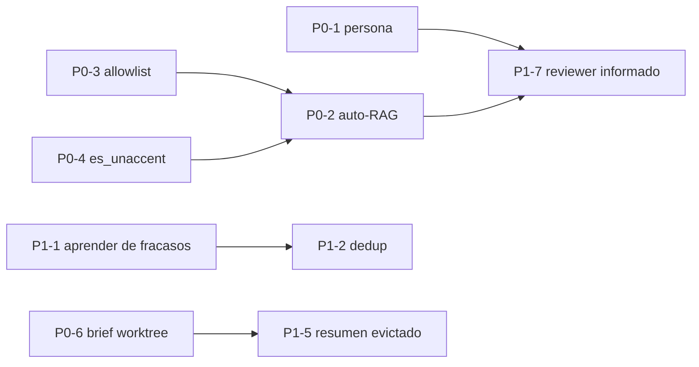

# Investigación: maximizar la inteligencia de los agentes (equipo e individuales)

- **Fecha**: 2026-07-11
- **Autor**: Claude (investigación multi-agente: 5 exploradores en paralelo sobre prompts, KB/RAG, memoria, configuración y bucle de ejecución)
- **Estado**: investigación entregada — pendiente de priorización por el operador
- **Alcance**: SOLO diagnóstico y propuestas. No se ha implementado nada.

---

## 1. Resumen ejecutivo

La pregunta era: _¿se puede hacer que los agentes rindan lo máximo posible mejorando prompts, acceso a la KB, gestión de memoria…?_ La respuesta es **sí, y con mucho margen**. El hallazgo central de la investigación es que **la plataforma ya posee casi toda la información que haría más inteligente a un agente, pero no se la entrega en el momento de ejecutar**:

1. **La persona (`system_prompt`) de cada agente nunca llega al run.** Los equipos built-in (CI4, etc.) tienen personas riquísimas (HMVC, Doctrine, convenciones…) que se descartan: implementador y reviewer corren con un system genérico idéntico para todos. Es la palanca nº 1.
2. **La KB no se auto-inyecta en los runs.** El motor RAG híbrido (BM25+vector+RRF) funciona, pero el agente solo lo ve si _él mismo_ decide llamar a la tool `rag_search` — y esa tool puede caerse silenciosamente de la allowlist. Las memorias sí se auto-inyectan (recall D1); los pasajes de KB no.
3. **La memoria aprende solo de éxitos y sin consolidación.** El bucle write-post-run/read-pre-run existe, pero por defecto solo memoriza runs `done`, no deduplica entre runs, la query del recall es solo título+descripción, y las memorias de equipo no envejecen ni se priorizan (todo eso el córtex ya lo tiene).
4. **El bucle de ejecución pierde contexto por diseño.** Cada turno el modelo ve solo los últimos 8 items sin resumen de lo evictado; no hay scratchpad/plan interno persistente; el implementador arranca ciego al worktree acumulado (el harvest ya existe para el reviewer); los logs de tests van en tail crudo de 8000 chars; no hay tool-calling en paralelo (una lectura = una iteración del presupuesto).
5. **Palancas de configuración declaradas que no operan**: `temperature` validada pero no llega al runtime; `skill_match` en asignación es un no-op; los equipos built-in no pueden ajustar modelo/effort sin tocar el default global; el reranker existe pero está OFF; la ruta BM25 de los agentes usa tokenizador `simple` (sin español/unaccent).

La sección 4 propone un plan en 3 niveles: **P0** (quick wins de alto impacto, datos ya disponibles, ~1-2 días cada uno), **P1** (mejoras medias) y **P2** (estructurales, requieren ADR).

---

## 2. Método

Cinco exploradores read-only en paralelo, uno por subsistema, con verificación en código (fichero:línea), no en docs:

| Explorador | Subsistema                                                    | Ficheros ancla                                                                                                     |
| ---------- | ------------------------------------------------------------- | ------------------------------------------------------------------------------------------------------------------ |
| 1          | Pipeline de prompts (implementador/reviewer/planning)         | `orchestrator/dispatch.py`, `workers/run_spec.py`, `agent_runtime/{__main__,providers}.py`, `chat/planning_llm.py` |
| 2          | KB/RAG (ingestión, retrieval, consumidores)                   | `api_server/rag/*`, `ingestion/*`, `routers/internal_agent.py`, `agent_runtime/rag_tools.py`                       |
| 3          | Memoria (scopes, memorizer, recall)                           | `api_server/memorizer/*`, `workers/memorizer.py`, `db/memory.py`, `cortex/memory.py`                               |
| 4          | Configuración (modelo/effort/skills/tools/guardrails/budgets) | `db/domain.py`, `platform_settings.py`, `workers/model_resolver.py`, `budgets/envelope.py`, `seeds/ci4_team.py`    |
| 5          | Bucle de ejecución (contexto, convergencia, feedback)         | `agent_runtime/{graph,state,nudges,loop_detection,safeguards}.py`                                                  |

---

## 3. Diagnóstico: qué ve (y qué no ve) un agente al ejecutar hoy

### 3.1 Lo que SÍ ve un implementador

El prompt de cada turno es exactamente `[system, user]` reconstruido desde cero (`providers.py:282-324`):

- **System**: preámbulos (comentarios humanos → feedback de rechazos previos → fragmentos de skills) + `_DECIDE_SYSTEM` genérico (`__main__.py:606-645`, `providers.py:79-102`).
- **User**: `Task: título` + descripción + acceptance criteria + bloque PROGRESS (iteración, ficheros escritos, digests de lectura) + **últimos 8 items** de contexto + última observación + canales sticky (REVIEW FEEDBACK / GUIDANCE / REPETITION WARNING, truncados a 2000 chars).
- **Auto-recall de memorias** pre-plan: 5 hits × 700 chars, query = título+descripción (`__main__.py:122-162`).
- El worktree en disco (pero sin narrativa de lo que contiene).

### 3.2 Lo que NO ve (y existe en el sistema)

| #   | Información disponible                                                                         | Dónde vive                                                                  | Dónde se corta                                                                                  |
| --- | ---------------------------------------------------------------------------------------------- | --------------------------------------------------------------------------- | ----------------------------------------------------------------------------------------------- |
| G1  | **Persona/`system_prompt` del agente** (+ `model_config.system_prompts` bilingüe)              | `agents.system_prompt` (`domain.py:444`), seeds CI4 (`ci4_team.py:165-631`) | Nunca entra al payload del run (`dispatch.py:678-709`)                                          |
| G2  | **Rol del agente** (backend/architect/QA…)                                                     | `domain.py:443`, `role_in_team`                                             | No se inyecta; el LLM no sabe qué es                                                            |
| G3  | **Pasajes de KB** (convenciones, ADRs, docs del proyecto)                                      | Motor RAG completo (`rag/search.py`)                                        | Sin auto-inyección; solo tool PULL opcional (`__main__.py:126` trae solo memorias)              |
| G4  | **Resumen del worktree acumulado / tareas hermanas del plan**                                  | `review_harvest.py:39-84` (ya lo calcula para el reviewer)                  | El implementador arranca ciego y lo re-descubre leyendo                                         |
| G5  | **Errores de runs anteriores de la misma task** (aborts, budget, loops)                        | `Execution.output`/`abort_code`                                             | Solo se realimentan 3 `review_comment` de rechazos (`dispatch.py:1176-1216`)                    |
| G6  | Comentarios de **fase** del plan                                                               | `PlanComment(target_kind='phase')`                                          | `_read_relevant_comments` solo trae task y plan (`dispatch.py:1138-1153`)                       |
| G7  | Contexto de proyecto para el **reviewer** (prior_plans/memories/docs, ya existe para planning) | `responder.py:279-348`                                                      | El reviewer no lo recibe; y solo ve el output del último run (`LIMIT 1`, `dispatch.py:735-742`) |

**Conclusión del diagnóstico**: dos agentes distintos del equipo CI4 (Architect vs Backend) ejecutan hoy la misma tarea con _exactamente el mismo_ prompt salvo los fragmentos de skill. La "inteligencia diferencial" que el operador configura en la UI (personas, roles, KBs por rol) no llega al punto donde se gasta el dinero: el run.

---

## 4. Plan de mejora priorizado

### P0 — Quick wins (alto impacto, bajo riesgo, datos ya disponibles)

| ID       | Mejora                                                                   | Detalle                                                                                                                                                                                                                                                                                                                                                                                                                                  | Ficheros                                                  | Impacto | Esfuerzo   |
| -------- | ------------------------------------------------------------------------ | ---------------------------------------------------------------------------------------------------------------------------------------------------------------------------------------------------------------------------------------------------------------------------------------------------------------------------------------------------------------------------------------------------------------------------------------- | --------------------------------------------------------- | ------- | ---------- |
| **P0-1** | **Inyectar persona + rol del agente en el run**                          | Nueva clave `agent_persona` en el payload (`dispatch.py::_assemble_run_request`) → spec (`run_spec.py::_agent_spec`) → preámbulo del system en el mismo raíl que `skill_prompt_fragments` (`__main__.py:606-645`). Seleccionar idioma de `model_config.system_prompts.{es,en}` si existe; incluir `role`/`role_in_team`. Aplicar también al reviewer. La persona es contenido del tenant → valorar fence UNTRUSTED como los comentarios. | `dispatch.py`, `run_spec.py`, `agent_runtime/__main__.py` | ★★★★★   | Bajo       |
| **P0-2** | **Auto-inyección de KB al arrancar el run**                              | `_build_auto_rag` simétrico al auto-recall de memorias: pre-fetch `rag_search` (query = título+descripción+criterios) e inyectar top-k pasajes en el contexto inicial, dentro de fence UNTRUSTED (ADR 0102, igual que las memorias en `graph.py:331-344`).                                                                                                                                                                               | `agent_runtime/__main__.py:126-162`, `graph.py:320-353`   | ★★★★★   | Bajo-medio |
| **P0-3** | **Eximir `rag_search`+`memory_*` de la allowlist en modos de ejecución** | `rag_search` no está en `SYSTEM_FAMILY_TOOL_NAMES` (`builtin_families.py:210`): cualquier modo con whitelist sin `semantic_search` deja al run sin KB en silencio. Eximirla como familia de sistema (o auto-incluirla en modos de ejecución).                                                                                                                                                                                            | `agent_runtime/builtin_families.py`                       | ★★★★    | Trivial    |
| **P0-4** | **Búsqueda BM25 de agentes con `es_unaccent`**                           | La ruta que consumen runs y planning usa tokenizador `'simple'` (`rag/search.py:104-111`); el preview del dueño ya usa `public.es_unaccent` (`search.py:365-369`). Unificar → mejor recall en castellano.                                                                                                                                                                                                                                | `rag/search.py`                                           | ★★★     | Trivial    |
| **P0-5** | **Planning con embedder + KBs de rol**                                   | `build_project_context` llama `recall_chunks` sin `embedder` (BM25-only) y sin `agent_id` (ignora `agent_knowledge_bases`). Pasar ambos.                                                                                                                                                                                                                                                                                                 | `chat/responder.py:335-347`                               | ★★★     | Trivial    |
| **P0-6** | **Brief inicial del worktree en re-dispatch**                            | Reutilizar el harvest que ya ve el reviewer (`review_harvest.py:39-84`) como bloque "estado del worktree" en `perceive` cuando `plan_has_prior_work`. Ataca el read-churn en origen (hoy se combate a posteriori con nudges).                                                                                                                                                                                                            | `workers/execution.py`, `agent_runtime/graph.py:308-318`  | ★★★★    | Medio      |
| **P0-7** | **Realimentar fracasos no-review**                                       | Además de los 3 `review_comment`, incluir en el preámbulo del reintento el `abort_code` + cola del output del run anterior fallido ("el intento anterior murió por X").                                                                                                                                                                                                                                                                  | `dispatch.py:1176-1216`, `__main__.py:422-451`            | ★★★     | Bajo       |

### P1 — Mejoras medias (impacto alto, tocan más piezas)

| ID        | Mejora                                                     | Detalle                                                                                                                                                                                                                                                                               | Ficheros                                                   | Impacto | Esfuerzo            |
| --------- | ---------------------------------------------------------- | ------------------------------------------------------------------------------------------------------------------------------------------------------------------------------------------------------------------------------------------------------------------------------------- | ---------------------------------------------------------- | ------- | ------------------- |
| **P1-1**  | **Memoria: aprender de fracasos y de review**              | (a) Ampliar default de `memorizable_statuses` (hoy solo `done`, `policy.py:38`) — o al menos destilar runs `failed/aborted` con prompt específico de "lección de fracaso". (b) Destilar los `review_comment` (qué rechazó el reviewer y por qué) como memoria semántica reutilizable. | `memorizer/policy.py`, `workers/memorizer.py`              | ★★★★    | Medio               |
| **P1-2**  | **Memoria: dedup + consolidación automática**              | Portar el dedup por contenido normalizado del córtex (`cortex/memory.py:218-233`) al memorizer de agentes y a `memory_store`; beat de consolidación/olvido para scopes de equipo (existe `cortex_maintenance`, cortex-only). Sin esto, P1-1 multiplica ruido.                         | `memorizer/persistence.py`, nuevo beat                     | ★★★★    | Medio               |
| **P1-3**  | **Recall pre-run más rico**                                | Query = título+descripción+rol del agente+criterios+feedback de review previo; subir caps (5×700 hoy). Ponderar recency/`recall_count` en el RRF (el córtex ya instrumenta los contadores).                                                                                           | `agent_runtime/__main__.py:122-162`, `memorizer/recall.py` | ★★★     | Medio               |
| **P1-4**  | **Destilar outputs de stack_exec**                         | Hoy: tail crudo de 8000 chars (`stack_exec_task.py:215`) que puede cortar la traza útil. Extraer fallos estructurados (asserts, primer error de compilación) antes del tail.                                                                                                          | `workers/tasks/stack_exec_task.py`                         | ★★★     | Bajo-medio          |
| **P1-5**  | **Resumen de contexto evictado**                           | La ventana de 8 items evicta sin resumen (`providers.py:225`). Añadir un rolling summary barato (extractivo o LLM-lite) de lo que sale de la ventana, como bloque sticky. Alternativa mínima: subir `_CONTEXT_WINDOW` para claude_sdk (contextos grandes).                            | `agent_runtime/providers.py`, `graph.py`                   | ★★★★    | Medio               |
| **P1-6**  | **Scratchpad/plan interno persistente**                    | Tool `update_plan` (o similar) cuyo contenido se renderiza como bloque sticky: el agente escribe su estrategia/subpasos una vez y la ve todos los turnos. Compensa la reconstrucción single-turn.                                                                                     | `agent_runtime/tools.py`, `state.py`, `providers.py`       | ★★★★    | Medio               |
| **P1-7**  | **Reviewer mejor informado**                               | (a) Darle los N últimos outputs del implementador, no solo `LIMIT 1` (`dispatch.py:735-742`); (b) contexto de proyecto (prior_plans/memories/docs) como en planning; (c) auto-RAG de P0-2 aplica también a reviews.                                                                   | `dispatch.py:711-782`                                      | ★★★     | Bajo-medio          |
| **P1-8**  | **Cablear `temperature` (o retirarla)**                    | Está validada (0-2) en `model_config` pero no llega al runtime (`providers.py:1218-1253` pasa model/tools/effort, no temperature). Decidir: cablear a los kinds HTTP o quitar la palanca de la UI.                                                                                    | `run_spec.py`, `agent_runtime/providers.py`                | ★★      | Bajo                |
| **P1-9**  | **`teams.model_config` operable para built-ins**           | Los equipos built-in no pinean modelo (correcto), pero no hay forma de subir el effort/modelo del equipo entero sin tocar el default de plataforma o pinear agente a agente. Exponer edición de `teams.model_config`/`chat_model_config` en la UI de adopción.                        | admin-panel + `seeds/builtin_teams.py`                     | ★★★     | Medio               |
| **P1-10** | **Activar el reranker (flag existente)**                   | `rag.reranker_enabled` OFF por defecto (BGE-reranker-v2-m3, CPU). Medir latencia en dev y, si es aceptable, ON por defecto o recomendación al operador. **Es un toggle de operador, no código.**                                                                                      | flag de plataforma                                         | ★★      | Trivial (operación) |
| **P1-11** | **Comentarios de fase + backfill de embeddings de chunks** | (a) `_read_relevant_comments` no trae `target_kind='phase'`; (b) chunks con `embedding=NULL` (Ollama caído en ingesta) no tienen job de re-embed (sí existe para memorias: `memory_backfill.py`).                                                                                     | `dispatch.py:1138-1153`, nuevo beat                        | ★★      | Bajo                |

### P2 — Estructurales (pedir ADR antes de implementar)

| ID       | Mejora                                             | Por qué es ADR                                                                                                                                                                                                                                                                                                                        | Impacto |
| -------- | -------------------------------------------------- | ------------------------------------------------------------------------------------------------------------------------------------------------------------------------------------------------------------------------------------------------------------------------------------------------------------------------------------- | ------- |
| **P2-1** | **Threading conversacional real / prompt-caching** | Hoy cada `decide()` reconstruye `[system,user]` desde cero (claude_sdk corre `max_turns=1`): se pierde continuidad y se anula el caching de conversación creciente. Pasar a hilo persistente cambia el contrato provider-agnóstico (los 4 kinds) y el modelo de coste. Relacionado con ADR 0097 (sesión SDK persistente, `proposed`). | ★★★★★   |
| **P2-2** | **Tool-calling en paralelo (batch)**               | F36 descarta llamadas concurrentes (`providers.py:590-666`); permitir batch de reads reduciría iteraciones, pero toca loop-detection, safeguards, presupuestos y la semántica "una acción por turno" del grafo.                                                                                                                       | ★★★★    |
| **P2-3** | **Reflexión semántica proactiva**                  | `reflect` es bookkeeping+regex; un self-check LLM periódico ("¿avanzo hacia los criterios?") cada N iteraciones podría cortar derivas antes que los nudges reactivos — pero añade coste por run y riesgo de bucles de meta-razonamiento.                                                                                              | ★★★     |
| **P2-4** | **Presupuestos ampliables por proyecto**           | `execution_budgets` de proyecto solo puede APRETAR (clamp al ceiling hardcoded 50 iter/500k, `budgets/envelope.py:33-84`). Un proyecto pesado no tiene palanca para pedir más margen. Subir/parametrizar el ceiling es decisión de coste del operador.                                                                                | ★★★     |
| **P2-5** | **Canal pregunta-a-humano a mitad de run**         | Hoy el escalado es terminal (blocked+inbox). Un "ask_human" no-terminal (el run se suspende y reanuda con la respuesta) mejoraría tareas ambiguas, pero toca ciclo de vida, UI y presupuestos.                                                                                                                                        | ★★★     |
| **P2-6** | **Asignación `skill_match` real**                  | Es un no-op que cae a load-balanced (`dispatch.py:1381-1384`). Matching real rol+skills+proficiency contra la tarea.                                                                                                                                                                                                                  | ★★      |

### Dependencias y orden sugerido

- **Tanda 1 (P0)**: P0-3/P0-4/P0-5 (triviales) + P0-1 (la gran palanca) + P0-2 + P0-7. Todo cabe en el patrón ya establecido (payload→spec→preámbulo, TDD por pieza).
- **Tanda 2**: P0-6 + P1-4 + P1-7 + P1-8 (bucle mejor alimentado).
- **Tanda 3**: P1-1→P1-2→P1-3 (ciclo de aprendizaje sólido) + P1-5/P1-6 (contexto intra-run).
- **P2**: un ADR por ítem; P2-1 es el de mayor retorno si el operador acepta el cambio de modelo de coste.

---

## 5. Consideraciones transversales

1. **Anti prompt-injection**: todo contenido nuevo que entre al prompt (persona del tenant, pasajes de KB, briefs de worktree) debe ir en el fence `<<<UNTRUSTED_DATA` ya establecido (ADR 0102; ver `__main__.py:364-378` y `graph.py:331-344` para el patrón). La persona es un caso límite (la configura el tenant, no un tercero) — decidir fence sí/no explícitamente.
2. **Presupuesto de prompt**: P0-1/P0-2/P0-6 añaden tokens fijos por turno. Con claude_sdk (500k budget) es despreciable; con Ollama local conviene un cap por bloque (p. ej. persona ≤ 2000 chars, KB ≤ 3 pasajes × 700, brief ≤ 1500), consistente con los caps existentes.
3. **Medición**: antes/después con el mismo playbook del e2e del ciclo autónomo (tarea CI4 real): iteraciones hasta done, tokens, tasa de approve a la primera, read-churn (safeguard_stats ya lo instrumenta). Sin medición no sabremos qué palanca rinde.
4. **Guardrails**: hoy solo corre `post_tool` prompt_injection en modo LOG (fail-open, `agent_runtime/guardrails.py:26-37`); los otros 3 hooks están diferidos a prod-03. No es palanca de inteligencia, pero conviene saber que inyectar más contenido externo (KB) aumenta la superficie que ese guardrail debería vigilar.
5. **No tocar**: el catálogo cerrado de providers (ADR 0021), la exclusión de `git` del sandbox, y la semántica fail-closed de F32 — están así por diseño y la investigación no ha encontrado motivo para revisarlos.

---

## 6. Siguiente paso

Decisión del operador sobre qué tandas aprobar. Recomendación: **aprobar la Tanda 1 (P0) entera** — es donde está la relación impacto/esfuerzo más alta, no requiere ADR (usa raíles existentes) y es medible con el e2e actual. P2-1 (threading/caching) merece ADR propio en paralelo por su impacto en coste.
